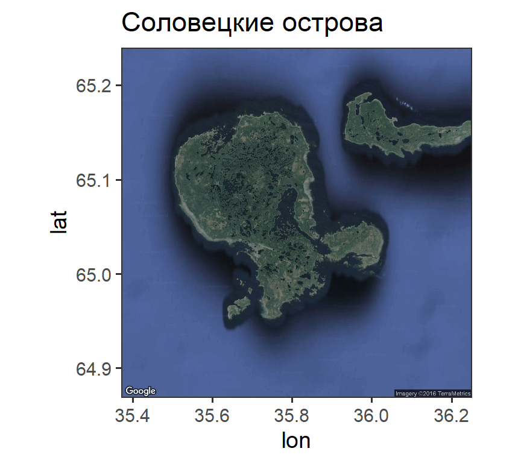

## Вы сможете

- Объяснить почему для некоторых задач больше подходят многомерные данные
- Объяснить суть понятия "многомерное пространство признаков"
- Представить многомерные данные в виде матриц описания значений признаков для объектов 
- Оценить сходство/различие между объектами с помощью специальных коэффициентов
- Описать _взаиморасположение_ объектов в многомерном пространстве признаков с помощью матриц
- Визуализировать взаиморасположение объектов с помощью простейших методов


# Общая характеристика многомерных методов 

## Почему нужны многомерные методы?

Пусть у нас имеется две группы объектов, у которых мы изучили некий признак. Мы хотим тестировать гипотезу о том, что эти две группы различаются.  

Вспомним логику тестирования гипотез.


## Почему нужны многомерные методы?

Теперь представим, что наш объект, по своей природе, не может быть описан только по одному признаку

- Сообщества (признаки - виды)
- Форма тела (признаки - размеры тех или иных частей)
- Социальная активность животного (признаки - проявление того или иного паттерна)
- Общественное мнение (признаки - ответы на разные вопросы анкет)
- Транскриптом (признаки - транскрипты)


## Почему нужны многомерные методы?

Предположим, что объекты характеризуются только двумя признаками 


## Какие задачи решаются методами могомерной статистики?

>- Выявление взаимоотношений (сходства-различия) между объектами (или признаками): 
    - Классификация (Кластерный анализ)
    - Ординация. В том числе картирование пространственно выраженных объектов (nMDS, PCA).
- Тестирование гипотез о различиях между группами объектов (ANOSIM, PERMANOVA).
- Выявление  связи между группами признаков (тест Мантела, BIOENV, RDA, CCA).


## Признаки и объекты 

Данные представляются в виде таблицы (матрицы), где строками являются объекты (Objects), а столбцами признаки (Descriptors).


## R и Q анализы 


- R-анализ: Выясняем взаимоотношения между признаками
- Q-анализ: Выясняем взаимоотношения между объектами

## Геометрическая интерпретация Q-анализа

- Признаки - оси
- Объекты - точки  


## Описание расположения объектов в многомерном пространстве признаков 

В большинстве случаев нас интересуют не абсолютные значения координат (признаков), а _взаиморасположение_ точек в многомерном пространстве.

Существует два основных способа описания.


## Способ 1. Геометрическое описание (линейная алгебра) {.smaller .columns-2}


Для описания взаиморасположения точек необходимо иметь два набора данных  
 
Матрицу углов между векторами (косинусов углов)

$$\begin{pmatrix}
\alpha_{11} & \alpha_{12} & \cdots & \alpha_{1n} \\
\alpha_{21} & \alpha_{22} & \cdots & \alpha_{2n} \\    
\vdots & \vdots & \ddots & \vdots \\
\alpha_{n1} & \alpha_{n2} & \cdots & \alpha_{nn}
\end{pmatrix}$$

Ряд длин векторов
$$\begin{vmatrix} LV1 \\ LV2 \\ ... \\ LVn \end{vmatrix}$$

Этот способ описания, с разными вариациями, будет применяться в методах _PCA, CA, CCA, RDA_


## Способ 2. Через вычисление матрицы попарных расстояний (Similarity/Dissimilarity matrix) {.smaller .columns-2}


В анализ вовлекается матрица попарных расстояний (сходств) между объектами. Эта матрица однозначно описывает взаиморасположение между объектами.  

Этот способ представления взаиморасположения лежит в основе _Иерархического кластерного анализа, MDS, теста Мантела, ANOSIM, PERMANOVA, процедуры BIOENV_


# Простейший многомерный анализ

## Простейшая матрица значений признаков

Два объекта и два признака


|         | Признак А | Признак B |
|:--------|:---------:|:---------:|
|Объект 1 |     1     |     1     |
|Объект 2 |     2     |     2     |

## Геометрическая интерпретация простейшей матрицы


## Евклидово расстояние {.smaller}
Это простейший способ описания расстояния между объектами в пространстве признаков.


По теореме Пифагора

>-  
$$
D = \sqrt{(A_2 - A_1)^2 + (B_2 - B_1)^2}
$$


>- Расстояние между объектами выражается просто числом D = 1.414

>- **At!** Эта мера различия между объектами не единственная, и далеко не всегда правильная (об этом далее).


## Усложняем задачу: объектов становится больше двух


|Объект   | Признак А | Признак B |
|:--------|:---------:|:---------:|
|Object 1 |    2.0    |     5     |
|Object 2 |    2.0    |    10     |
|Object 3 |    4.0    |     8     |
|Object 4 |    2.5    |     4     |


## Геометрическая интерпретация


## Матрица расстояний (Similarity/Dissimilarity matrix)

Когда объектов больше двух, то расстояния между объектами можно выразить **матрицей расстояний**.


```
##     1   2   3   4
## 1 0.0 5.0 3.6 1.1
## 2 5.0 0.0 2.8 6.0
## 3 3.6 2.8 0.0 4.3
## 4 1.1 6.0 4.3 0.0
```

Охарактеризуйте эту матрицу

>- Квадратная матрица
>- Симметричная матрица


## Усложняем задачу: признаков становится больше двух 


|Объект   | Признак А | Признак B | Признак С | Признак D |
|:--------|:---------:|:---------:|:---------:|:---------:|
|Object 1 |    2.0    |     5     |    100    |   0.10    |
|Object 2 |    2.0    |    10     |    258    |   0.01    |
|Object 3 |    4.0    |     8     |    122    |   0.09    |
|Object 4 |    2.5    |     4     |   10000   |   0.15    |


## Геометрическая интрепретация 

Облако точек в n-мерном пространстве значений признаков. 

**At!** Не пытайтесь представить n-мерный объект... Просто работайте с ним.


>- Warning
<center>


</center>

## Эвклидово расстояние в n-мерном пространстве

$$D = \sqrt{\sum(x_{i,j} - x_{i,k})^2}$$

В n-мерном пространстве соблюдаются те же законы, что и на плоскости. 


## Три способа изображения матрицы расстояний


```
##        1      2      3      4
## 1    0.0  158.1   22.3 9900.0
## 2  158.1    0.0  136.0 9742.0
## 3   22.3  136.0    0.0 9878.0
## 4 9900.0 9742.0 9878.0    0.0
```

```
##        1      2      3      4
## 1    0.0                     
## 2  158.1    0.0              
## 3   22.3  136.0    0.0       
## 4 9900.0 9742.0 9878.0    0.0
```

```
##        1      2      3
## 2  158.1              
## 3   22.3  136.0       
## 4 9900.0 9742.0 9878.0
```

Количество значимых чисел в треугольной матрице:

$$N = \frac{n^2 - n}{2}$$ 

## Матрица расстояний в развернутом виде (Unfolded dissimilarity matrix)  


```
##        1      2      3
## 2  158.1              
## 3   22.3  136.0       
## 4 9900.0 9742.0 9878.0
```

```
## [1]  158.1   22.3 9900.0  136.0 9742.0 9878.0
```

## Результаты простейшего могомерного анализа {.columns-2 .smaller}

**Исходная матрица признаков**


|Объект   | Признак А | Признак B | Признак С | Признак D |
|:--------|:---------:|:---------:|:---------:|:---------:|
|Object 1 |    2.0    |     5     |    100    |   0.10    |
|Object 2 |    2.0    |    10     |    258    |   0.01    |
|Object 3 |    4.0    |     8     |    122    |   0.09    |
|Object 4 |    2.5    |     4     |   10000   |   0.15    |

<br>
**Матрица расстояний**


```
##        1      2      3
## 2  158.1              
## 3   22.3  136.0       
## 4 9900.0 9742.0 9878.0
```


>- Какие объекты наиболее похожи друг на друга?    
>- Какие объекты наиболее  различны?
>- В чем проблема данного анализа?

# Простейший анализ реальных многомерных данных

## Пример: Сообщества бентоса акватории Долгой губы (о. Б. Соловецкий, Белое море)

В этом примере используется сокращенный набор данных о бентосе Долгой губы (Нинбург, 1990; Хайтов и др., 2013) --- только численность наиболее обильных видов на 68 станциях.

<div class="smaller">
- `dolg_abundance.txt` --- данные об обилии 25 видов
- `dolg_hydrology.txt` --- данные о 4 гидрологических характеристиках: глубина, Температура придонной воды, Соленость, Степень гидратации грунта
</div>



## Читаем данные


```r
abund <- read.table("data/dolg_abundance.txt", skip = 1, header = TRUE, sep = ";")
hydrol <- read.table("data/dolg_hydrology.txt", skip = 1, header = TRUE, sep = ";")
```


## Вопрос для многомерного анализа

Существуют ли группировки описаний, сходных по населению? 

Задание: Нарисуйте на бумаге как, по вашему мнению, должны располагаться объекты (описания-станции) в n-мерном пространстве признаков, если существует две группировки.


## Подготовка данных для анализа

Переменные могут быть измерены в разных шкалах

- численность, биомасса и проективное покрытие разных организмов
- температура воды, соленость и концентрация биогенов
- Размеры частей тела, количество частей тела, площадь частей тела

Для таких случаев необходима стандартизация величин.
Этот прием будет постоянно применяться при многомерных анализах, основанных на матричной алгебре.

$$x_{stand} = \frac{x_i - \bar{x}}{\sigma_x}$$

>- **Вопрос:** Какими свойствами обладают стандартизованные величины?
- Среднее значение равно нулю.
- Среднеквадратичное отклонение равно единице.


## Подготовка данных для анализа

В ряде случаев (особенно в экологических исследованиях) необходимо перевести абсолютные значения в относительные (доли от суммы или от максимума)

$$x_{rel} = \frac{x_i}{\sum x_i} \times 100 \%$$

$$x_{rel} = \frac{x_i}{max(x_i)} \times 100 \%$$


## Подготовка данных для анализа {.smaller}

Часто возникает ситуация, когда один признак (или несколько признаков) имеет существенно более высокие абсолютные значения, чем все остальные, или варьирует в более широких пределах, чем остальные признаки.


В такой ситуации необходима _трансформация_ , которая "уравнивает" силу влияния признаков.

По силе эффекта трансформирующие функции распределяются так:

Отсутствие трансформации $\Rightarrow$ Квадратный корень $\Rightarrow$ Корень четвертой степени $\Rightarrow$ Логарифм $log(x_i +1)$ $\Rightarrow$ Присутствие отсутствие (1, 0)


## Задание:

На основе датасета, содержащего данные по обилию видов, создайте матрицу, содержащую относительные величины (доли обилия каждого вида в общем обилии организмов на данной станции)

Hint: Воспользуйтесь функцией `apply()`

## Решение


```r
total <- apply(abund[, -1], MARGIN = 1,FUN = sum)
abund_rel <- abund[, -1] / total

head(abund_rel[,1:3])
```

```
##   Eteone_longa Nemertini Harmothoe_imbricata
## 1       0.0000   0.00772              0.0232
## 2       0.0000   0.00000              0.0000
## 3       0.0000   0.00000              0.0000
## 4       0.0000   0.00000              0.0000
## 5       0.0000   0.02857              0.0000
## 6       0.0143   0.01429              0.0000
```


## Знакомимся с пакетом `vegan` (Oksanen et al., 2015)


```r
library (vegan)
```

- Пакет `vegan` позволяет проводить много типов многомерных анализов (но не все!). 
- Ориентирован на экологические данные, отсюда много экологических терминов (признаки -- "species", объекты -- "sites")
- Исчерпывающее описание методов, реализованных в `vegan`, дается в "Numerical ecology" (Legendre & Legendre, 2012) 
- Альтернатива -- пакет `ade4`


## Подготовка данных в пакете `vegan` 

Относительные величины

```r
abund_rel <- decostand(abund[,-1], method = "total", MARGIN = 1)
head(abund_rel[, 1:3])
```

```
##   Eteone_longa Nemertini Harmothoe_imbricata
## 1       0.0000   0.00772              0.0232
## 2       0.0000   0.00000              0.0000
## 3       0.0000   0.00000              0.0000
## 4       0.0000   0.00000              0.0000
## 5       0.0000   0.02857              0.0000
## 6       0.0143   0.01429              0.0000
```

## Задание

С помощью пакета `vegan` создайте еще два датасета:

- `abund_stand` -- Стандартизованные величины обилий видов
- `abund_log` -- Логарифмированные величины обилий видов

## Решение: стандартизация в `vegan` 


```r
abund_stand <- decostand(abund[,-1], method = "standardize", MARGIN = 2)
head(abund_stand[, 1:3])
```

```
##   Eteone_longa Nemertini Harmothoe_imbricata
## 1       -0.329    0.6878               2.783
## 2       -0.329   -0.5594              -0.508
## 3       -0.329   -0.5594              -0.508
## 4       -0.329   -0.5594              -0.508
## 5       -0.329    0.6878              -0.508
## 6        0.118    0.0642              -0.508
```

## Решение: log-трансформация  в `vegan` 


```r
abund_log <-  decostand(abund[,-1], method = "log", MARGIN = 2)
head(abund_log[, 1:3])
```

```
##   Eteone_longa Nemertini Harmothoe_imbricata
## 1         0.00      6.32                7.91
## 2         0.00      0.00                0.00
## 3         0.00      0.00                0.00
## 4         0.00      0.00                0.00
## 5         0.00      6.32                0.00
## 6         5.32      5.32                0.00
```


## Матрицы расстояний в пакете `vegan`


```r
dist_init <- vegdist(abund[,-1], method = "euclidean")
dist_stand <- vegdist(abund_stand, method = "euclidean")
dist_log <- vegdist(abund_log, method = "euclidean")
dist_rel <- vegdist(abund_rel, method = "euclidean")
```


## Существуют ли группировки в n-мерном облаке точек? 

Самый простой анализ - частотное распределение расстояний между объектами.    
Позволяет понять есть ли сгущения в облаке точек в n-мерном пространстве признаков.

**Задание:** Создайте вектор, соответствующий развернутой (unfolded) матрице эвклидовых расстояний, основанной на относительных обилиях видов, и постройте частотную гистограмму для этого вектора.    

## Решение


```r
disatances <- data.frame(Init = as.numeric(dist_init), 
                        Stand = as.numeric(dist_stand),
                        Log = as.numeric(dist_log),
                        Rel = as.numeric(dist_rel))


Pl_hist <- ggplot(disatances) + geom_histogram()
Pl_init <- Pl_hist + aes(x = Init) + ggtitle("Исходные данные") + labs(x = "Евклидово расстояние")
Pl_stand <- Pl_hist + aes(x = Stand) + ggtitle("Стандартизация") + labs(x = "Евклидово расстояние")
Pl_log <- Pl_hist + aes(x = Log)  + ggtitle("Логарифмирование")+ labs(x = "Евклидово расстояние")
Pl_rel <- Pl_hist + aes(x = Rel) + ggtitle("Относительные величины")+ labs(x = "Евклидово расстояние")
```

## Существуют ли группировки? 


## Структура облака точек

Если в n-мерном облаке точек присутствуют несколько "сгущений", то расстояния между объектами делятся на внутригрупповые (пик в области малых значений расстояний) и межгрупповые (пик в области высоких значений)


# Меры сходства и различия между объектами (Resemblance coefficients)

## От того в чем измерено различие многое зависит

Мы уже знаем, что от способа выражения признаков очень многое зависит.

Однако еще сильнее анализ зависит от того с помощью какой величины (Resemblance coefficients) описывается степень различия между объектам. 

**Задание:** 
1. На базе датасета `abund_log`, используя функцию `vegdist()` рассчитайте матрицу различий между объектами (`dist_eucl`), основанную на евклидовом расстоянии.

2. На том же датасете постройте матрицу различий (`dist_bray`), основанную на методе, называемом 'bray'.

3. Разверните обе матрицы в векторы.

4. Постройте для этих векторов частотные диаграммы.


## Решение


```r
dist_eucl <- vegdist(abund_log, method = "euclidean")
dist_bray <- vegdist(abund_log, method = "bray")

dists <- data.frame(Euclidean = as.numeric(dist_eucl), 
                    Bray = as.numeric(dist_bray))

Pl_hist <- ggplot(dists) + geom_histogram()
Pl_eucl <- Pl_hist + aes(x = Euclidean)
Pl_bray <- Pl_hist + aes(x = Bray)
```

## Решение


```r
grid.arrange(Pl_eucl, Pl_bray, ncol = 2)
```


## Сходства и различия

- Сходство (S) достигает максимума, когда объекты обладают идентичными признаками,
различиe (D), наоборот - достигает минимума.

- Обычно (но не всегда) коэффициенты сходства распределены от 0 до 1.
- Тогда $D = 1 - S$, или $D = \sqrt{1 - S}$, или $D = \sqrt{1-S^2}$.
- Показатели можно нормировать. $D_{norm} = \frac{D}{D_{max}}$, или $D_{norm} = \frac{D - D_{min}}{D_{max} - D_{min}}$.

В большинстве случаев нас будут интересовать меры различия между объектами


## Проблема двойных нулей (Double zeros probem)


```
##         D1 D2 D3 D4 D5 D6 D7 D8 D9 D10
## Object1  0  0  0  0  0  0  0  2  2   1
## Object2  0  0  0  0  0  4  5  0  0   1
```

О чем говорит то, что признаки D1, D2, D3, D4, D5 не были отмечены у двух объектов?

>- Вариант 1. Это ничего не означает. Признаки D1, D2, D3, D4, D5 можно не учитывать при сравнении объектов 1 и 2.
>- Вариант 2. Отсутствие признака - дополнительное сходство между объектами. Сходство между объектами 1 и 2 повышается так как у них нет признаков D1, D2, D3, D4, D5, которые возможно есть у других объектов.

>- От выбора одного из двух вариантов зависит какой коэффициент использовать в анализе.


## Два типа коэффициентов

Меры различия *не учитывающие* двойные нули. Эти коэффициенты не изменяются если в данные будут добавлены двойные нули (например, при увеличении количества описанных объектов).

Примеры:

- Евклидово расстояние
- расстояние по Манхеттену.

Меры различия *учитывающие* двойные нули. Эти коэффициенты изменяются при появлении двойных нулей. Сходство возрастает за счет того, что отсутствие признака считается тоже сходством.

Пример:

- Коэффициенты корреляции.


## Меры расстояния, или метрики

Свойства:

- Если $a = b$, то $D(a, b) = 0$
- Симметричность $D(a, b) = D(b, a)$
- Справедливо неравенство треугольника $D(a,b) + D(b,c) \geq D(a,c)$

_Важно:_ метрики неадекватно оценивают степень различия при большом количестве нулей.Очень чувствительны к выбросам.


## Наиболее популярные меры расстояния

<div class = "columns-2">

**Нестандартизованные**

- Евклидово расстояние:

$$D = \sqrt{\sum(x_{i,j} - x_{i,k})^2}$$

- Расстояние по Манхеттену (Manhattan metric, taxicab metric, city-block metric):

$$D = \sum \mid x_{i,j} - x_{i,k} \mid$$

<br /><br /><br /><br /><br /><br /><br />

**Стандартизованные**

Удобнее так как признаки могут быть измерены в разных шкалах

- Расстояние по Канберре (Canberra metric):

$D = \frac{1} {p} \sum \frac {\mid x_{i,j} - x_{i,k} \mid} {x_{i,j}+ x_{i,k}}$

- Расстояние $\chi^2$

$\chi^2 = \sqrt{ \sum {\frac{1}{c_i}} (x_{i,j} - x_{i,k})^2}$

- Евклидово расстояние, вычисленное по относительным величинам.

</div>

## Неметрические коэффициенты различия

- Корреляция Браве-Пирсона:
$$ R = \frac {cov(X, Y)}{\sqrt{\sigma_x^2\sigma_y^2}} $$

Коэффициент Браве-Пирсона варьирует от -1 до 1.

Обычно используется в R анализе

- Коэффициент Брея-Куртиса (Bray-Curtis dissimilarity):
$$D = \frac{\sum \mid x_{i,j} - x_{i,k} \mid} {\sum x_{i,j} + \sum x_{i,k}}$$

Это самый распространенный коэффициент в экологии.


## Коэффициенты для бинарных данных

В основе лежит четырехпольная таблица

$$\begin{vmatrix} \, & + & - \\ + & a & b \\ - & c & d \end{vmatrix}$$

- a - сходство объектов по наличию признака
- b - различие
- c - различие
- d - сходство по отсутствию признака


## Коэффициенты для бинарных данных


- Доля несовпадений:

$$D = \frac{b+c}{a+b+c}$$

- Коэффициент Жаккара:

$$S = \frac{a}{a+b+c}$$

- Коэффициент Сёренсена:

$$S = \frac{2a}{2a + b + c}$$

_NB!_ Коэффициент Сёренсена - это коэффициент Брея-Куртиса, вычисленный для значений, оцененных как 1 или 0.


## Коэффициенты для бинарных данных

- $\phi$-корреляция Пирсона

$$\phi = \frac{ad-bc}{(a+b)(c+d)(a+c)(b+d)}$$

Используется в R-анализе

<br /><br /><br /><br /><br /><br /><br /><br /><br />

## Коэффициент Говера


Обобщенный коэффициент, который применяется для случаев, когда одни признаки объекта описаны, как количественные величины, а другие - как бинарные данные (или даже качественные данные).


$$ D = \frac{1}{p} \frac{\sum W_i\dfrac{\mid x_{i,j} - x_{i,k} \mid}{\max x_{i,j} - \min x_{i,k}}}{\sum W_i}$$

$W_i=0$ Если отсутствует информация o $x_{i,j}$ и/или $x_{i,k}$ отсутствует     

$W_i=1$ Если присутствует информация как о $x_{i,j}$ так и о $x_{i,k}$


## Отчего зависит выбор коэффициента?

1. От природы материала (признаки могут иметь количественную, бинарную и качественную оценку).
2. От характера тестируемой гипотезы (какой аспект природы сходства-различия хочет выразить автор).
3. В экологии: от того, насколько мы хотим учитывать вклад редких и малочисленных видов.
4. От взглядов исследователя на природу сходства/различия между объектами.
5. От типа анализа (R или Q)

## Многие показатели взаимосвязаны и, часто, взаимозаменяемы


# Ординация -- основной метод описания многомерных данных

## Многомерные объекты, их свойства и внешние факторы

Элемент анализа | (син)экология | морфология | молекулярная биология |
----------------| ------------- | ---------- | --------------------- |
Объекты | площадки / пробы | особи / клетки и т.п. | особи / клетки и т.п. |
Собственные свойства объектов | численность / биомасса особей разных видов | измерения, свойства | интенсивность экспрессии гена/пептида |
Внешние факторы | свойства среды | свойства среды / особей / клеток | свойства среды / особей / клеток |


**По аналогии с одномерными линейными моделями**

- Объекты -- Измерения   
- Свойства объектов -- Зависимая переменная
- Внешние факторы -- Предикторы


## Ординация

__Ординация__ (лат. _ordinatio_ --- расположение в порядке) --- это упорядочивание объектов вдоль некоторых осей, определяющих варьирование свойств этих объектов.

Если у объектов всего два свойства, то ординация имеет вид облака точек в двух осях.


Аналогия ординации с одномерными методами -- просто числовой ряд. 

## Ординация в сокращенном пространстве признаков (Оrdination in reduced space)

Если признаков становится больше двух, то визуализация взаиморасположения объектов в n-мерном пространстве признаков становится невозможной. Для этого применяют разные способы получения "образа" n-мерного облака:

**Старинные методы:**

- Висконсинская полярная ординация (Bray and Curtis, 1957)

**Современные методы:**

- Метрическое многомерное шкалирование (MDS)
- Неметричекое многомерное шкалирование (nMDS)
- Метод главных компонент (PCA)
- Корреспондентный анализ (CA)


## Висконсинская полярная ординация 

Это простейший прием ординации в сокращенном пространстве

Шаг 1. Подготовка данных для анализа.

Логарифмирование мы провели ранее


```r
row.names(abund_rel) <- abund$Station
```


## Висконсинская полярная ординация 

Шаг 2. Вычисление матрицы сходства/различия между объектами.   
Из дидактических соображений возьмем матрицу Евклидовых расстояний. 


```r
library(vegan)
E_dist <- vegdist(abund_log, method = "euclidean")
```


## Висконсинская полярная ординация 

Шаг 3. Найдем наиболее различающиеся объекты (максимальное Евклидово расстояние между ними). 


```
##         i Object_j Object_k Distance
## 1991 1991       44       57     36.6
```

Эти два объекта и задают ось, вдоль которой будет производиться ординация.

## Висконсинская полярная ординация 

Шаг 4. Координаты каждого из объектов на этой оси могут быть найдены, согласно правилам треугольника 

Возьмем любую другую точку, например "S2"


## Висконсинская полярная ординация 

Шаг 5. Вычисляем координаты на полярной оси для каждого объекта. 


## Висконсинская полярная ординация 

Шаг 6. При необходимости, находим следующую пару наиболее несходных объектов и вычисляем координаты для каждой точки на новой оси.  

_At!_ Одновременное изображение информации об обеих полярных осях на одной диаграмме невозможно!  
Мы не знаем как взаимосвязаны эти оси. Они могут быть неортогональны. 


## Интерпретация результатов ординации 

Сама по себе ординация - это лишь визуализация структуры многомерных данных.

Исследователю важно объяснить, с какими внешними факторами связана наблюдаемая ординация. 

## Пример: Структура сообщества и градиент температуры

С помощью Висконсинской полярной ординации мы получили градиент точек на полярной оси.

Этот градиент связан с внешним фактором - температурой.


## Две схемы интерпретации

Методы интерпретации многомерных данных делят на две большие группы (ter Braak, 1987; Legendre & Legendre, 2014):

- Непрямая интерпретация (*indirect gradient analysis*, *indirect comparison*) 

- Прямая интерпретация (*direct gradient analysis*, *direct comparison*) 


## Методы непрямой интерпретации {.columns-2 .smaller}

Синоним -- неограниченная ординация (_unconstrained ordination_).

Мы строим ординацию (или используем иной тип визуализации), основанную на свойствах самих объектов, далее пытаемся связать эту ординацию с внешними факторами. 


**Методы неограниченной ординации:**

- Висконсинская полярная ординация
- неметрическое многомерное шкалирование (_non-Metric Multidimensional Scaling_, nMDS) 
- анализ главных компонент (_Principal Component Analysis_, PCA)
- корреспондентный анализ (_Correspondence Analysis_, CA).

После построения ординации на нее накладывают информацию о внешних факторах:    

<br>
**Простейший способ:** Построить точечные диаграммы, отражающие связь координат осей ординации с той или иной внешней переменной.


## Задание

Вычислите значения координат полярной ординации, основанной на относительных обилиях видов (`abund_rel`) и постройте точечную диаграмму, отражающую связь этой ординации с глубиной, температурой? соленостью и обводненностью грунта.

## Решение {.smaller}


```r
New_coord2 <- polarord(abund_rel)

Pl_1 <- qplot(hydrol$Temp, New_coord2$Coord) + labs(x = "Температура", y = "Координаты ординации")
Pl_2 <- qplot(hydrol$Depth, New_coord2$Coord) + labs(x = "Глубина", y = "Координаты ординации")
Pl_3 <- qplot(hydrol$Sal, New_coord2$Coord) + labs(x = "Соленость", y = "Координаты ординации")
Pl_4 <- qplot(hydrol$Water_content, New_coord2$Coord) + labs(x = "Обводненность", y = "Координаты ординации")
```

## Решение {.smaller}


```r
grid.arrange(Pl_1, Pl_2, Pl_3, Pl_4, ncol = 2)
```


## Методы прямой интерпретации {.columns-2 .smaller}

Синоним -- ограниченная ординация (_constrained ordination_). 

Для построения ординации в один анализ включаются и свойства объектов и внешние факторы. Итоговая ординация отражает результат взаимосвязи свойств объектов с внешними факторами.       

Методы прямой ординации позволяют тестировать гипотезы о влиянии различных внешних переменных на свойства многомерных объектов:

**Методы ограниченной ординации:**

- анализ избыточности (_Redundancy Analysis_, RDA)
- канонический корреспондентный анализ (_Canonical Correspondence Analysis_, CCA).


## Summary

>- Существует два подхода к анализу многомерных данных:
    -  подход, основанный на линейной алгебре,
    -  подход, основанный на исследовании матриц сходства/различия между объектами.
- Выбор коэффициентов сходств/различия - непростая задача, решение которой зависит от структуры материала и поставленных задач. Разные коэффициенты потенциально могут давать разные результаты. 
- Получить важную информацию о взаиморасположении объектов можно с помощью некоторых простейших методов. 


## Что почитать 

* Legendre P., Legendre L. (1998) Numerical ecology. Second english edition. Elsevier, Amsterdam. (Фундаментальный труд, описывающий большинство методов. Дается исчерпывающее обсуждение разнообразных коэффициентов сходства/различия)
* Zuur, A. F., Ieno, E. N., Smith, G. M. Analysing Ecological Data. Springer 2007 (Практически все то же самое, что в L&L, но написанное простым языком)
* Clarke, K. R., Gorley R. N. (2006) PRIMER v6: User Manual/Tutorial. PRIMER-E, Plymouth. (Очень доходчиво написанное руководство, дающее общее представление о "механике" работы многомерных методов)
* Миркин Б.М., Розенберг Г.С. Фитоценология. Принципы и методы. М., 1978. (Руководство написано в докомпьютерную эпоху, но простейшие методы изложены очень хорошо)
* Василевич В.И. Статистические методы в геоботанике. - Л.: Наука, 1969.
* Дюран Б., Оделл П. Кластерный анализ. М.: Статистика, 1977
