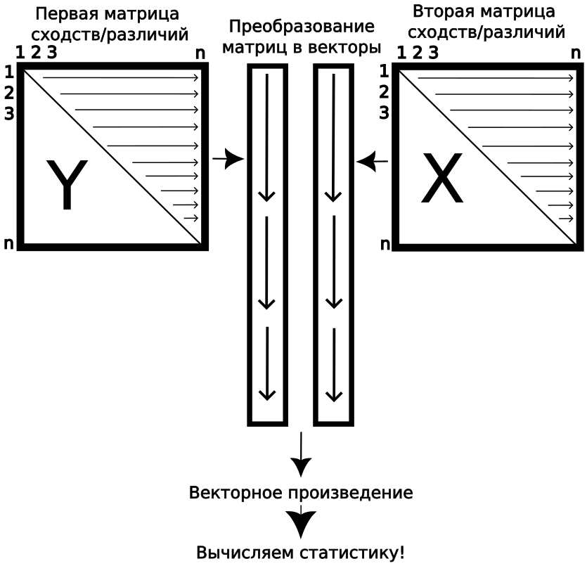
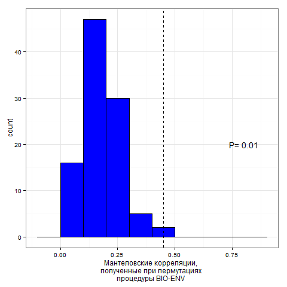
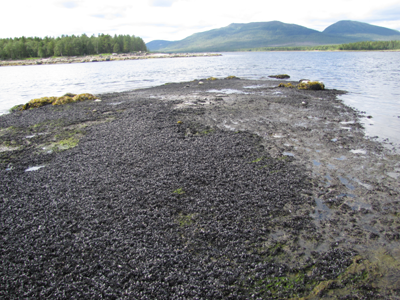

```{=html}
<style>
div#before-column p.forceBreak {
    #break-before: column;
}
div#after-column p.forceBreak {
    break-after: column;
}
</style>
```
## Вы сможете

-   Количественно оценить степень взаимосвязи между несколькими наборами данных.
-   Протестировать гипотезу о наличии в данных некоторого специфического паттерна, используя метод модельных матриц.
-   Найти оптимальное сочетание признаков, не вошедших в ординацию, которые "объясняют" характер взаиморасположения точек на ординации.

```{r setup, include = FALSE, cache = FALSE, purl = FALSE}
# output options
options(width = 70, scipen = 6, digits = 3)
library(knitr)
# chunk default options
opts_chunk$set(fig.align='center', tidy = FALSE, fig.width = 7, fig.height = 3, warning = FALSE)
```

## Ординация растительности на пастбищах северных оленей {.columns-2} 

Данные из работы\
Väre, H., Ohtonen, R. and Oksanen, J. (1995)


<small>из Väre, Ohtonen & Oksanen (1995)</small>

<br><br><br> \

```{r, message=FALSE}
library(vegan)
library(ggplot2)
data(varespec)
data(varechem)
```

Два набора данных:

-   `varespec` --- Описание растительности (обилия отдельных видов);
-   `varechem` --- Параметры среды на участках (Концентрации веществ).


<br /><br /><br /><br /><br /><br /><br />

## Задание

1.  Используя средства пакета "ggplot2", постройте ординацию описаний растительности в осях MDS.
2.  Раскрасьте точки в соответствии с концентрацией Al.
3.  На диаграмме приведите величину стресса для данной ординации

Hint. В качестве меры различия используйте коэффициент Брея-Куртиса.

## Решение {.columns-2 .smaller}

<!-- ```{r, eval=FALSE} -->

<!-- veg_ord <- metaMDS(varespec, trace = 0) -->

<!-- veg_MDS <- as.data.frame(veg_ord$points) -->

<!-- ``` -->

<!-- ```{r message=FALSE, eval=FALSE} -->

<!-- library(ggplot2) -->

<!-- Pl_mds <-  -->

<!--   ggplot(veg_MDS, aes(x = MDS1, y = MDS2,  -->

<!--                     fill = varechem$Al))  + -->

<!--   geom_point(shape=21, size =4)+ -->

<!--   ggtitle(paste("Stress = ", round(veg_ord$stress, 2))) +  -->

<!--   theme_bw() + -->

<!--   theme(legend.position = "bottom") + -->

<!--   labs(fill = "Aluminium concentration") + -->

<!--   scale_fill_gradient(high = "red", low = "yellow")  -->

<!-- ``` -->

```{r, fig.height=5, fig.width=5, message=FALSE}
veg_ord <- metaMDS(varespec, trace = FALSE)
veg_MDS <- as.data.frame(veg_ord$points)

```

```{r, message=FALSE}
library(ggplot2)
Pl_mds <- 
  ggplot(veg_MDS, aes(x = MDS1, y = MDS2, 
                    fill = varechem$Al))  +
  geom_point(shape=21, size =4)+
  ggtitle(paste("Stress = ", 
                round(veg_ord$stress, 2))) + 
  theme_bw() +
  theme(legend.position = "bottom") +
  labs(fill = "Aluminium concentration") +
  scale_fill_gradient(high = "red", 
                      low = "yellow") 

```


<br /><br /><br /><br /><br /><br /><br />

```{r, fig.height=5, fig.width=5, echo=FALSE}
Pl_mds
```

## Анализ связи с переменными c помощью функции envfit()

**Задание**: Постройте рисунок, который будет отражать связь полученной ординации с изученными переменными среды (датасет `varechem`).

## Решение {.columns-2 .smaller}

```{r}
env_fit <- envfit(veg_ord ~ ., data = varechem)
```

```{r, fig.height=4.5, fig.width=4.5}
ordiplot(veg_ord, display = "site")
plot(env_fit)
```

## Анализ связи с переменными c помощью функции ordisurf()

**Задание**: Постройте рисунок, который будет отражать связь полученной ординации с концентрацией Mn и Al.

## Решение 


```{r fig1, message=FALSE, results='hide', fig.height=3.5, fig.width=4, fig.align='center'}
env_fit2 <- envfit(veg_ord ~ Al + Mn, data = varechem)
plot(veg_ord, display = "site")
plot(env_fit2, col = "red")
ordisurf(veg_ord, varechem$Al, add = TRUE, col="blue")
ordisurf(veg_ord, varechem$Mn, add = TRUE, col="green")
```

## **Вопрос:**

Сможем ли мы на основе данных, полученных с помощью функций `envfit()` или `ordisurf()`, построить оптимальную модель, описывающую связь структуры сообществ и параметров среды?


## Оценка связи между данными

Можно оценивать отношения между:

>- исходными данными (следующие лекции);

>- матрицами попарных расстояний между объектами в исходных данных (**текущая лекция!**).

# Тест Мантела

## Постановка проблемы

Нам необходимо оценить связаны ли два набора данных и оценить силу этой связи.

**Похожие задачи:**

> Зависит ли растительность от параметров среды?\

> Связаны ли морфологические признаки и экспрессия генов?\

> Связаны ли характеристики паразитов и хозяев?

и т.п.

## Метод сравнения сопряженных матриц, описывающих попарные расстояния (или сходства), был предложен Натаном Мантелом

<center></center>

## Корреляция матриц сходства/различия

Если две матрицы сопряжены, то меры сходства/различия в одной матрице должны быть подобны мерам сходства/различия в другой матрице.

```{r}
dist_com <- vegdist(varespec, method = "bray")
dist_chem <- vegdist(varechem, method = "euclidean")
```

```{r, echo=FALSE, fig.width=5, fig.height=4, message=FALSE}
x <- as.vector(dist_com)
y <- as.vector(dist_chem)
R <- round(cor(x, y, method = "spearman"), 3)
xy <- data.frame (x, y)
mant <- ggplot(xy, aes(x = x, y = y))
mant + geom_point(size = 3) + xlab ("Biological dissimilarity") + ylab ("Chemical dissimilarity") + annotate("text", x = 0.25, y = 0.35, label = paste("Rspearmen =", R, sep = " "), size = 3) + theme_bw() + geom_smooth(method = "lm", se = FALSE)

```

## Корреляция матриц сходства/различия {.columns-2}



<small>из Legendre, Legendre (2012)</small>

Вопрос: Как можно определить статистическую значимость полученного коэффициента корреляции?

> -   Внимание! Значимость этой корреляции нельзя оценивать как для обычной корреляции, например функцией `cor.test()` или по таблице пороговых значений коэффициента корреляции.

# Пермутационные методы оценки статистической значимости {.smaller}

<p style="text-align:right">

-- Друг мой, -- отвечал Диоталлеви, -- ты никогда ничего не поймешь. Да, это правда, что Тора -- я имею в виду, разумеется, видимую Тору -- есть лишь одна из перестановок-*пермутаций* букв, составляющих вековечную Тору, какою создал ее Творец и какой ее дал Адаму. Умберто Эко\
"Маятник Фуко"

</p>

## Тестирование простейшей гипотезы

Создадим две выборки из популяций с нормальным распределением признака, с заведомо отличающимися средними значениями.

```{r}
set.seed(12345)

male <- rnorm(100, 130, 5)
female <- rnorm(100, 129,5)
```

## Частотное распределение этих двух выборок выглядит так:

```{r, echo=FALSE, fig.height=5, fig.width=7, message=FALSE}
size <- data.frame(L=1:200, gender=1:100)
size$L <- male
size$gender <- "m"
size$L[101:200] <- female
size$gender[101:200] <- "f"
size$gender <- as.factor(size$gender)
pl <- ggplot(size, aes(x=L, ..density..))
pl <- pl + theme_bw()  + geom_histogram(binwidth = 5, fill = "gray", color = "black") + facet_grid(gender~.) 
pl 
```

## Сравним две выборки с помощью t-критерия Стьюдента

Какая статистика используется в t-критерии?

>-   $t= \frac {X1-X2} {SE}$

## Сравним две выборки с помощью t-критерия Стьюдента

Результаты

```{r}
t <- t.test(male, female)
t
```

Что означает выражение p-value = `r t$p.value`?

## Пермутационный подход к тестированию

Если две сравниваемые выборки взяты из одной совокупности (справедлива $H_0$), то обмен элементами между ними ничего не изменит. Степень различия между выборками (значение статистики) останется более или менее тем же самым.

<p class="forceBreak">

</p>

**Пермутации --- это перестановки.**

Полное количество пермутаций (при равном количестве объектов в двух группах) будет вычисляться по следующей формуле:

$$K= \frac{(2n)!}{(2!(n!)^2)}$$

При большом объеме выборок это огромное число!

В таких случаях используют метод Монте-Карло.

## Пермутационный метод вручную

Применим этот метод (на очень примитивном уровне) к нашим двум выборкам, описывающим размеры мальчиков и девочек (векторы male и female).

```{r}
head(male)
head(female)
```

## Пермутационный метод вручную

Введем статистику:

$$t= \frac {X_1 - X_2}{ \sqrt {SE_1^2+SE_2^2}}$$

Вычислим значение этой статистики при сравнении векторов male и female:

```{r}
SE_m <- sd(male) / sqrt(length(male))
SE_f <- sd(female) / sqrt(length(female))
t_initial <- (mean(male) - mean(female))/sqrt(SE_m^2 + SE_f^2)
```

Полученное значение t = `r t_initial`.

## Пермутационный метод вручную

При пермутациях мы должны поменять местами, например, male[10] = `r male[10]` и female[20] = `r female[20]`. А еще лучше поменять случайное количество элементов одной выборки на случайное количество элементов из другой выборки.

```{r}
f <- female
m <- male
num_perm <- sample(1:100, 1)
order_m <- sample(1:100, num_perm)
order_f <- sample(1:100, num_perm)
f[order_f] <- male[order_f]
m[order_m] <- female[order_f]
SE_m <- sd(m) / sqrt(length(m))
SE_f <- sd(f) / sqrt(length(f))
t_p <- (mean(m) - mean(f)) / sqrt(SE_m^2 + SE_f^2)
```

После этой пермутации у нас получилось значение $t_{perm}$ = `r t_p`, а исходное значение было t = `r t_initial`.

## Пермутационный метод вручную

Теперь нужно провести процедуру пермутации много раз и получить распределение значений статистики $t_{perm}$.

```{r, echo=TRUE}
Nperm = 10000
tperm <- rep(NA, Nperm)

set.seed(12345)
for (i in 1:(Nperm-1)) 
  {
  BOX <- c(male ,female)
  ord <- sample(1:200, 200)
  f <- BOX[ord[1:100]]
  m <- BOX[ord[101:200]]
  SE_m <- sd(m) / sqrt(length(m))
  SE_f <- sd(f) / sqrt(length(f))
  tperm[i]=(mean(m) - mean(f))/sqrt(SE_m^2 + SE_f^2)
}

head(tperm)
```

## Пермутационный метод вручную

Посмотрим в конец этого вектора.

```{r}
tail(tperm)
```

Последнее 10000-е значение не заполнено!\
В него надо вписать исходное, полученное до пермутаций, значение t = `r t_initial`. Это необходимо, так как мы тестируем гипотезу о принадлежности этого значения случайному распределению.

```{r}
tperm [Nperm] <- t_initial
```

## Пермутационный метод вручную

Построим частотное распределение пермутированных значений статистики $t_{perm}$.

```{r, echo=FALSE, fig.width=7, fig.height=5, warning=FALSE, message=FALSE}
tperm <- as.data.frame(tperm)
names(tperm) <- "t_p" 
tperm_pl <- ggplot(tperm, aes(x=t_p))
tperm_pl <- tperm_pl + geom_histogram (bin=0.4, fill="blue", colour="black") + theme_bw() + xlab("Пермутационные значения статистики") + geom_vline(xintercept=c(t_initial, -t_initial), linetype=2)
tperm_pl
```

## Пермутационный метод вручную

Рассчитаем величину уровня значимости $p_{perm}= \frac{N_{t_{perm}>=t}}{N_{perm}}$:

```{r, warning=FALSE}
p_perm <- length(tperm[tperm >= t_initial] | tperm[tperm 
                                                   <= -t_initial]) / Nperm
```

Мы получили уровень значимости $p_{perm}$ = `r p_perm`.

Сравним его с уровнем значимости, вычисленным с помощью параметрического t-критерия p = `r t$p.value`.

Они оба близки и оба выявляют значимые различия!

## Пермутационная оценка коэффициента корреляции

Создадим два скоррелированных вектора.

```{r}
library(MASS)
set.seed(1234567)
mu <- c(10, 20) #Вектор средних значений
Sigma <- matrix(.7, nrow=2, ncol=2) #Ковариационная матрица
diag(Sigma) <- c(1, 3)

dat <- as.data.frame(mvrnorm(n=100, mu=mu, Sigma=Sigma)) 

# Датафрейм с двумя скоррелированными переменными
cor.test(dat$V1, dat$V2, method = "spearman")

```

## Пермутационная оценка коэффициента корреляции

```{r, message=FALSE}
library(coin)

spearman_test(V1 ~ V2, data = dat, 
              distribution = approximate(nresample=9999))

```

## Проверка статистической значимости Мантеловской корреляции {.smaller}

Для оценки достоверности Мантеловской корреляции применяется пермутационная процедура. Эта процедура реализована в функции `mantel()` из пакета `vegan`. 

Возвращаемся к данным с начала лекции: описание растительности и параметров среды (их матрицы сходства/различия). 

```{r}
options(digits=4)
mant <- mantel(dist_com, dist_chem, method="pearson", permutations = 9999)
mant
```

Вероятность наблюдать такое значение при условии, что верна $H_0$, равна `r mant$signif`.

## Частная Мантеловская корреляция {.columns-2}

```{r, echo=FALSE}
geo <- read.table("data/Coordinates.txt",  
                  header = TRUE, sep = "\t")
dist_geo <- vegdist(geo[, -1], 
                  method = "euclidean")
```


<small>из Väre, Ohtonen & Oksanen (1995)</small>

В материале есть одна проблема

> -   Cходство между отдельными описаниями может быть обусловлено не только их биологическими свойствами, но и тем, что они просто располагаются ближе друг к другу в пространстве.\
> -   Корреляция между биологическими признаками и химическими должна оцениваться при учете еще одной матрицы --- **Матрицы географических расстояний**. 

## Частная Мантеловская корреляция {.smaller}

```{r}
mantel_partial <- mantel.partial(xdis = dist_com, ydis = dist_chem, 
                                 zdis = dist_geo, method = "pearson",
                                 permutations = 9999)
mantel_partial
```

## Частная Мантеловская корреляция {.smaller}

```{r, echo=FALSE}
mant

mantel_partial
```


# Подбор оптимальной модели: процедура BIO-ENV

## Постановка задачи

Необходимо выбрать предикторы, которые наилучшим образом объясняют поведение биологической системы.

$NB!$ Эта задача аналогична задачам, ставящимся в регрессионном анализе.

К. Кларком и M. Эйнсвортом был предложен метод BIO-ENV (Clarke, Ainsworth, 1993). Это непараметрический аналог пошагового регрессионного анализа.

## Процедура BIO-ENV

В этом анализе есть две сцепленные матрицы:

> -   Зависимая матрица (BIO) - матрица геоботанических описаний.
> -   Матрица-предиктор (ENV) - матрица химических параметров.

## Алгоритм процедуры BIO-ENV

> -   Расчёт матрицы взаимных расстояний между объектами для зависимой матрицы $D_{BIO}$ (с помощью vegdist). Используются все переменные.
> -   Вычисление **всех** возможных матриц взаимных расстояний между объектами для всех возможных комбинаций признаков матрицы ENV --- $D_{ENV_i}$. **ВНИМАНИЕ!** В результате матриц будет $2^p-1$, т.к. матрица-предиктор имеет $p$ переменных.
> -   Расчёт мантеловской корреляции между каждой из матриц $D_{ENV_i}$ (предиктор) и матрицей $D_{BIO}$ (описания).
> -   Находится матрица $D_{ENV_i}$, имеющая максимальное значение мантеловской корреляции.
> -   Вывод признаков матрицы ENV, на основе которых получена максимально подобная матрица $D_{ENV_i}$.

## Функция bioenv() из пакета vegan

```{r, results='hide'}
BioEnv <- bioenv(varespec, varechem, method = "spearman", index = "bray")
```
```{r}
BioEnv
```

## Оценка достоверности результатов

**Внимание!** Не надо оценивать достоверность результата процедуры BIO-ENV путем оценки достоверности мантеловской корреляции между $D_{BIO}$ и матрицей, полученной в результате применения BIO-ENV $D_{ENV}$. **Это будет жульничеством**, так как это уже максимально подобная матрица. <br /><br /> Для оценки достоверности полученного результата применяется пермутационный метод, основанный на **многократном повторении самой процедуры BIO-ENV**. <br /><br /> **Внимание!** Это занимает очень много времени.

## Алгоритм оценки достоверности применения процедуры BIO-ENV {.columns-2}



1.  Применяем процедуру BIO-ENV и находим лучшее сочетание переменных в матрице-предикторе (ENV).
2.  Пермутируем зависимую матрицу (BIO).
3.  Применяем процедуру BIO-ENV к пермутированной матрице и вновь находим наилучшее сочетание, сохраняем значение Мантеловской корреляции.
4.  Повторяем шаги 2 и 3 многократно, получаем распределение пермутационных статистик.
5.  Вычисляем уровень значимости способом, принятым при пермутационной оценке.

## Трактовка результатов BIO-ENV?

Задание: Постройте ординацию описаний в осях nMDS и отразите на этой диаграмме векторы, соответствующие результатам процедуры `BIO-ENV`.

## Решение

```{r, fig.height=5}
plot(veg_ord, display = "site")
plot(envfit(veg_ord ~ N + P + Al + Mn + Baresoil, data = varechem))
```

# Тестирование гипотезы о соответствии ожидаемому паттерну: метод модельных матриц

## Пример: Динамика сообществ мидиевых банок {.columns-2 .smaller}

Существуют ли направленные многолетние изменения в размерной структуре поселений мидий и в структуре сообщества (Khaitov, 2013)?

```{r}
com <- read.csv("data/mussel_beds.csv", 
                sep=';', header = T)

ascam <- read.csv("data/ASCAM.csv", 
                  sep=';', header = T)
```

`com` --- усредненные данные по обилию `r ncol(com[,-c(1:3)])` видов для 3 мидиевых банок (Vor2, Vor4, Vor5).

`ascam` --- (averaged size class abundance matrix) средние плотности поселения мидий разных размеров (`r ncol(ascam[, -c(1:2)])`] размерных классов).



## Задание {.columns-2 .smaller}

```{r dynam-1, echo=FALSE, results='hide', message=FALSE}
library(vegan)

log_com <- decostand(com[,-c(1:3)], method = "log")

vor2_log_com <- log_com[com$Bank == "Vor2",]

log_ascam <- decostand(ascam[, -c(1:2)], method = "log")

mds_vor2_com <- as.data.frame(metaMDS(vor2_log_com)$points)

vor2_log_ascam <- log_ascam[ascam$Bank == "Vor2",]

mds_vor2_ascam <- as.data.frame(metaMDS(vor2_log_ascam, 
                                        distance = "euclid")$points)
```

```{r dynam-2, echo=FALSE, message=FALSE, fig.height=5.5, fig.width=5}
library(ggplot2)
library(gridExtra)
theme_set(theme_bw())

Pl1 <- ggplot(mds_vor2_com, aes(x=MDS1, y=MDS2)) + geom_point() + 
  geom_path() + geom_text(label = com$Year[com$Bank == "Vor2"]) + 
  ggtitle("Динамика сообщества")

Pl2 <- ggplot(mds_vor2_ascam, aes(x=MDS1, y=MDS2)) + geom_point() + 
  geom_path() + geom_text(label = com$Year[com$Bank == "Vor2"]) + 
  ggtitle("Динамика размерной структуры")

grid.arrange(Pl1, Pl2)
```

Рассмотрите многолетние изменения структуры сообщества и размерной структуры мидий на мидиевой банке Vor2.

Постройте рисунок, аналогичный приведенному на данном слайде.

Hint 1. Прологарифмируйте данные.

Hint 2. Примените наиболее подходящий коэффициент для оценки различий между объектами.

## Решение

### Ординация

```{r dynam-1, eval=FALSE}
```

## Решение

### График ординации

```{r dynam-2, eval=FALSE}
```

## Градиентная модельная матрица 

Это матрица Евклидовых расстояний между временными точками.

```{r}
gradient_model <- vegdist(com$Year[com$Bank == "Vor2"], method="euclidian")
gradient_model 
```

## Тестируем гипотезу о наличии градиента

Протестируем гипотезу о наличии временного градиента с помощью теста Мантела.

```{r}
dist_vor2_com <- vegdist(vor2_log_com, method = "bray")
dist_vor2_ascam <- vegdist(vor2_log_ascam, method = "euclidean")
```

### 1) Наличие градиента в структуре сообщества

```{r}
mantel(dist_vor2_com, gradient_model)
```

## Тестируем гипотезу о наличии градиента

### 2) Наличие градиента в размерной структуре мидий

```{r}
mantel(dist_vor2_ascam, gradient_model)
```

## Прослеживается ли связь между размерной структурой мидий и структурой сообщества?

### Не самое правильное решение

```{r}
mantel(dist_vor2_com, dist_vor2_ascam)
```

## Прослеживается ли связь между размерной структурой мидий и структурой сообщества?

### Более корректное решение

```{r}
mantel.partial(dist_vor2_com, dist_vor2_ascam, gradient_model)
```

## Могут быть и более сложные модельные матрицы {.columns-2}

Проверим, нет ли в динамике размерной структуры мидий на банке Vor2 циклических изменений, которые предсказываются некоторыми моделями динамики плотных поселений (Наумов, 2006; Khaitov, Lentsman, 2016).

```{r, echo=FALSE, fig.height=4, fig.width=4}
cycmod <- function(x){
  points <- data.frame(X=c(1:x), Y=c(1:x))
  for (i in 1:x) {
    points$X[i] <- cos(2*pi*(i-1)/x)
    points$Y[i] <- sin(2*pi*(i-1)/x)
  }
  return(points)
}

qplot(cycmod(nrow(mds_vor2_ascam))$X, cycmod(nrow(mds_vor2_ascam))$Y, xlab="X", ylab="Y", geom = "point", size = 4) + guides(size = "none") 
```

Циклическая модельная матрица.

```{r, echo=FALSE}
cycl_model <- round(vegdist(cycmod(nrow(mds_vor2_ascam)), method = "euclidean"))
cycl_model
```

## Выявляется ли циклическая составляющая в динамике размерной структуры?

```{r}
mantel(dist_vor2_ascam, cycl_model)
```

Циклическая составляющая есть, но...

## Более корректная оценка

```{r}
mantel.partial(dist_vor2_ascam, cycl_model, gradient_model)
```

Мы не можем говорить о наличии столь длительного цикла. При данной длине временного ряда нельзя отличить цикл с большим периодом от направленного изменения. Можно обсуждать только циклы с периодом не более половины длины временного ряда.

<!-- ## Модельные матрицы и ANOSIM -->

<!-- При проверке гипотезы о значимости различий между группами можно использовать тест Мантела. В этой ситуации модельная матрица будет содержать 0, если расстояние внутригрупповое, и 1 если расстояние межгрупповое.  -->

<!-- ```{r} -->

<!-- m <- vegdist(as.numeric(com$Bank), method = "euclidean")  -->

<!-- mm <- m -->

<!-- mm[m > 0] <- 1 -->

<!-- mm[m == 0] <- 0 -->

<!-- mantel(vegdist(log_com), mm, method = "pearson") -->

<!-- ``` -->

<!-- Значения теста Мантела будут очень близки к $R_{global}$ -->


# ANOSIM и SIMPER

## Вы сможете

 
- Протестировать гипотезу о различиях между дискретными группами многомерных данных с помощью теста ANOSIM.  
- Выявить переменные, вносящие наибольший вклад в формирование различий между группами, применив процедуру SIMPER. 

## Вспомним основы {.columns-2}


       

Этапы работы с гипотезами (из Underwood, 1997):

- Формулировка биологической гипотезы;  

- Численное выражение биологической гипотезы ($H$);  

- Формулировка альтернативной гипотезы ($H_0$ --- нулевой гипотезы);

- Тестирование нулевой гипотезы.  


Если $H_0$ ложна, то признаем, что верна $H$ и, следовательно, биологическую гипотезу можно рассматривать как истинное утверждение.  

Если $H_0$ истинна, то…  


# ANOSIM: Analysis Of Similarity

## ANOSIM

ANOSIM --- анализ сходства. Анализ используется для выявления различий в матрицах сходств/различия между группами. Представляет собой специальную форму теста Мантела, впервые был предложен К.Кларком и Р.Грином в 1988 году. 

ANOSIM --- непараметрический тест, результаты которого можно было бы отразить на ординации nMDS. 

## Пример: Динамика сообществ мидиевых банок {.columns-2 .smaller}

Существуют ли различия в сообществах мидиевых банок, сформированных старыми и молодыми мидиями (Khaitov, 2013)?


<br>
<br>
<br>
```{r, echo=TRUE}
com <- read.csv("data/mussel_beds.csv", sep=';', header = T)

com$Mussel_size <- factor(com$Mussel_size)

ascam <- read.csv("data/ASCAM.csv", sep=';', header = T)
```

<br>
<br>

`com` --- усредненные данные по обилию `r ncol(com[,-c(1:3)])` видов для 3 мидиевых банок (Vor2, Vor4, Vor5).         
`ascam` --- (averaged size class abundance matrix) средние плотности поселения мидий разных размеров (`r ncol(ascam[, -c(1:2)])`] размерных классов).


## Задание

- Постройте ординацию всех описаний датасета `com` (прологарифмированные данные) в осях nMDS на основе матрицы Брея-Куртиса.
- Раскрасьте разными цветами точки, относящиеся к двум разным группам: "Large-dominated" и "Small-dominated".


## Решение

```{r}
library(vegan)
library(ggplot2)

log_com <- log(com[,-c(1:3)] + 1)

ord_log_com <- metaMDS(log_com, distance = "bray", k=2, 
                       autotransform = FALSE, trace = 0)
MDS <- data.frame(ord_log_com$points)

```

## Решение

Обратите внимание, здесь есть две группы расстояний между точками. 

```{r, fig.width=6, fig.height=3.5}
ggplot(MDS, aes(x = MDS1, y = MDS2, fill = com$Mussel_size)) + 
  geom_point(shape = 21, size = 4) + 
  scale_fill_manual(values = c("red", "blue")) + 
  labs(fill = "Mussel size structure type") + 
  ggtitle(paste("Stress = ", round(ord_log_com$stress, 3), sep = " "))
```

## Расстояния между объектами {.columns-2}

### 1. Внутригрупповые расстояния 


<br />

### 2. Межгрупповые расстояния


## Ранги расстояний

Для работы удобно (но не обязательно!) перейти от исходных расстояний между объектами, к их рангам.

Обозначим внутригрупповые расстояния (ранги), как $r_w$, а межгрупповые, как $r_b$.

Вычислим  

* средние значения внутригрупповых рангов расстояний $R_w$;
* средние значения межгрупповых рангов расстояний $R_b$.


## R-статистика

На основе полученных значений можно построить статистику (Clarke, 1988, 1993):

$$R_{global} = \frac{R_b-R_w}{n(n-1)/4}$$
Эта статистика распределена в интервале -1 < $R_{global}$ < 1

$R_{global}$ -- оценивает степень разделенности групп в пространстве признаков.

$R_{global} > 0$  -- как минимум есть тенденция к разделению групп.

$R_{global} \rightarrow 1$  -- группы разделяются хорошо.

$R_{global} \leq 0$  -- нет разделения на группы.

Статистическая значимость этой величины оценивается пермутационным методом.

# ANOSIM вручную

## Ранги расстояний в пространстве признаков

**Задание:**

1. Вычислите матрицу коэффициентов Брея-Куртиса на основе матрицы `log_com`.
2. Разверните полученную матрицу в вектор. 
3. На основе полученного вектора создайте вектор, содержащий ранги расстояний.


## Решение

```{r}
dist_com <- vegdist(log_com, method = "bray")

rank_dist_com <- rank(dist_com)

```

## Внутри- и межгрупповые расстояния

**Задание:**

4. Создайте треугольную матрицу `dummy_dist`, той же размерности, что и матрица `dist_com`, в которой `0` будет с стоять в тех ячейках, которые соответствуют межгрупповым расстояниями, а   `1` -- внутригрупповым.    

## Решение

```{r}
dummy_dist <- dist(as.numeric(factor(com$Mussel_size)))

dummy_dist <- ifelse(dummy_dist == 0, 0, 1)

```


## R-статистка

**Задание:**

5. Вычислите средние значения рангов внутри- и межгрупповых расстояний.
6. Вычислите R-статистику.


## Решение


```{r, message=FALSE}
dists <- data.frame(rank_dist = rank_dist_com,
                    dummy = as.vector(dummy_dist))

library(dplyr)

mean_dists <- dists %>% 
  group_by(dummy) %>% 
  summarize(rank_mean = mean(rank_dist))

n <- nrow(log_com)

R_glob <- (mean_dists$rank_mean[2] - mean_dists$rank_mean[1]) / 
  (n * (n - 1)/4) 
```


> Вопрос: Каков дальнейший ход процедуры `ANOSIM`?


## Пермутации


**Задание:**

7. Напишите пользовательскую функцию (пусть она будет называться `R_perm`), которая пермутировала бы принадлежность каждого объекта к той или иной группе и вычисляла бы значение R-статистики для новой комбинации.
8. Используя функцию `for()` вычислите 10000 значений R-статистики и запишите их в вектор.


Hint. Весь код для пользовательской функции почти такой же, как ранее писали.


## Решение


```{r}
# функция. Весь код почти такой же, как написали ранее.
R_perm <- function(comm, group){
  require(vegan)
  dist_com <- vegdist(comm)
  rank_dist_com <- rank(dist_com)
  dummy_dist <- dist(sample(as.numeric(group))) #Перемешиваем группы
  dummy_dist <- ifelse(dummy_dist == 0, 0, 1)
  dists <- data.frame(rank = rank_dist_com, 
                      dummy = as.vector(dummy_dist))
  require(dplyr)
  mean_dists <- dists %>% group_by(dummy) %>% 
    summarize(rank_mean = mean(rank))
  n <- nrow(log_com)
  R_p <- (mean_dists$rank_mean[2] - mean_dists$rank_mean[1]) / 
    (n * (n - 1)/4) 
  R_p
} 

R_perms <-  rep(NA, 10000)
for(i in 1:9999) R_perms[i] <- R_perm(comm = log_com, 
                                      group = com$Mussel_size)

```


Вопрос: Что надо добавить в вектор `R_perms`?


## Распределение пермутационных оценок R-статистики

**Задание:**

9. Постройте частотную гистограмму, характеризующую распределение пермутационных оценок.
10. Нанесите на нее полученное значение $R_{global}$.
10. Вычислите уровень значимости.

## Решение

```{r}
R_perms[10000] <- R_glob

Pl_manual <- ggplot(data.frame(R_perms), aes(x = R_perms)) + 
  geom_histogram(binwidth = 0.01) + 
  geom_vline(xintercept = R_glob, linetype = 2) + xlim(-0.4, 0.4) 

Pl_manual
```

## Решение

Вычисляем уровень значимости.

```{r}
p_level <- mean(R_perms >= R_glob)
p_level
```


# Процедура ANOSIM в пакете `vegan`

## Специализированная функция `anosim()`

```{r}
com_anosim <- anosim(log_com, 
           grouping = com$Mussel_size, 
           permutations = 9999, 
           distance = "bray")
```


## Задание

Изучите структуру объекта `com_anosim` и постройте частотное распределение значений $R_{global}$, полученных при каждом акте пермутации.

## Решение

```{r r-global, eval=TRUE}

anosim_perm <- data.frame(perm = com_anosim$perm)

anosim_perm[(com_anosim$permutations + 1), 1] <- com_anosim$statistic

Pl_prof <- ggplot(anosim_perm, aes(x = perm)) + 
  geom_histogram(binwidth = 0.01, color = "black", fill = "blue") + 
  geom_vline(xintercept = com_anosim$statistic, linetype = 2)  +
  xlim(-0.4, 0.4)
Pl_prof

```

## Сравним результаты ручной и автоматической обработки

```{r, echo=FALSE, fig.height=4}
library(gridExtra)
grid.arrange(Pl_manual, Pl_prof, ncol = 1)
```


## Результаты процедуры ANOSIM

```{r}
summary(com_anosim)
```

## Ограничения (Assumptions) для применения ANOSIM

### 1) Внутригрупповые расстояния (ранги) для разных групп должны иметь приблизительно равные медианы и пределы варьирования.

Для проверки этого допущения надо сравнить распределения внутригрупповых и межгрупповых расстояний (рангов).

Распределение расстояний имеет следующий вид:

```{r fig.width=5, fig.height=3.5, warning=FALSE}
plot(com_anosim)
```

## ANOSIM позволяет сравнивать одновременно и несколько групп

НО! Есть одно очень важное ограничение: 

### 2) Попарные сравненения групп можно осуществлять только если было показано, что $R_{global}$ статистически значимо.

Если это условие выполнено, то можно проводить попарные сравнения.

### Пример

Пусть у нас есть три группы объектов: A, B, C.  
Можно вычислить $R_{A vs B}$, $R_{A vs C}$, $R_{B vs C}$.


Но при больших объемах выборки даже незначительные различия будут достоверны. Важно обращать внимание не только на оценку статистической значимости, но и на значения R! 

**Важно!** При множественных сравнениях придется вводить поправку Бонферрони.

NB! Для сравнения нескольких групп многомерных объектов, есть более мощное средство --- **PERMANOVA**.


## Задание

- Постройте ординацию в осях nMDS, раскрасив точки в разные цвета в зависимости от номера мидиевой банки (переменная Bank);
- Проверьте гипотезу о различиях в структуре сообществ на разных банках;
- Проверьте условия применимости ANOSIM;
- Проведите попарное сравнение всех банок.


## Решение

### График ординации 

```{r fig.height = 4, fig.width=5}
ggplot(MDS, aes(x = MDS1, y = MDS2, fill = com$Bank)) + 
  geom_point(shape = 21, size = 4) + 
  scale_fill_manual(values = c("red", "blue", "green")) + 
  labs(fill = "Mussel beds") + 
  ggtitle(paste("Stress = ", round(ord_log_com$stress, 3), 
                sep = " "))
```

## Решение

### Проверка гипотезы о различиях в структуре сообществ на разных банках

```{r}
bed_anosim <- anosim(log_com, grouping = com$Bank, 
                     permutations = 999, distance = "bray")
bed_anosim
```

## Решение

### Условия применимости

```{r}
plot(bed_anosim)
```

## Решение

### Попарные сравнения Vor2 vs Vor4

```{r}
# Vor2 vs Vor4
anosim(log_com[com$Bank %in% c("Vor2", "Vor4"),], 
    grouping = com$Bank[com$Bank %in% c("Vor2", "Vor4")])
```

## Попарные сравнения Vor2 vs Vor5

```{r}
# Vor2 vs Vor5
anosim(log_com[com$Bank %in% c("Vor2", "Vor5"),], 
       grouping = com$Bank[com$Bank %in% c("Vor2", "Vor5")])
```

## Попарные сравнения Vor4 vs Vor5

```{r}
# Vor4 vs Vor5
anosim(log_com[com$Bank %in% c("Vor4", "Vor5"),], 
       grouping = com$Bank[com$Bank %in% c("Vor4", "Vor5")])
```

## Проблема малых выборок

Мощность ANOSIM невелика.

При малых выборках пермутационная оценка уровня значимости может не выявить достоверных различий, даже при очень высоком значении R.

# SIMPER: Similarity Percentages

## SIMPER: анализ процентного сходства

Данный анализ стремится оценить средний процентный вклад отдельных переменных в значения, полученные в матрице расстояний Брея-Куртиса.

Введён Кларком в 1993, несмотря на название исследует скорее различия, чем сходства между объектами. 

В результате выдаёт список видов, которые вносят наибольший вклад, для каждой из сравниваемых групп. 


## Какие признаки зависимой матрицы вносят наибольший вклад в формирование различий между группами? {.smaller}

```{r, R.options=list(width = 80)}
log_com_simper <- simper(log_com, group = com$Mussel_size, 
                         permutations = 999)
summary(log_com_simper)
```

## Оценка вклада в формирование различий

$$Contr_{ijk} = \frac{|{y_{ij}-y_{ik}}|}{\sum\limits_{i=1}^{S}{(y_{ij}+y_{ik})}}$$


$y_{i,j}-y_{i,k}$ --- разность значений $i$-той переменной (вида) в объектах (пробах) $j$ и $k$. $S$ --- количество всех видов. 

Итоговая статистика вычисляется как сумма вклада каждого отдельного вида:

$$d_{jk} = \sum\limits_{i = 1}^{S}d_{ijk}$$

## Результаты SIMPER 

$average$ –-- вклад, который признак вносит в различия;

$ava$ и $avb$ –-- среднее обилие в первой и второй группе, соответственно;

$sd$ –-- стандартное отклонение $average$;

$ratio$ --- $average/sd$; отношение вклада к отклонению. Характеризует дискриминирующую силу переменной;

$cumsum$ –-- накопленная степень различий.

## Задание

Выявите виды, отвечающие за различия в сообществах разных банок

## Решение

```{r R.options=list(width = 80)}
summary(simper(log_com, group = com$Bank, permutations = 999))
```

## Summary

-   Степень сопряженности двух наборов признаков можно оценивать с помощью теста Мантела.
-   Оценка достоверности теста Мантела и корреляций с признаками, вычисленными в процедуре `envfit()` проводится пермутационным методом
-   С помощью процедуры `BIO-ENV` можно выявить набор переменных в матрице-предикторе, которые обеспечивают наибольшее сходство с зависимой матрицей.
- ANOSIM --- простейший вариант сравнения нескольких групп объектов, охарактеризованных по многим признакам.
- С помощью процедуры SIMPER можно оценить вклад отдельных переменных в формирование различий между группами. 


## Другое программное обеспечение

PRIMER 6.

Здесь реализована расширенная процедура `BEST`.\
Она позволяет проводить не только полный перебор всех переменных в матрице-предикторе (Bio-Env), но и оптимизировать эту процедуру (BVStep). Кроме того, есть возможность оценивать достоверность результатов анализа. Но работает так же медленно.


## Что почитать

-   Oksanen, J., 2011. Multivariate analysis of ecological communities in R: vegan tutorial. R package version 2--0.
-   Clarke, K. R & Ainsworth, M. 1993. A method of linking multivariate community structure to environmental variables. Marine Ecology Progress Series, 92, 205--219.
-   Clarke, K. R., Gorley R. N. (2006) PRIMER v6: User Manual/Tutorial. PRIMER-E, Plymouth.
-   Legendre P., Legendre L. (2012) Numerical ecology. Second english edition. Elsevier, Amsterdam. (В этом издании приводятся ссылки на реализацию методов в R)
