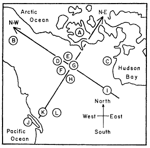
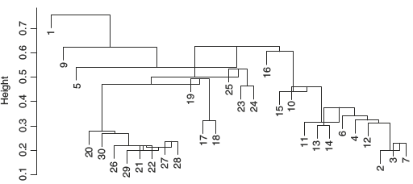
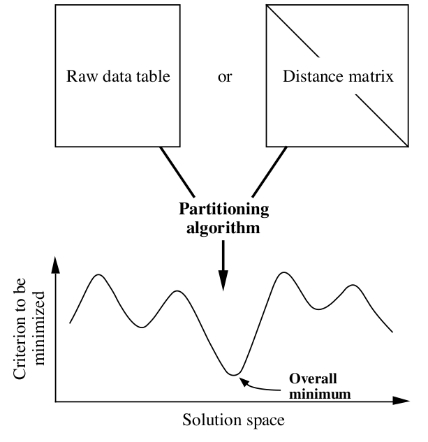
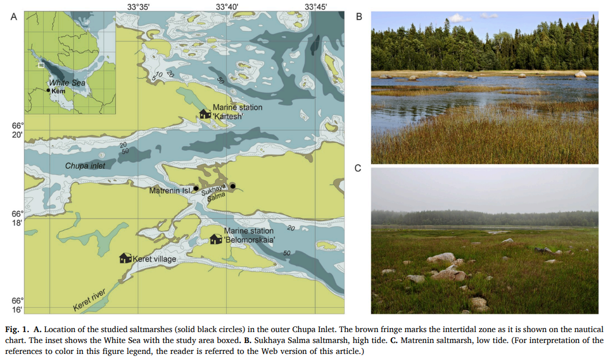
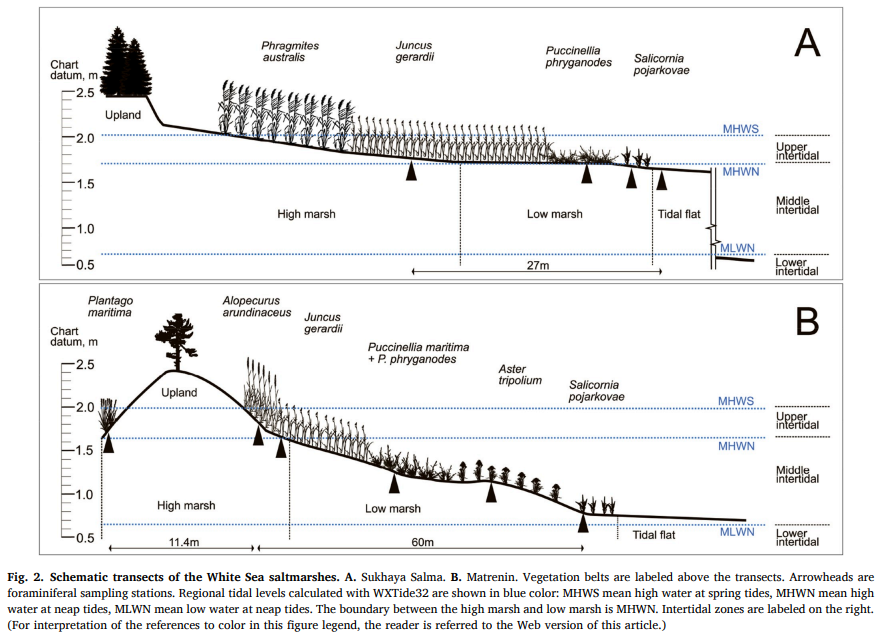
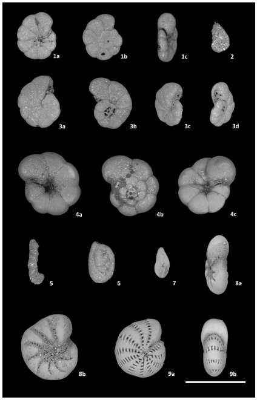
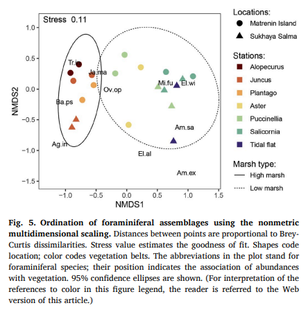
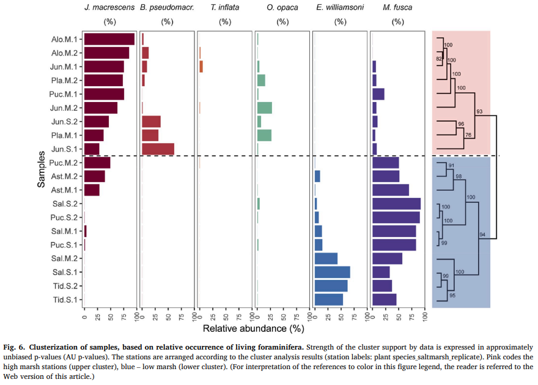

## Кластерный анализ

- Методы построения деревьев
- Методы кластеризации на основании расстояний
- Примеры для демонстрации и для заданий
- Кластерный анализ в R
- Качество кластеризации:
    - кофенетическая корреляция
    - ширина силуэта
    - поддержка ветвей
- Сопоставление деревьев: танглграммы
- Неиерархические методы кластеризации:
    - K-means
    - C-means
    - DBSCAN

---

### Вы сможете

- Выбирать подходящий метод агрегации (алгоритм кластеризации)
- Строить дендрограммы
- Оценивать качество кластеризации (кофенетическая корреляция, ширина силуэта, поддержка ветвей) 
- Сопоставлять дендрограммы, полученные разными способами, при помощи танглграмм


```{r setup, include = FALSE, cache = FALSE, purl = FALSE, fig.showtext = TRUE}
source("assets/xaringan_setup.R")
library(xaringanExtra)
use_tile_view()
use_scribble()
use_search(show_icon = FALSE)
use_progress_bar(color = "#C6FFE7", location = "bottom", height = "10px")
use_freezeframe()
# use_webcam()
# use_panelset()
# use_extra_styles(hover_code_line = TRUE)

# http://tachyons.io/docs/
# https://roperzh.github.io/tachyons-cheatsheet/
use_tachyons()
```


---

class: middle, center, inverse

# Пример: Волки

---

## Пример: Волки

Морфометрия черепов у волков в Скалистых горах и в Арктике (Jolicoeur, 1959)



Данные взяты из работы Morrison (1990):

- A --- волки из Арктики (10 самцов, 6 самок)
- L --- волки из Скалистых гор (6 самцов, 3 самки)

```{r, message=FALSE}
library(candisc)
data("Wolves")
```

---

## Знакомимся с данными

```{r}
dim(Wolves)
colnames(Wolves)
head(rownames(Wolves))
any(is.na(Wolves))
table(Wolves$group)
```

---

## Задание

- Постройте ординацию nMDS данных
- Оцените качество ординации
- Обоснуйте выбор коэффициента
- Раскрасьте точки на ординации волков в зависимости от географического происхождения (`group`)

---

## Решение

.scroll-box-20[
```{r results='hold', echo=-c(3, 4)}
library(vegan)
library(ggplot2); theme_set(theme_bw(base_size = 16))
update_geom_defaults("point", list(size = 4)); 
update_geom_defaults("text", list(size = 5))
st_w <- scale(Wolves[, 4:ncol(Wolves)]) ## стандартизируем
ord_w <- metaMDS(comm = st_w, distance = "euclidean", autotransform = FALSE)
dfr_w <- data.frame(ord_w$points, Group = Wolves$group)
gg_w <- ggplot(dfr_w, aes(x = MDS1, y = MDS2)) + 
  geom_point(aes(colour = Group)) + 
  scale_color_manual(labels = c("Самки из Арктики", "Самцы из Арктики",
                                "Самки из Скалистых гор", 
                                "Самцы из скалистых гор"), 
                      values = c("red", "green", "blue", "purple")) +
  labs(colour = "Группы")
```
]

---

## Решение

```{r fig-wolves, echo=FALSE, purl=FALSE}
gg_w
```

---

## Методы кластеризации

.pull-left[
### Иерархические методы

- методы построения деревьев (о них следующие слайды)
]

.pull-right[
### Неиерархические методы

- метод K-среднмх (K-means clustering) 
- метод нечёткой кластеризации C-средних (C-means clustering, fuzzy clustering)
- Основанная на плотности пространственная кластеризация для приложений с шумами (Density-based spatial clustering of applications with noise, DBSCAN)

]

---

## Какие бывают методы построения деревьев?

### Методы кластеризации на основании расстояний (о них сегодня)
  - Метод ближайшего соседа
  - Метод отдаленного соседа
  - Метод среднегруппового расстояния
  - Метод Варда
  - и т.д. и т.п.

### Методы кластеризации на основании признаков
  - Метод максимальной бережливости
  - Метод максимального правдоподобия

### И это еще далеко не всё!

---

class: middle, center, inverse

# Методы кластеризации на основании расстояний

---

## Этапы кластеризации 

.pull-left[
```{r fig-cluster-steps, echo=FALSE, cache=FALSE, opts.label='MxXL', purl=FALSE}
library(DiagrammeR)
DiagrammeR(
  "graph TD; 
           A(Набор признаков)-->B(Матрица расстояний или сходств); 
           B-->C(Группировка объектов);
           C-->D(Отношения между кластерами); D-->E(Поправки); E-->A;
           style A fill:#C6FFE7,stroke:#C6FFE7;
           style B fill:#C6FFE7,stroke:#C6FFE7;
           style C fill:#C6FFE7,stroke:#C6FFE7;
           style D fill:#C6FFE7,stroke:#C6FFE7;
           style E fill:#C6FFE7,stroke:#C6FFE7;
           style A color:#C6FFE7,stroke:#C6FFE7;
  ")
```
]

.pull-right[

Результат кластеризации зависит от

- выбора признаков
- коэффициента сходства-различия
- от алгоритма кластеризации

]

---

## Методы кластеризации

```{r fig-cluster-methods, echo=FALSE, purl=FALSE}
library(gridExtra)
library(ggtext)
theme_set(theme_bw(base_size = 16))
update_geom_defaults("point", list(size = 4))
cl_dat <- data.frame(cl = c(rep("A", 5), rep("B", 4)), 
                     x = c(1, 2.7, 2, 1.5, 2, 5, 6, 5.5, 5.8),
                     y = c(1, 1.2, 3, 2, 1.5, 1.2, 1, 3, 2))

segm_between <- function(ind1, ind2, dat){
  i_betw <- expand.grid(ind1, ind2)
  segm <- lapply(1:nrow(i_betw), function(i) cbind(dat[i_betw[i, 1], ], 
                                                   dat[i_betw[i, 2], ]))
  segm <- Reduce(rbind, segm)
  colnames(segm) <- c("x", "y", "xend", "yend")
  return(segm)
}

segm_within <- function(ind1, ind2, dat){
  # for ward
  dat1 <- dat[ind1, ]
  dat2 <- dat[ind2, ]
  with1 <- segm_between(1:nrow(dat1), nrow(dat1)+1, rbind(dat1, colMeans(dat1)))
  with2 <- segm_between(1:nrow(dat2), nrow(dat2)+1, rbind(dat2, colMeans(dat2)))
  segm <- rbind(with1, with2)
  return(segm)
}

betw_segm <- segm_between(1:5, 6:9, cl_dat[, 2:3])
with_segm <- segm_within(1:5, 6:9, cl_dat[, 2:3])

library(dplyr)
cl_means <- cl_dat %>% group_by(cl) %>% summarise(
  x = mean(x), y = mean(y)
)
betw <- as.matrix(dist(cl_dat[, 2:3]))[6:9, 1:5]
# which.min(betw)
# which.max(betw)
th <- theme_classic(base_size = 16) + theme(axis.line = element_blank(), 
                                            axis.title = element_blank(),
                                            axis.ticks = element_blank(), 
                                            axis.text = element_blank(), 
                                            legend.position = "none",
                                            plot.title = element_textbox_simple())

gg <- ggplot(cl_dat, aes(x = x, y = y, colour = cl)) + geom_point() + 
  stat_ellipse(level = 0.8) + geom_point(data = cl_means, size = 4, shape = 5) + th

gg_single <- gg + annotate(geom = "segment", x = 2.7, y = 1.2, 
                           xend = 5, yend = 1.2, colour = "grey60")

gg_complete <- gg + annotate(geom = "segment", x = 1, y = 1, 
                             xend = 6, yend = 1, colour = "grey60")

gg_average <- gg + geom_segment(data = betw_segm, aes(x = x, y = y, xend = xend, 
                                                      yend = yend, colour = NULL), 
                                colour = "grey60")

gg_ward <- gg + geom_segment(data = with_segm, aes(x = x, y = y, xend = xend, 
                                                   yend = yend, colour = NULL), 
                             colour = "grey60")

grid.arrange(gg_single + ggtitle("Метод ближайшего соседа"), gg_complete + 
               ggtitle("Метод отдаленного соседа"), gg_average + 
               ggtitle("Метод среднегруппового расстояния"), gg_ward + 
               ggtitle("Метод Варда"), ncol = 2)
```

---

## Метод ближайшего соседа


.pull-left-66[
.content-box-green[

__= nearest neighbour = single linkage__

- к кластеру присоединяется ближайший к нему кластер/объект
- кластеры объединяются в один на расстоянии, которое равно расстоянию между ближайшими объектами этих кластеров
]
]

.pull-right-33[

```{r fig-single, echo=FALSE, opts.label='SxS', purl=FALSE}
gg_single
```
]

### Особенности

- Может быть сложно интерпретировать, если нужны группы
  - объекты на дендрограмме часто не образуют четко разделенных групп
  - часто получаются цепочки кластеров (объекты присоединяются как бы по одному)
- Хорош для выявления градиентов

---

## Как работает метод ближайшего соседа

```{r ani-dat, include=FALSE, purl=FALSE}
# Данные
dat <- data.frame(x = c(9, 19, 30, 32, 38, 50, 20, 50), y = c(42, 40, 10, 30, 60, 35, 42, 31))
rownames(dat) <- LETTERS[1:8]
plot(dat, type = "n"); text(dat, rownames(dat))
# Кластеризация
hc_s <- hclust(dist(dat), method = "single")
hc_c <- hclust(dist(dat), method = "complete")
hc_a <- hclust(dist(dat), method = "average")

cluster_ani <- function(dat, gg_dat, dist_fun = "vegdist", dist_method = "euclidean", hclust_method = "average", k = nrow(dat)){
  library(vegan)
  library(ggplot2)
  library(ggalt)
  library(dendextend)
  library(cowplot)
  if (dist_fun == "vegdist") {
    d <- vegdist(dat, method = dist_method)
  } else if (dist_fun == "dist") {
    d <- vegdist(dat, method = dist_method)
  } else {
    stop("dist_fun should be either `vegdist` or `dist`")
  }

  hc <- hclust(d, method = hclust_method)
  den <- as.dendrogram(hc)
    # ordination plot
    gg_ord <- ggplot(data = gg_dat, aes(x = MDS1, y = MDS2, label = rownames(gg_dat))) +
      coord_fixed() +
      geom_point(size = 2) +
      geom_text(hjust = 1.2, vjust = 1.2) +
      geom_encircle(aes(group = cutree(hc, k = k)), colour = "red", s_shape = 0, expand = 0.001) +
      scale_y_continuous(expand=c(0.1,0.1))

    # dendrogram plot
    gg_tree <- function(){
      par(mar = c(2, 2, 0, 0))
      if (k == 1) {
        plot(den)
      } else {
        plot(den)
        rect.dendrogram(den, k = k, lty = 1, lwd = 1, border = "red")
      }
    }
    # together
    plot_grid(gg_ord, 
              gg_tree, 
              nrow = 1, rel_widths = c(0.65, 0.35), 
              hjust = 0, vjust = 1, scale = c(0.8, 0.9))
}

suppressWarnings(ord <- metaMDS(dat, distance = "euclidean", autotransform = FALSE))
gg_dat <- data.frame(ord$points)

gg_list_s <- lapply(8:1, function(x) cluster_ani(dat, gg_dat, hclust_method = "single", k = x))
gg_list_c <- lapply(8:1, function(x) cluster_ani(dat, gg_dat, hclust_method = "complete", k = x))
gg_list_a <- lapply(8:1, function(x) cluster_ani(dat, gg_dat, hclust_method = "average", k = x))
gg_list_w <- lapply(8:1, function(x) cluster_ani(dat, gg_dat, hclust_method = "ward.D2", k = x))
```

```{r fig-single-guess, opts.label='LxXXL', echo=FALSE, purl=FALSE}
ggplot(data = gg_dat, aes(x = MDS1, y = MDS2, label = rownames(gg_dat))) +
      geom_point(size = 2) +
      geom_text(hjust = 1.2, vjust = 1.2) +
      scale_y_continuous(expand=c(0.1,0.1))
```

---

## Как работает метод ближайшего соседа

```{r single-ani, echo=FALSE, purl=FALSE, opts.label='XLxXXL', fig.show='animate', interval=2, animation.hook='gifski', aniopts='control,loop', results='hide', purl=FALSE}
sapply(gg_list_s, plot)
```

---

## Метод отдаленного соседа


.pull-left-60[
.content-box-green[

__= furthest neighbour = complete linkage__

- к кластеру присоединяется отдаленный кластер/объект
- кластеры объединяются в один на расстоянии, которое равно расстоянию между самыми отдаленными объектами этих кластеров (следствие — чем более крупная группа, тем сложнее к ней присоединиться)
]]

.pull-right-25[

```{r fig-complete, echo=FALSE, opts.label='SxM', purl=FALSE}
gg_complete
```

]

### Особенности

- На дендрограмме образуется много отдельных некрупных групп
- Хорош для поиска дискретных групп в данных

---

## Как работает метод отдаленного соседа

```{r fig-complete-guess, opts.label='LxXXL', echo=FALSE, purl=FALSE}
ggplot(data = gg_dat, aes(x = MDS1, y = MDS2, label = rownames(gg_dat))) +
      geom_point(size = 2) +
      geom_text(hjust = 1.1, vjust = 1.1) +
      scale_y_continuous(expand=c(0.1,0.1))
```

---

## Как работает метод отдаленного соседа

```{r complete-ani, echo=FALSE, purl=FALSE, opts.label='XLxXXL', fig.show='animate', interval=2, animation.hook='gifski', aniopts='control,loop', results='hide', purl=FALSE}
sapply(gg_list_c, plot)
```

---

## Метод невзвешенного попарного среднего

.pull-left-66[
.content-box-green[

__= UPGMA = Unweighted Pair Group Method with Arithmetic mean__

- кластеры объединяются в один на расстоянии, которое равно среднему значению всех возможных расстояний между объектами из разных кластеров.
]]
.pull-right-33[

```{r fig-average, echo=FALSE, opts.label='SxM', purl=FALSE}
gg_average
```

]

### Особенности

- UPGMA и WUPGMС иногда могут приводить к инверсиям на дендрограммах
.pull-left-66[

]
.pull-right-33[
.pull-down[
из Borcard et al., 2011
]]

---

## Как работает метод среднегруппового расстояния

```{r average-ani, echo=FALSE, purl=FALSE, opts.label='XLxXXL', fig.show='animate', interval=2, animation.hook='gifski', aniopts='control,loop', results='hide'}
sapply(gg_list_a, plot)
```

---

## Метод Варда


.pull-left-66[.content-box-green[

__= Ward's Minimum Variance Clustering__

- объекты объединяются в кластеры так, чтобы внутригрупповая дисперсия расстояний была минимальной.
]


```{r fig-ward, echo=FALSE, opts.label='SxM', purl=FALSE}
gg_ward
```
]
.pull-left-33[
### Особенности

- метод годится и для неевклидовых расстояний несмотря на то, что внутригрупповая дисперсия расстояний рассчитывается так, как будто это евклидовы расстояния.]

---

## Как работает метод Варда

```{r ward-ani, echo=FALSE, purl=FALSE, opts.label='XLxXXL', fig.show='animate', interval=2, animation.hook='gifski', aniopts='control,loop', results='hide'}
sapply(gg_list_w, plot)
```

---

class: middle, center, inverse

# Кластерный анализ в R

---

## Кластеризация

Давайте построим деревья при помощи нескольких алгоритмов кластеризации (по стандартизованным данным, с использованием Евклидова расстояния) и сравним их.

```{r}
# Пакеты для визуализации кластеризации
library(ape)
library(dendextend)
```

```{r}
# Матрица расстояний
d <- dist(x = st_w, method = "euclidean")
```


---

## (1.0) Метод ближайшего соседа + `base`

```{r fig-single-base, opts.label='XLxL'}
hc_single <- hclust(d, method = "single")
plot(hc_single)
```

---

## (1.1) Метод ближайшего соседа + `ape`

```{r fig-single-ape, opts.label='XLxL'}
ph_single <- as.phylo(hc_single)
plot(ph_single, type = "phylogram")
axisPhylo()
```

---

## (1.2) Метод ближайшего соседа + `dendextend`

```{r fig-single-dend, opts.label='XLxL'}
den_single <- as.dendrogram(hc_single)
plot(den_single, horiz = TRUE)
```

---

## (2.1) Метод отдаленного соседа + `ape`

```{r fig-complete-ape, opts.label='XLxL'}
hc_compl <- hclust(d, method = "complete")
ph_compl <- as.phylo(hc_compl)
plot(ph_compl, type = "phylogram")
axisPhylo()
```

---

## (2.2)Метод отдаленного соседа + `dendextend`

```{r fig-complete-dend, opts.label='XLxL'}
den_compl <- as.dendrogram(hc_compl)
plot(den_compl, horiz = TRUE)
```

---

## (3.1) Метод невзвешенного попарного среднего (UPGMA) + `ape`

```{r fig-average-ape, opts.label='XLxL'}
hc_avg <- hclust(d, method = "average")
ph_avg <- as.phylo(hc_avg)
plot(ph_avg, type = "phylogram")
axisPhylo()
```

---

## (3.2) Метод невзвешенного попарного среднего (UPGMA) + `dendextend`

```{r fig-average-dend, opts.label='XLxL'}
den_avg <- as.dendrogram(hc_avg)
plot(den_avg, horiz = TRUE)
```

---

## (4.1) Метод Варда + `ape`

```{r fig-ward-ape, opts.label='XLxL'}
hc_w2 <-hclust(d, method = "ward.D2")
ph_w2 <- as.phylo(hc_w2)
plot(ph_w2, type = "phylogram")
axisPhylo()
```

---

## (4.2) Метод Варда + `dendextend`

```{r fig-ward-dend, opts.label='XLxL'}
den_w2 <- as.dendrogram(hc_w2)
plot(den_w2, horiz = TRUE)
```

---

class: middle, center, inverse

# Качество кластеризации

---

## Кофенетическая корреляция

__Кофенетическое расстояние__  — расстояние между объектами на дендрограмме, т.е. то расстояние, на котором объекты становятся частью одной группы в ходе процесса кластеризации.

.content-box-green[
__Кофенетическая корреляция__  — мера качества отображения многомерных данных на дендрограмме. Кофенетическую корреляцию можно рассчитать как Пирсоновскую корреляцию (обычную) между матрицами исходных и кофенетических расстояний между всеми парами объектов. В идеальном случае равна 1. 
]


<br/>

Метод агрегации, который дает наибольшую кофенетическую корреляцию, дает кластеры, лучше всего отражающие исходные данные.

Матрицу кофенетических расстояний и кофенетическую корреляцию можно рассчитать при помощи функций из пакета `stats` (`dendextend`) и `ape`, соответственно.

---

## Кофенетическая корреляция в R

```{r}
# Матрица кофенетических расстояний 
c_single <- cophenetic(ph_single)

# Кофенетическая корреляция = 
# = корреляция матриц кофенетич. и реальн. расстояний
cor(d, as.dist(c_single))
```

---

## Задание:

Оцените при помощи кофенетической корреляции качество кластеризаций, полученных разными методами.

Какой метод дает лучший результат?

---

## Решение:

```{r}
c_single <- cophenetic(ph_single)
cor(d, as.dist(c_single))

c_compl <- cophenetic(ph_compl)
cor(d, as.dist(c_compl))

c_avg <- cophenetic(ph_avg)
cor(d, as.dist(c_avg))

c_w2 <- cophenetic(ph_w2)
cor(d, as.dist(c_w2))
```


---

## Что можно делать дальше с дендрограммой

- Можно выбрать число кластеров: 
    + либо субъективно, на любом выбранном уровне (главное, чтобы кластеры были осмысленными и интерпретируемыми);
    + либо исходя из распределения расстояний ветвления.
- Можно оценить стабильность кластеризации при помощи бутстрепа.

---

## Ширина силуэта

.content-box-green[
Ширина силуэта $s_i$ --- мера степени принадлежности объекта $i$ к кластеру 
]

$$s_i = \frac {\color{purple}{\bar{d}_{i~to~nearest~cluster}} - \color{green}{\bar{d}_{i~within}}} {max\{\color{purple}{\bar{d}_{i~to~nearest~cluster}}, \color{green}{\bar{d}_{i~within}}\}}$$

$s_i$ --- сравнивает между собой средние расстояния от данного объекта:
- $\color{green} {\bar{d}_{i~within}}$ --- до других объектов из того же кластера
- $\color{purple} {\bar{d}_{i~to~nearest~cluster}}$ --- до ближайшего кластера


$-1 \le s_i \le 1$ --- чем больше $s_i$, тем "лучше" объект принадлежит кластеру.

- Средняя ширина силуэта для всех объектов из кластера --- оценивает, насколько "тесно" сгруппированы объекты.
- Средняя ширина силуэта по всем данным --- оценивает общее качество классификации.
- Чем больше к 1, тем лучше. Если меньше 0.25, то можно сказать, что нет структуры.

---

## Как рассчитывается ширина силуэта

Оценим ширину силуэта для 3 кластеров

```{r fig-silhouette}
library(cluster)
avg3 <- cutree(tree = hc_avg, k = 3) # делим дерево на нужное количество кластеров
plot(silhouette(x = avg3, dist = d), cex.names = 0.6)
```

---

## Бутстреп

.content-box-green[
__Бутстреп__ --- один из методов оценки значимости полученных результатов; повторная выборка из имеющихся данных. В такой выборке элементы могут повторяться.]

### Алгоритм
- Имеющиеся данные делим на группы одинакового размера: какие-то элементы могут отсутствовать, а какие-то --- повторяться несколько раз. 
- На основе полученных данных строим дендрограмму. 
- Повторяем всё много раз.   

---

## Бутстреп поддержка ветвей


> "An approximately unbiased test of phylogenetic tree selection."
>
> --- Shimodaria, 2002

Этот тест использует специальный вариант бутстрепа --- multiscale bootstrap. Мы не просто многократно берем бутстреп-выборки и оцениваем для них вероятность получения топологий (BP p-value), эти выборки еще и будут с разным числом объектов. По изменению BP при разных объемах выборки можно вычислить AU (approximately unbiased p-value). 

```{r}
library(pvclust)
set.seed(389)
# итераций должно быть 1000 и больше, здесь мало для скорости
cl_boot <- pvclust(t(st_w), method.hclust = "average", nboot = 100, 
                   method.dist = "euclidean", parallel = TRUE, iseed = 42)
```

Обратите внимание на число итераций: `nboot = 100` --- это очень мало. На самом деле нужно 10000 или больше.

---

## Дерево с величинами поддержки

AU --- approximately unbiased p-values (красный),
BP --- bootstrap p-values (зеленый)

```{r fig-cl-boot, fig.show='hold', opts.label='XLxL'}
plot(cl_boot)
pvrect(cl_boot) # достоверные ветвления
```

---

## Для диагностики качества оценок AU

График стандартных ошибок для AU p-value нужен, чтобы оценить точность оценки самих AU. Чем больше было бутстреп-итераций, тем точнее будет оценка AU.

```{r fig-seplot, fig.show='hold', opts.label='XLxL'}
seplot(cl_boot)
# print(cl_boot) # все значения
```

---

class: middle, center, inverse

# Сопоставление деревьев: Танглграммы

---

## Танглграмма

Два дерева (с непохожим ветвлением) выравнивают, вращая случайным образом ветви вокруг оснований. Итеративный алгоритм. Картина каждый раз разная.

```{r fig-tang, eval=FALSE, opts.label='XLxL'}
set.seed(395)
untang_w <- untangle_step_rotate_2side(den_compl, den_w2, print_times = F)

# танглграмма
tanglegram(untang_w[[1]], untang_w[[2]],
           highlight_distinct_edges = FALSE,
           common_subtrees_color_lines = F,
           main = "Tanglegram",
           main_left = "Left tree",
           main_right = "Right tree",
           columns_width = c(8, 1, 8),
           margin_top = 3.2, margin_bottom = 2.5,
           margin_inner = 4, margin_outer = 0.5,
           lwd = 1.2, edge.lwd = 1.2, 
           lab.cex = 1.5, cex_main = 2)
```

---

## Танглграмма

```{r fig-tang, eval=TRUE, echo=FALSE, opts.label='XLxL'}
```

---

## Задание

Постройте танглграмму из дендрограмм, полученных методом ближайшего соседа и методом Варда.

---

## Раскраска дендрограмм

### Вручную

```{r}
# Произвольные цвета радуги
cols <- rainbow(30) 
den_avg_manual <- color_labels(dend = den_avg, col = cols)
plot(den_avg_manual, horiz = TRUE)
```

---

## Раскраска дендрограмм

### С помощью функции

.pull-left[
```{r}
# Функция для превращения лейблов в цвета
# (группы определяются по `n_chars` первых букв в лейбле)
get_colours <- function(dend, n_chars, palette = "Dark2"){
  labs <- get_leaves_attr(dend, "label")
  group <- substr(labs, start = 0, stop = n_chars)
  group <- factor(group)
  cols <- brewer.pal(length(levels(group)), name = palette)[group]
  return(cols)
}
```
]

.pull-right[
```{r}
library(RColorBrewer)
cols <- get_colours(dend = den_avg, n_chars = 3)
den_avg_c <- color_labels(dend = den_avg, col = cols)
plot(den_avg_c, horiz = TRUE)

```
]
---

class: middle, center, inverse

## Неиерархические методы кластеризации

---

## Метод K-средних (K-means)

.pull-left[
```{r purl=FALSE, echo=FALSE}
data_k_final <- data.frame(X = c(1.4, 1.8, 2.5, 3, 2.3, 1.8,
                           3, 2.8, 3.5, 4, 4.2,
                           7, 8.2, 7.5, 8.4, 8, 7.7, 9),
                     Y = c(1, 1.5, 3.7, 2.8, 2.5, 3,
                           4.8, 5.2, 7, 6.3, 5.9,
                           5, 5.2, 5.8, 6.7, 6.3, 7, 6.9),
                     Col = c(1, 1, 1, 1, 1, 1,
                             2, 2, 2, 2, 2,
                             3, 3, 3, 3, 3, 3, 3))

gg_k_final <-  ggplot(data_k_final, aes(X, Y, col = factor(Col))) +
  geom_point(size = 3) +
  theme_bw() +
  scale_colour_manual(values = c("#A1FFA1", "#A1C7FF", "#FFA1DA")) +
  annotate("text", x = mean(data_k_final$X[1:6]), y = mean(data_k_final$Y[1:6]), 
           label = "X") +
  annotate("text", x = mean(data_k_final$X[7:11]), y = mean(data_k_final$Y[7:11]), 
           label = "X") +
  annotate("text", x = mean(data_k_final$X[12:18]), y = mean(data_k_final$Y[12:18]), 
           label = "X") +
  theme(axis.text.x = element_blank(),
        axis.ticks.x = element_blank(),
        axis.text.y = element_blank(),
        axis.ticks.y = element_blank(),
        legend.position = "none")

gg_k_final
```
]

.pull-right[
В отличие от иерархических методов кластеризации K-means будет искать то количество кластеров (k), которое вы ему зададите. Каждое наблюдение принадлежит кластеру с ближайшим значением среднего числа (центроида); помимо этого K-means кластеризация минимизирует разброс значений внутри каждого из кластера.

Используется в машинном обучении, в том числе, например, для цветовой редуцкии изображений. 
]

---

## Алгоритм K-means

.pull-left[
### График наблюдений 
```{r purl = FALSE, echo=FALSE}
data_k <- data.frame(X = c(1.4, 1.8, 2.5, 3, 2.3, 1.8,
                           3, 2.8, 3.5, 4, 4.2,
                           7, 8.2, 7.5, 8.4, 8, 7.7, 9),
                     Y = c(1, 1.5, 3.7, 2.8, 2.5, 3,
                           4.8, 5.2, 7, 6.3, 5.9,
                           5, 5.2, 5.8, 6.7, 6.3, 7, 6.9),
                     Col = c(1, 0, 0, 0, 2, 0,
                             0, 0, 0, 0, 0,
                             0, 0, 0, 0, 3, 0, 0),
                     Size = c(1, 0, 0, 0, 1, 0,
                              0, 0, 0, 0, 0,
                              0, 0, 0, 0, 1, 0, 0))

gg_kmeans <- ggplot(data_k, aes(X, Y)) +
  geom_point(size = 3) + theme_bw()
gg_kmeans
```

Здесь как будто бы выделяются 3 кластера, поэтому возьмём k = 3. Что же будет делать алгоритм?
]

--

.pull-right[
### 1. Выбираются случайным образом 3 точки на графике --- кластерные центроиды

Например, так:

```{r purl = FALSE, echo=FALSE}
gg_centr <- gg_kmeans +
  geom_point(aes(col = factor(Col), size = Size)) +
  scale_colour_manual(values = c("#000000", "#A1FFA1",
                                "#A1C7FF", "#FFA1DA")) +
  scale_size(range = c(3, 8)) +
  theme(axis.text.x = element_blank(),
        axis.ticks.x = element_blank(),
        axis.text.y = element_blank(),
        axis.ticks.y = element_blank(),
        legend.position = "none")

gg_centr
```
]

---

## Алгоритм K-means 

.pull-left[
### 2. Измеряется Евклидово расстояние между каждой точкой и центроидом 

При этом каждая точка приписывается к ближайшему кластеру. 

```{r purl=FALSE, echo=FALSE}
data_k2 <- data.frame(X = c(1.4, 1.8, 2.5, 3, 2.3, 1.8,
                           3, 2.8, 3.5, 4, 4.2,
                           7, 8.2, 7.5, 8.4, 8, 7.7, 9),
                     Y = c(1, 1.5, 3.7, 2.8, 2.5, 3,
                           4.8, 5.2, 7, 6.3, 5.9,
                           5, 5.2, 5.8, 6.7, 6.3, 7, 6.9),
                     Col = c(1, 1, 0, 2, 2, 0,
                             0, 0, 0, 0, 0,
                             0, 0, 0, 3, 3, 0, 0),
                     Size = c(1, 0, 0, 0, 1, 0,
                              0, 0, 0, 0, 0,
                              0, 0, 0, 0, 1, 0, 0))


gg_nearest <- ggplot(data_k2, aes(X, Y, col = factor(Col), size = Size)) +
  geom_point() +
  theme_bw() +
  scale_colour_manual(values = c("#000000", "#A1FFA1",
                                "#A1C7FF", "#FFA1DA")) +
  scale_size(range = c(3, 8)) +
  theme(axis.text.x = element_blank(),
        axis.ticks.x = element_blank(),
        axis.text.y = element_blank(),
        axis.ticks.y = element_blank(),
        legend.position = "none")

gg_nearest
```
]

.pull-right[
### 3. Расситываются центроиды для каждого кластера

```{r purl=FALSE, echo=FALSE}
data_k3 <- data.frame(X = c(1.4, 1.8, 2.5, 3, 2.3, 1.8,
                            3, 2.8, 3.5, 4, 4.2,
                            7, 8.2, 7.5, 8.4, 8, 7.7, 9),
                      Y = c(1, 1.5, 3.7, 2.8, 2.5, 3,
                            4.8, 5.2, 7, 6.3, 5.9,
                            5, 5.2, 5.8, 6.7, 6.3, 7, 6.9),
                      Col = c(1, 1, 2, 2, 2, 2,
                              2, 2, 3, 3, 3,
                              3, 3, 3, 3, 3, 3, 3),
                      Size = c(1, 0, 0, 0, 1, 0,
                               0, 0, 0, 0, 0,
                               0, 0, 0, 0, 1, 0, 0))


gg_new_centr <- ggplot(data_k3, aes(X, Y, col = factor(Col), size = Size)) +
  geom_point() +
  theme_bw() +
  scale_colour_manual(values = c("#A1FFA1",
                                 "#A1C7FF", "#FFA1DA")) +
  scale_size(range = c(3, 8)) +
  annotate("text", x = mean(data_k3$X[1:2]), y = mean(data_k3$Y[1:2]), label = "X") +
  annotate("text", x = mean(data_k3$X[3:8]), y = mean(data_k3$Y[3:8]), label = "X") +
  annotate("text", x = mean(data_k3$X[9:18]), y = mean(data_k3$Y[9:18]), label = "X") +
  theme(axis.text.x = element_blank(),
          axis.ticks.x = element_blank(),
          axis.text.y = element_blank(),
          axis.ticks.y = element_blank(),
    legend.position = "none")

gg_new_centr
```
]

---

## 4. Расчёт расстояний от каждой точки до нового центроида 

.pull-left[
Также оценивается разброс внутри каждого кластера.

```{r purl=FALSE, echo=FALSE}
gg_dist_new <-  gg_new_centr +
  geom_segment(aes(X[1], y = Y[1], xend = mean(X[1:2]), yend = mean(Y[1:2])),
               linewidth = 0.5, colour = "black") +
  geom_segment(aes(X[4], y = Y[4], xend = mean(X[3:8]), yend = mean(Y[3:8])),
               linewidth = 0.5, colour = "black") +
  geom_segment(aes(X[12], y = Y[12], xend = mean(X[9:18]), yend = mean(Y[9:18])),
               linewidth = 0.5, colour = "black")

gg_dist_new
```
]

.pull-right[
Разброс считается как сумма квадратов расстояний между отдельными наблюдениями и центроидом.

$$ \sum_{i=1}^{n}(x_i - \overline{x})$$
]

---

## 5. Повторяем всё многократно до тех пор, пока разброс не станет минимальным

Кластеры с минимальным разбросом --- финальные. 

```{r purl=FALSE, echo=FALSE}
gg_k_final
```

---

## Поиск локального минимума


.tiny[
Из Legendre, Legendre, 2012
]

Кратко алгоритм можно свести к поиску общего минимума среди локальных (вне зависимости от начальной конфигурации). 

---

## K-means в R

Если в данных много нулей, их обязательно нужно стандартизовать (что мы уже делали).

K-means кластеризацию в R делает функция `kmeans` (пакет `stats`), ей нужно передать аргументы `centers` (количество кластеров) и `nstart`(количество случайных итераций).


```{r}
set.seed(333)
w_kmeans <- kmeans(st_w, centers = 3, nstart = 100)
```
Полученные результаты можно сравнить с тем, что нам дала иерархическая кластеризация (UPGMA) --- оценка ширины силуэта. 

```{r}
table(avg3, w_kmeans$cluster)
```

---

## Как выбрать нужное количество кластеров?

Два популярных критерия: 

- Индекс Калински-Харабаза (Calinski–Harabasz index): F-статистика, сравнивающая меж- и внутригрупповую сумму квадратов. Если группы одинаковой величины 

- Индекс простой структуры (Simple Structure Index): оценивает влияние на интепретабельность полученной кластеризации. Если группы разной величины

---

## Как выбрать нужное количество кластеров? 

Функция `cascadeKM` из пакета `vegan`. По сути функция-обёртка, которая проводит кластеризацию с разным заданным количеством кластеров. 

```{r}
w_cascade <- cascadeKM(st_w, inf.gr = 2, sup.gr = 10, 
                       iter = 100, criterion = 'calinski')
```

- `inf.gr` --- начальное количество кластеров,
- `sup.gr` --- максимальное количество кластеров,
- `iter` --- количество итераций для каждой кластеризации,
- `criterion` --- индекс: `calinski` или `ssi`. 

---

## Визуализация результатов множественной кластеризации


```{r}
plot(w_cascade, sortg = TRUE) # чтобы объекты, относящиеся к одному кластеру, рисовались вместе
```

Советует 2 кластера! 

---

## Визуализация k-means

Делается с помощью функции `fviz_cluster` из пакета `factoextra`.

.pull-left[
```{r}
library(factoextra)
fviz_cluster(w_kmeans, data = st_w,
             ggtheme = theme_bw())
```
]

.pull-right[
```{r}
w_2k <- kmeans(st_w, centers = 2, 
               nstart = 100)

fviz_cluster(w_2k, data = st_w,
             ggtheme = theme_bw())

```
]

---

## Оценка качества кластеризации: ширина силуэта

.pull-left[
```{r}
plot(silhouette(w_kmeans$cluster, d))
```
]

.pull-right[
```{r}
plot(silhouette(w_2k$cluster, d))
```
]

---

## Density-based spatial clustering of applications with noise (DBSCAN)

.pull-left[
Основанная на плотности пространственная кластеризация для приложений с шумами --- метод, более подходящий для "вложенных" кластеров. Основан на распределении плотности точек. 

```{r purl=FALSE, echo=FALSE}
library(dbscan)
library(factoextra)
library(dplyr)

data('multishapes')

multi_circle <- multishapes %>% filter(shape == c(1, 2))
multi <- multi_circle[, 1:2]

ggplot(multi, aes(x, y)) + geom_point()
```
]

.pull-right[
Работает с данными, с которыми другие методы кластеризации не могут справиться (K-means в примере).
```{r}
set.seed(123)
circle_kmeans <- kmeans(multi, centers = 2, nstart = 20)
my_col_circle <- c("#2E9FDF", "#E7B800")
fviz_cluster(circle_kmeans, data = multi,
             palette = my_col_circle)
```
]

---

## Принцип работы DBSCAN 

Кластеры выбираются на основе плотности расположения точек. В результате в единый кластер объединяются близко расположенные друг к другу точки. 

Задаваемые параметры:
- радиус расстояния, на котором должны рассматриваться близлежащие точки (`eps`)
- минимальное количество точек, которые расположены в круге этого радиуса (`minPts`)

Сore points --- точки, от которых можем присоединять в кластер новые точки и рядом с которыми расположено `minPts` количество точек.

Пограничные точки --- те, на которых кластер заканчивается.

Остальные точки считаются шумом и выбросами.  

---

## DBSCAN в R

Провести такую кластеризацию можно с помощью функции `dbscan` из пакета `dbscan`. 

```{r echo=FALSE}
library(dbscan)
circle_dbscan <- dbscan(multi, 0.23, 5)
fviz_cluster(circle_dbscan, data = multi,
             palette = my_col_circle)
```

---

## Epsilon --- выбираем расстояние для радиуса

**График k-расстояний (k-distance plot)**

1. Вычисляется среднее значение расстояний каждой точки до ее k ближайших соседей.

2. k-расстояния отображаются в порядке возрастания. 

Если на графике есть "колено" --- значительный перегиб, будет легко найти нужное значение радиуса. 
.pull-left[
```{r}
kNNdistplot(multi, k = 5)
abline(h = 0.23, lty = 2)
```
]
.pull-right[
```{r}
circle_dbscan <- dbscan(multi, 0.23, 5)
fviz_cluster(circle_dbscan, data = multi,
             palette = my_col_circle)
```
]

---

## Задание 4

Кластеризуйте данные по волкам, используя DBSCAN-алгоритм.

---

## Примерное решение

.pull-left[
```{r purl=FALSE}
kNNdistplot(st_w, k = 4)
abline(h = 2.4, lty = 2) 
```
]

.pull-right[
```{r purl=FALSE}
w_dbscan <- dbscan(st_w, 2.4, 4)
fviz_cluster(w_dbscan, data = st_w)
```
]

---

## Метод нечёткой кластеризации C-средних (C-means, fuzzy clustering)

При данном подходе объект необязательно принадлежит одному кластеру. Каждому объекту присваивается вероятность принадлежности к кластеру (membership value). В сумме все значения принадлежности к кластеру дают 1 для каждого из объектов. 

---

## Алгоритм C-means

1. Каждому объекту приписывается случайное значение принадлежности к кластеру.

2. Рассчитываются центроиды для каждого кластера:

$$\hat{v}_{i} = \frac{\sum^{N}_{k=1}(\hat{u}_{ik})^{m}y_k}{\sum^{N}_{k=1}(\hat{u}_{ik})^m}$$

где $\hat{u}$ --- значение принадлежности к кластеру, $m$ --- параметр размытости (fuzziness), равный обычно 2, $y_k$ --- конкретный объект, N --- количество объектов. 

---

## Алгоритм C-means

<ol start="3">

<li> Расчёт расстояния от каждой точки до центроида. 

<li> Обновление значений принадлежности к кластерам. 

</ol>

$$\hat{u}_{ik} = (\sum^{c}_{j=1}(\frac{\hat{d}_{ik}}{\hat{d}_{jk}})^{\frac{2}{m-1}})^{-1}$$
где $d_{ki}$ --- расстояние от точки до центроида. 

<ol start="5">

<li> Повторить шаги с 2 по 4, пока не будут получены постоянные значения принадлежности к кластеру. 

</ol>

---

## Кластеризация C-means в R

Есть несколько функций из разных пакетов, реализующих кластеризацию С-средних (например `fanny` из `cluster`, `cmeans` из `e1071`, `fcm` из `ppclust` и т.д.). Мы воспользуемся функцией `fanny` из пакета `cluster`. 

Функция funny принимает как исходные данные, так и матрицу расстояний.

```{r}
w_cmeans <- fanny(d, k = 4, memb.exp = 2)
summary(w_cmeans)
```

---

## Оценка качества кластеризации: ширина силуэта

```{r}
plot(silhouette(w_cmeans), cex.names = 0.6)
```

--

Получилась не очень качественная кластеризация. 

---

## Задание 5

Попробуйте оценить ширину силуэта для C-means кластеризации с более подходящим числом кластеров. 

---

## Решение

```{r}
w_2means <- fanny(d, k = 2, memb.exp = 2)
plot(silhouette(w_2means), cex.names = 0.6)
```

---

## Визуализация кластеризации

Для визуализации возьмём нашу исходную ординацию nMDS.

```{r}
library(scatterpie)
w_clust <- cbind(dfr_w, w_2means$membership)
ggplot() + geom_scatterpie(data = w_clust, aes(x = MDS1, y = MDS2),
                           cols = c("1", "2"))
```

---

## Take-home messages

- Результат кластеризации зависит не только от выбора коэффициента, но и от выбора алгоритма.
- Качество кластеризации можно оценить разными способами.
- Кластеризации, полученные разными методами, можно сравнить на танглграммах.

---

## Дополнительные ресурсы

- Borcard, D., Gillet, F., Legendre, P., 2011. Numerical ecology with R. Springer.
- Legendre, P., Legendre, L., 2012. Numerical ecology. Elsevier.
- Quinn, G.G.P., Keough, M.J., 2002. Experimental design and data analysis for biologists. Cambridge University Press.

---

## И еще ресурсы

Как работает UPGMA можно посмотреть здесь:

- http://www.southampton.ac.uk/~re1u06/teaching/upgma/

Как считать поддержку ветвей (пакет + статья):

- pvclust: An R package for hierarchical clustering with p-values [WWW Document], n.d. URL http://www.sigmath.es.osaka-u.ac.jp/shimo-lab/prog/pvclust/ (accessed 11.7.14).

Для анализа молекулярных данных:

- Paradis, E., 2011. Analysis of Phylogenetics and Evolution with R. Springer.

Статья про C-means кластеризацию:

- Bezdek et al., 1984. FCM: The Fuzzy c-Means Clustering Algorithm. *Computer & Geosciences, 10: 2-3*, 191-203.

---

## Данные для самостоятельной работы

### Фораминиферы маршей Белого моря (Golikova et al. 2020)


---

## Фораминиферы маршей Белого моря


---

## Фораминиферы маршей Белого моря

.pull-left[

]

.pull-right[

Plate 1.

1. _Balticammina pseudomacrescens_. 
2. _Ammotium salsum_. 
3. _Jadammina macrescens_. 
4. _Trochammina inflata_. 
5. _Ammobaculites balkwilli?_ 
6. _Miliammina fusca_. 
7. _Ovammina opaca_. 
8. _Elphidium albiumbilicatum_. 
9. _Elphidium williamsoni_. 

Scale bar 500 μm. 

]

---

## Задание

Проанализируйте данные об относительных обилиях фораминифер в пробах на Белом море.

- Выберите и обоснуйте трансформацию данных и расстояние.

- Постройте ординацию nMDS по относительным обилиям фораминифер:
  - цвет значков --- растение-доминант, 
  - форма значков --- точка сбора.

- Постройте дендрограмму проб по сходству относительных обилий фораминифер.
  - оцените при помощи кофенетической корреляции, какой метод аггрегации лучше,
  
- Постройте визуализацию для методов неиерархической кластеризации

- Опишите получившиеся кластеры при помощи различных параметров:
  - ширина силуэта
  - бутстреп-поддержка ветвлений

---

## Фораминиферы маршей Белого моря



---

## Фораминиферы маршей Белого моря


