## Вы сможете
- Объяснить что такое матрицы и какие бывают их основные разновидности
- Выполнить базовые операции с матрицами с использованием функций R
- Применить в среде R методы линейной алгебры для решения простейших задач


# Level 1: Немного повторения: *Зоопарк матричных объектов* 

## Матричные объекты
- Есть много типов объектов, для которых такое выражение оказывается наиболее естественным (изображения, описания многомерных объектов и т.д.)
- В матрицах, как и в обычных числах, скрыта информация, которую можно извлекать и преобразовывать по определенным правилам


## Структура матриц

$$\begin{pmatrix}
a_{11} & a_{12} & \cdots & a_{1c} \\
a_{21} & a_{22} & \cdots & a_{2c} \\    
\vdots & \vdots & \ddots & \vdots \\
a_{r1} & a_{r2} & \cdots & a_{rc}
\end{pmatrix}
    $$

Размер (порядок) матрицы $r \times c$ 

## Разновидности матриц 


$$ 
\textbf {a} =
\begin{pmatrix}
1 & 2 & 3 
\end{pmatrix}
$$
Вектор-строка (Row matrix)

$$ 
\textbf {b} =
\begin{pmatrix}
1 \\
4 \\    
7 \\
10 
\end{pmatrix}
$$
Вектор-столбец (column matrix)


## Разновидности матриц 


$$ 
\textbf {C} =
\begin{pmatrix}
1 & 2 & 3 \\
4 & 5 & 6 \\    
7 & 8 & 9 \\
10 & 11 & 12 
\end{pmatrix}
$$


$$ 
\textbf {D} =
\begin{pmatrix}
1 & 2 & 3 \\
4 & 5 & 6     
\end{pmatrix}
$$

> Прямоугольные матрицы (rectangular matrices)


> В таком виде обычно представляются исходные данные при многомерном анализе. 

В такой матрице столбцы - признаки (p), а строки - объекты (n).

Лучше, когда n > p, то есть когда объектов больше, чем признаков.


## Квадратные матрицы (square matrices) {.smaller}

Это наиболее "операбельные" матрицы

$$ \textbf {E} =
\begin{pmatrix}
1 & 2 & 3 \\
4 & 5 & 6 \\    
7 & 8 & 9 
\end{pmatrix}
$$

Диагональные матрицы (diagonal matrix)

$$ \textbf {F} =
\begin{pmatrix}
1 & 0 & 0 & 0 \\
0 & 5 & 0 & 0 \\    
0 & 0 & 9 & 0 \\
0 & 0 & 0 & 1
\end{pmatrix}
$$

## Квадратные матрицы (square matrices) {.smaller}

Треугольные матрицы (triangular matrices)
$$ \textbf {H} =
\begin{pmatrix}
1 & 2 & 3 & 4 \\
0 & 5 & 6 & 7 \\    
0 & 0 & 9 & 10 \\
0 & 0 & 0 & 1
\end{pmatrix}
$$

или

$$ \textbf {H} =
\begin{pmatrix}
1 & 0 & 0 & 0 \\
3 & 5 & 0 & 0 \\    
4 & 7 & 9 & 0 \\
5 & 8 & 10 & 11
\end{pmatrix}
$$

## Квадратные матрицы (square matrices) {.smaller}

Единичная матрица (identity matrix)

$$ 
\textbf {I} =
\begin{pmatrix}
1 & 0 & 0 & 0 \\
0 & 1 & 0 & 0 \\    
0 & 0 & 1 & 0 \\
0 & 0 & 0 & 1
\end{pmatrix}
$$


Единичная матрица (обозначение $\textbf{I}$) занимают особое место в матричной алгебре.   
Она выполняет ту же роль, которую выполняет единица в обычной алгебре. 


## Матрицы ассоциации

Изначально результаты исследования имеют вид исходной матрицы (обычно прямоугольной)

$$ 
\textbf{Y} = [n_{objects} \times p_{descriptors}]
$$

Информация из этой матрицы конденсируется в двух других матрицах 


Q анализ

$$ 
\textbf{A}_{nn} = [n_{objects} \times n_{objects}]
$$

R анализ

$$ 
\textbf{A}_{pp} = [p_{descriptors} \times p_{descriptors}]
$$


## Матрицы ассоциации 

Это симметричные квадратные матрицы  

$$ 
\textbf{A}_{pp} =  
\begin{pmatrix}
a_{11} & a_{12} & \cdots & a_{1p} \\
a_{21} & a_{22} & \cdots & a_{2p} \\    
\vdots & \vdots & \ddots & \vdots \\
a_{p1} & a_{p2} & \cdots & a_{pp}
\end{pmatrix}
$$

В этой матрице $a_{ij} = a_{ji}$

Большинство многомерных методов имеет дело именно с такими матрицами

## Особенность квадратных матриц

Для квадратных матриц могут быть найдены (но не обязательно существуют) некоторые важные для линейной алгебры показатели: *определитель*, *инверсия*, *собственные значения* и *собственные векторы*


 
 
 

## Задание
Создайте с помощью R следующие матрицы

```
##      [,1] [,2] [,3]
## [1,]    1    5    9
## [2,]    2    6   10
## [3,]    3    7   11
## [4,]    4    8   12
```


```
##      [,1] [,2] [,3] [,4] [,5]
## [1,]    1    0    0    0    0
## [2,]    0    2    0    0    0
## [3,]    0    0    3    0    0
## [4,]    0    0    0    4    0
## [5,]    0    0    0    0    5
```


# Level 2: Еще немного повторения: *Простейшие операции с матричными объектами*


## Транспонирование матриц


```r
A <- matrix(1:12, ncol = 3)
A
```

```
##      [,1] [,2] [,3]
## [1,]    1    5    9
## [2,]    2    6   10
## [3,]    3    7   11
## [4,]    4    8   12
```

Транспонированная матрица $\textbf{B} = \textbf{A}'$ синонимичная запись $\textbf{B} = \textbf{A}^{T}$


```r
B <- t(A)
B
```

```
##      [,1] [,2] [,3] [,4]
## [1,]    1    2    3    4
## [2,]    5    6    7    8
## [3,]    9   10   11   12
```

## Сложение матриц

```r
A + 4
```

```
##      [,1] [,2] [,3]
## [1,]    5    9   13
## [2,]    6   10   14
## [3,]    7   11   15
## [4,]    8   12   16
```


```r
A + A
```

```
##      [,1] [,2] [,3]
## [1,]    2   10   18
## [2,]    4   12   20
## [3,]    6   14   22
## [4,]    8   16   24
```

Но! Нельзя складывать матрицы разных размеров

```r
A + B
```


## Простое умножение 
Умножение на число

```r
A * 4
```

```
##      [,1] [,2] [,3]
## [1,]    4   20   36
## [2,]    8   24   40
## [3,]   12   28   44
## [4,]   16   32   48
```

Простое умножение матрицы на вектор возможно только если число элементов в векторе равно числу строк в матрице


```r
A * c(10, 11, 12, 13)
```

```
##      [,1] [,2] [,3]
## [1,]   10   50   90
## [2,]   22   66  110
## [3,]   36   84  132
## [4,]   52  104  156
```

Все элементы первой строки матрицы умножаются на первый элемент вектора, все элементы второй строки на второй элемент вектора и т.д.  


# Level 3: Векторы и их геометрическая интерпретация

## Вектор в языке R

Мы уже привыкли, что в языке R все основано на векторных операциях. 


Вектор -- это последовательность чисел: $(x_1, x_2, ..., x_n)$.


Примеры векторов


```r
seq(1, 10, 2)
```

```
## [1] 1 3 5 7 9
```


```r
rnorm(10, 0, 1)
```

```
##  [1]  0.6220 -0.0177 -0.6340  1.2746  0.1040  1.2678 -0.2620  2.3466
##  [9]  0.6105  2.0236
```

НО! Почему одно число тоже вектор?


```r
runif(1)
```

```
## [1] 0.0027
```


## Почему одно число - это тоже вектор? {.columns-2 .smaller}

У матричных объектов есть геометрическая интерпретация.

Пусть у нас есть одно единственное число, например, "10". 

Его можно представить, как точку на числовой оси.


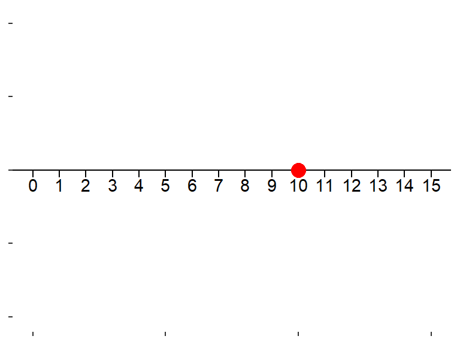


Но! Это же самое число можно представить в виде вектора, направленного отрезка, идущего от точки "0" к точке "10"


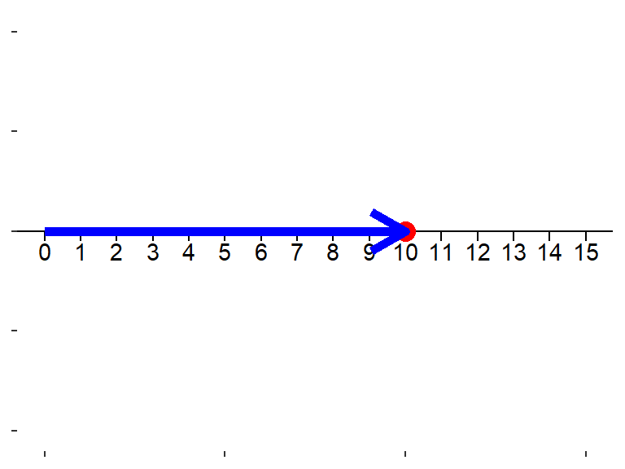


## Интерпретация вектора{.columns-2 .smaller}

Геометрической интерпретацией вектора является направленный отрезок в n-мерном пространстве с началом в точке $(0, 0 .... 0)$. 

Если в векторе всего два числа, то это направленный отрезок на плоскости.

Пример: `vec = (1, 5)`

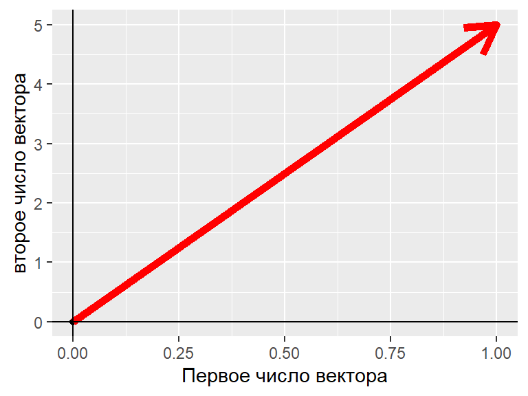


## Длина вектора, геометрическая итерпретаця


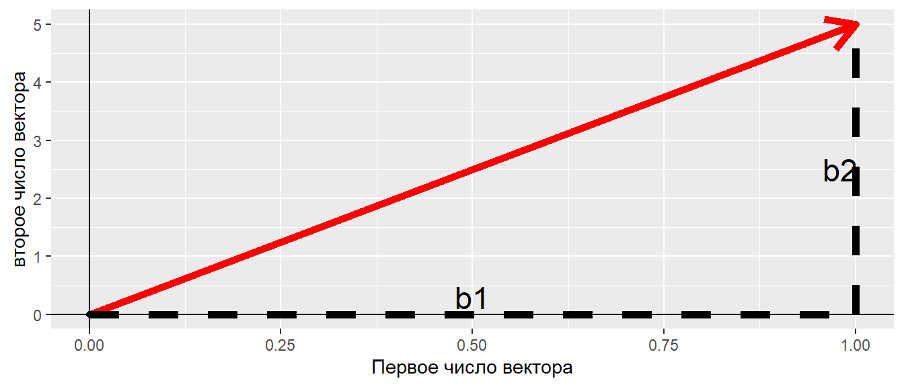

По теореме Пифагора

$$
R = \sqrt{b_1^2 + b_2^2}
$$


## Длина вектора в матричной алгебре


Пусть есть вектор:  $\textbf{b} = b_1, b_2,  \dots,  b_n$


Длина вектора, или норма вектора


$$
||\textbf{b}|| = \sqrt{b_1^2 + b_2^2 + \dots + b_n^2}
$$

Длина вектора 


```r
Vec <- 1:5

sqrt(sum(Vec^2))
```

```
## [1] 7.42
```

```r
norm(t(Vec), type = "F") #Аналогчное решение
```

```
## [1] 7.42
```


##  Скалярное произведение векторов   
Допустимо только для векторов одинаковой размерности

$$
\textbf{a} \cdot \textbf{b} =  
\begin{pmatrix}
a_1 \\
a_3 \\    
a_4 \\
a_5 \\
a_6 \\
a_7
\end{pmatrix}
\times
\begin{pmatrix}
b_1 &
b_3 &    
b_4 &
b_5 &
b_6 &
b_7
\end{pmatrix}
= a_1b_1 + a_2b_2 + ... + a_7b_7 = x
$$

Это базовая операция для истинного матричного умножения.

Результат этой операции - число (скаляр)


## Как это работает?

### Бытовой пример


В доме есть следующие электроприборы.

Электроприбор | Количество | Мощность (Вт) |    
--------------|------------|---------------|     
Чайник        | 2 шт       |       1200    |     
Обогреватели  | 3 шт.      |    1300       |
Осушитель     | 1 шт.      |     1100 |
Стиральная машина | 1 шт.| 1500 |
Фен | 2 шт. | 800 |

Вопрос: Какова будет суммарная мощность всех электроприборов, если их включить одновременно?

## Решение


```r
a <- c(2, 3, 1, 1, 2)
b <- c(1200, 1300, 1100, 1500, 800)

a %*% b
```

```
##       [,1]
## [1,] 10500
```


## Геометрическая интерпретация скалярного произведения векторов {.smaller}


Скалярное произведение равно произведению длин векторов на $cos$ угла между ними

$$
\textbf{a} \cdot \textbf{b} =  ||\textbf{a}|| \times ||\textbf{b}|| \times \cos(\alpha)
$$

Пусть у нас есть два вектора: $\textbf{a} = 1, 5$ и $\textbf{b} = 0.25, 4$

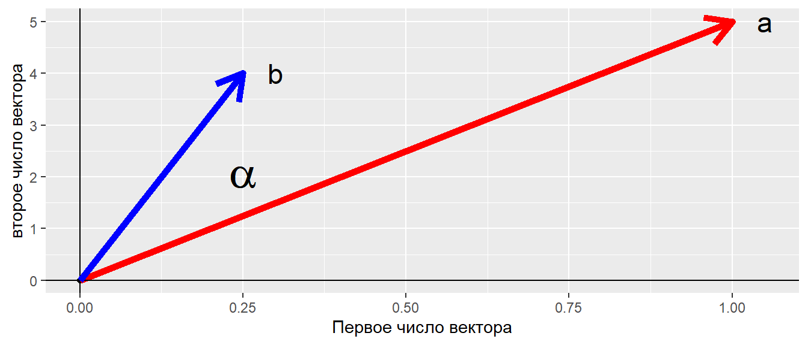


## Ортогониальные векторы


Если угол между векторами равен 90 градусов, то такие векторы называются ортогональными.

У таких векторов скалярное произведение $\textbf{a} \cdot \textbf{b} = 0$

## Задание

Выясните, являются ли ортогональными следующие векторы?


```r
a <- c(0, 1)
b <- c(1, 0)
c <- c(1, 1)
d <- c(1, -1)
```

## Решение {.smaller .columns-2}
Аналитическое решение

```r
(a) %*% (b) #Ортогональны
```

```
##      [,1]
## [1,]    0
```

```r
(c) %*% (a) #Неортогональны
```

```
##      [,1]
## [1,]    1
```

```r
(c) %*% (b) #Неортогональны
```

```
##      [,1]
## [1,]    1
```

```r
(d) %*% (c) #Ортогональны
```

```
##      [,1]
## [1,]    0
```

```r
(c) %*% (a) #неортогональны
```

```
##      [,1]
## [1,]    1
```

```r
(b) %*% (d) #неортогональны
```

```
##      [,1]
## [1,]    1
```

Геометрическое решение
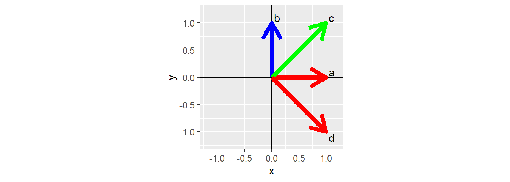


## Угол между векторами
Пусть, векторы отражают признаки объектов.   
Что характеризует угол между векторами?  


```
##     Object1 Object2
## Tr1     0.5     0.5
## Tr2     0.0     3.0
```

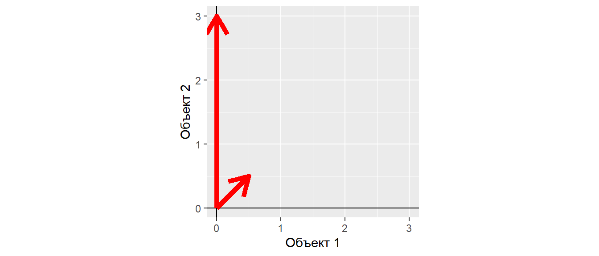

## Угол между векторами

### Длина векторов


```r
norm(t(Dat[ ,1 ]), type = "F") #Длина вектора Tr1 
```

```
## [1] 0.707
```

```r
norm(t(Dat[ , 2]), type = "F") #Длина вектора Tr2
```

```
## [1] 3
```

## Угол между векторами

Если

$$
\textbf{a} \cdot \textbf{b} =  ||\textbf{a}|| \times ||\textbf{b}|| \times \cos(\alpha)
$$

то


$$
\cos(\alpha) = \frac{\textbf{a} \cdot \textbf{b}} {||\textbf{a}|| \times ||\textbf{b}||}
$$


```r
cos_a <- (Dat[, 1] %*% Dat[, 2])/(norm(t(Dat[, 1]), type = "F") * 
                                    norm(t(Dat[, 2]), type = "F"))

cos_a
```

```
##       [,1]
## [1,] 0.707
```

Угол между векторами - мера сонаправленности векторов...


## Интерпретация угла между векторами {.smaller .columns-2}


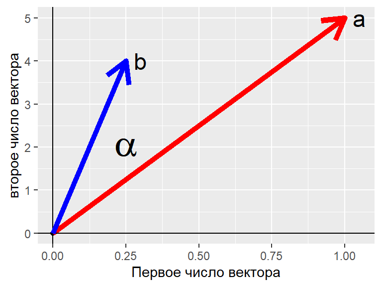


$$
\cos(\alpha) = \frac{\textbf{a} \cdot \textbf{b}}{||\textbf{a}|| \times ||\textbf{b}||}  = ?     
$$

```r
vec_a <- c(1, 5)
vec_b <- c(0.25, 4)

cos_alpha <- vec_a %*% vec_b / (norm(t(vec_a), type = "F") * norm(t(vec_b), type = "F")) 

cos_alpha
```

```
##       [,1]
## [1,] 0.991
```


## Интерпретация угла между векторами {.smaller .columns-2}


$$
\cos(\alpha) = \frac{\textbf{a} \cdot \textbf{b}}{||\textbf{a}|| \times ||\textbf{b}||}  = \frac{a_x \cdot b_x+a_y \cdot b_y}{\sqrt {a_x^2 + a_y^2} \times \sqrt {b_x^2 + b_y^2}}     
$$

## Интерпретация угла между векторами {.smaller .columns-2}

Если вектор трехмерный


$$
\cos(\alpha) = \frac{\textbf{a} \cdot \textbf{b}}{||\textbf{a}|| \times ||\textbf{b}||}  = \frac{a_x \cdot b_x + a_y \cdot b_y + a_z \cdot b_z }  {\sqrt {a_x^2 + a_y^2 + a_z^2} \times \sqrt {b_x^2 + b_y^2 + b_z^2}}     
$$


## Интерпретация угла между векторами 

Если вектор n-мерный


$$
\cos(\alpha) = \frac{\textbf{a} \cdot \textbf{b}}{||\textbf{a}|| \times ||\textbf{b}||}  = \frac{\Sigma{(a_i\cdot b_i)}}  {\sqrt {\Sigma{a_i^2}} \times \sqrt {\Sigma{b_i^2}}}     
$$
Ничего не напоминает?


## Интерпретация угла между векторами 

За точку отсчета взято начало координат, т.е. точка с координатами $0, 0, \dots, 0$, тогда  

$$
\cos(\alpha) = \frac{\textbf{a} \cdot \textbf{b}}{||\textbf{a}|| \times ||\textbf{b}||}  = \frac{\Sigma{((a_i-0)\cdot (b_i - 0))}}  {\sqrt {\Sigma{(a_i-0)^2}} \times \sqrt {\Sigma{(b_i-0)^2}}}     
$$
Ничего не напоминает?


## Интерпретация угла между векторами 

$$
r_{x,y} = \frac{\sum(x_i-\bar{x})(y_i-\bar{y})} {\sqrt{\sum(x_i-\bar{x})^2}\sqrt{\sum(y_i-\bar{y})^2}} = \frac{cov_{x,y}} {\sigma_x \sigma_y}
$$

Ключевая разница - это наличие вот этих элементов в формуле: $x_i-\bar{x}$ и $y_i-\bar{y}$

Как называется действие, которое описывается такими формулами?


## Интерпретация угла между векторами 


$$
r_{x,y} = \frac{\sum(x_i-\bar{x})(y_i-\bar{y})} {\sqrt{\sum(x_i-\bar{x})^2}\sqrt{\sum(y_i-\bar{y})^2}} = \frac{cov_{x,y}} {\sigma_x \sigma_y}
$$

Ключевая разница - это наличие вот этих элементов в формуле: $x_i-\bar{x}$ и $y_i-\bar{y}$

Как называется действие, которое описывается такими формулами?


Это **центрирование**! Перевод начала координат в точку с координатами равными средним значениям векторов. Такая точка называется **центроидом**.


## Вычисление косинуса угла между векторами {.smaller .columns-2}


```r
vectors <- data.frame(a = c(1, 5), b = c(0.25, 4), c = c(-3, 0))
vectors
```

```
##   a    b  c
## 1 1 0.25 -3
## 2 5 4.00  0
```


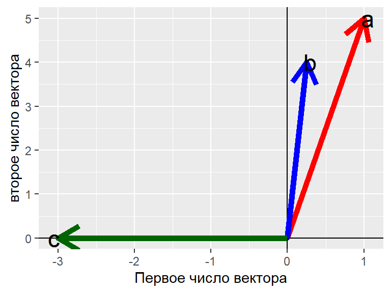


```r
with(vectors, a %*% b/(norm(t(a), type = "F") * norm(t(b), type = "F")) )
```

```
##       [,1]
## [1,] 0.991
```

```r
with(vectors, a %*% c/(norm(t(a), type = "F") * norm(t(c), type = "F")) )
```

```
##        [,1]
## [1,] -0.196
```

```r
with(vectors, b %*% c/(norm(t(b), type = "F") * norm(t(c), type = "F")) )
```

```
##         [,1]
## [1,] -0.0624
```


## Коэффициент корреляции и косинус угла между векторами {.smaller .columns-2}

Пусть есть два вектора в 100-мерном пространстве

```r
set.seed(12345)
vec_1 <- rnorm(100, 10, 1)
vec_2 <- -10*vec_1 + 10 + rnorm(100, 0, 10)
```


Коэффициент корреляции

```r
cor(vec_1, vec_2)
```

```
## [1] -0.708
```

Косинус угла в 100-мерном пространстве

```r
# Центрированные векторы
vec_1_c <- as.vector(scale(vec_1, center = T, scale = F))
vec_2_c <- as.vector(scale(vec_2, center = T, scale = F))

cos_alpha <- (vec_1_c %*% vec_2_c)/(norm(t(vec_1_c), type = "F")*norm(t(vec_2_c), type = "F"))
cos_alpha
```

```
##        [,1]
## [1,] -0.708
```


## Нормализованные векторы

Для многомерных методов важны взаимоотношения векторов, а не их истинные длины. 

Для приведения векторов к соизмеримости проводят их *нормализацию*.

$$
\textbf{c} = \frac{\textbf{b}} {||\textbf{b}||}
$$


## Задание 

Найдите нормализованный вектор для следующего вектора и определите его длину


```r
Vec <- 1:5
Vec
```

```
## [1] 1 2 3 4 5
```

## Решение

```r
normalized_Vec <- Vec/norm(t(Vec), type = "F")
normalized_Vec
```

```
## [1] 0.135 0.270 0.405 0.539 0.674
```

Длина нормализованного вектора 


```r
norm(t(normalized_Vec), type = "F")
```

```
## [1] 1
```


>- Длина нормализованного вектора равна 1. Это важное свойство для многомерных методов. 


## Нормализованные векторы {.smaller .columns-2}

Исходные данные


```
##     Object1 Object2
## Tr1     0.5     0.5
## Tr2     0.0     3.0
```

Нормализованные данные


```
##     Object1 Object2
## Tr1   0.707   0.707
## Tr2   0.000   1.000
```

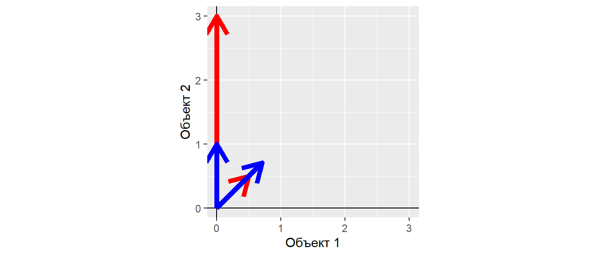

Характер взаимосвязи между нормализованными векторами такой же, как и у исходных векторов.

После нормализации, можно пренебречь разницами длин векторов.


# Level 4: Еще немного повторения: *Операции с матрицами* 


## Матричное умножение матрицы на вектор {.smaller .columns-2}

$$
\mathbf{A} \times \mathbf{a}
$$

Умножать можно только в том случае, если число столбцов в матрице равно количеству чисел в векторе.  

Пусть, есть матрица  $\mathbf{A}$


```
##      [,1] [,2] [,3]
## [1,]    1    5    9
## [2,]    2    6   10
## [3,]    3    7   11
## [4,]    4    8   12
```

<br>

<br>

<br>

<br>


```r
A %*% c(10, 10, 10)
```

```
##      [,1]
## [1,]  150
## [2,]  180
## [3,]  210
## [4,]  240
```

- Первое число итогового вектора - скалярное произведение первой строки $\mathbf{A}$ на вектор $\mathbf{a}$    
- Второе число - скалярное произведение второй строки $\mathbf{A}$ на вектор $\mathbf{a}$   
и т.д.


Но! если поменять местами множители, то будет ошибка

```r
c(10, 10, 10) %*% A
```

```
## Error in c(10, 10, 10) %*% A: неподобные аргументы
```

## Матричное умножение вектора на матрицу

$$
\mathbf{a} \times  \mathbf{A}
$$

Умножать можно только в том случае, если количество чисел в векторе равно количеству строк в матрице.


```r
c(10, 10, 10, 10) %*% A
```

```
##      [,1] [,2] [,3]
## [1,]  100  260  420
```

Но! если поменять местами множители, то будет ошибка

```r
A %*% c(10, 10, 10, 10)
```

```
## Error in A %*% c(10, 10, 10, 10): неподобные аргументы
```


## Умножение матриц {.smaller .columns-2}


Умножать можно только в том случае, если число колонок в первой матрице равно числу строк второй матрицы: $\mathbf{A} \times \mathbf{B}$ 

Пусть, есть матрица $\mathbf{A}$


```
##      [,1] [,2] [,3]
## [1,]    1    5    9
## [2,]    2    6   10
## [3,]    3    7   11
## [4,]    4    8   12
```

и матрица $\mathbf{B}$


```
##      [,1] [,2] [,3] [,4]
## [1,]    1    2    3    4
## [2,]    5    6    7    8
## [3,]    9   10   11   12
```

<br>


```r
A %*% B
```

```
##      [,1] [,2] [,3] [,4]
## [1,]  107  122  137  152
## [2,]  122  140  158  176
## [3,]  137  158  179  200
## [4,]  152  176  200  224
```


НО! Нельзя произвести такое умножение

```r
A %*% A
```

```
## Error in A %*% A: неподобные аргументы
```

## Схема умножения матриц

$$
\begin{pmatrix}
A & B  \\
C & D \\
\end{pmatrix}
\times
\begin{pmatrix}
E & F \\ G & H\\ 
\end{pmatrix}
=
\begin{pmatrix}
(A \cdot E + B \cdot G)  & (A \cdot F + B \cdot H ) \\ (C \cdot E + D \cdot G)  & (C \cdot F + D \cdot H)  \\
\end{pmatrix}
$$

<!-- ## Некоторые свойства произведения матриц {.smaller .columns-2} -->

<!-- Если существует произведение матриц $\textbf{BC}$, то не обязательно существует $\textbf{CB}$ -->

<!-- ```{r, purl=TRUE} -->
<!-- B <- matrix(1:24, ncol = 4) -->
<!-- B -->
<!-- C <- matrix(1:12, ncol = 3) -->
<!-- C -->

<!-- B %*% C -->
<!-- ``` -->

<!-- HO!  -->

<!-- ```{r, error=TRUE, purl=TRUE} -->

<!-- C %*% B -->
<!-- ``` -->


<!-- ## Некоторые свойства произведения матриц -->

<!-- Всегда существует такое произведение матриц $\textbf{C}\textbf{C}'$ и $\textbf{C}'\textbf{C}$ -->

<!-- ```{r, purl=TRUE} -->
<!-- C %*% t(C) -->
<!-- ``` -->

<!-- ```{r, purl=TRUE} -->
<!-- t(C) %*% C -->
<!-- ``` -->


<!-- ## Некоторые свойства произведения матриц -->

<!-- Произведение матриц $\textbf{BC}$ как правило не равно $\textbf{CB}$ -->
<!-- ```{r, purl=TRUE} -->
<!-- B <- matrix(1:9, ncol = 3) -->
<!-- C <- matrix(11:19, ncol = 3) -->

<!-- B %*%  C -->

<!-- C %*% B -->
<!-- ``` -->


<!-- ## Некоторые свойства произведения матриц -->

<!-- $[\textbf{BC}]' = \textbf{C}'\textbf{B}'$ -->
<!-- ```{r, purl=TRUE} -->
<!-- t(B %*% C) -->
<!-- ``` -->

<!-- ```{r, purl=TRUE} -->
<!-- t(C) %*% t(B) -->
<!-- ``` -->

<!-- ## Некоторые свойства произведения матриц -->

<!-- Произведение $\textbf{B}\textbf{B}'$ и $\textbf{B}'\textbf{B}$ всегда дает симметричную матрицу  -->

<!-- ```{r, purl=TRUE} -->
<!-- B %*% t(B) -->
<!-- ``` -->

<!-- ```{r, purl=TRUE} -->
<!-- t(B) %*% B -->

<!-- ``` -->

<!-- ## Как это работает?  {.smaller .columns-2} -->
<!-- ### Бытовой пример -->
<!-- Представим себе, что вы решили купить четыре товара, по следующим ценам  -->

<!-- Товар | Цена     -->
<!-- ------|-----     -->
<!-- Товар 1 | 10     -->
<!-- Товар 2 | 20     -->
<!-- Товар 3 | 30    -->
<!-- Товар 4 | 40     -->


<!-- Прямых выходов на продавца у вас нет, но есть три посредника, которые выставляют следующие "накрутки" цен.  -->

<!-- Посредники  | Товар 1 | Товар 2 | Товар 3 | Товар 4  -->
<!-- ------------|---------|---------|---------|-------- -->
<!-- Посредник 1 | 0.1 | 0.15 | 0.05 | 0.05  -->
<!-- Посредник 2 | 0.15 | 0.15 | 0.09 | 0.01  -->
<!-- Посредник 3 | 0.2 | 0.05 | 0.1 | 0.1   -->

<!-- <br> -->

<!-- Какой из посредников выгоднее? -->


<!-- ## Решение -->

<!-- ```{r, purl=TRUE} -->
<!-- cost <- c(10, 20, 30, 40) -->

<!-- retailer <- matrix(c(0.1, 0.15, 0.05, 0.05,   -->
<!--                      0.15, 0.15, 0.09, 0.01,  -->
<!--                      0.2, 0.05, 0.1, 0.1 ), byrow = TRUE, ncol = 4) -->


<!-- retailer %*% cost   -->

<!-- ``` -->


# Level 5.Матрицы, как инструмент преобразования 

## Геометрическая интерпретация матрицы {.smaller .columns-2}

Вектор это направленный n-мерный отрезок. 


```r
y = c(2,2,3,3,2,2,3,4,5,6,6,5,4,3,2)
x = c(2,3,4,5,6,7,7,7,6,5,4,3,2,2,2)
```


Матрица - это система векторов


```r
cbind((x), (y))
```

```
##       [,1] [,2]
##  [1,]    2    2
##  [2,]    3    2
##  [3,]    4    3
##  [4,]    5    3
##  [5,]    6    2
##  [6,]    7    2
##  [7,]    7    3
##  [8,]    7    4
##  [9,]    6    5
## [10,]    5    6
## [11,]    4    6
## [12,]    3    5
## [13,]    2    4
## [14,]    2    3
## [15,]    2    2
```

Два сцепленных 15-мерных вектора

и/или

15 сцепленных двумерных векторов.


## Геометрическая интерпретация матрицы

**Интерпретация матрицы, вариант 1**


```r
Matr <- as.data.frame(t(cbind((x), (y))))
Matr
```

```
##   V1 V2 V3 V4 V5 V6 V7 V8 V9 V10 V11 V12 V13 V14 V15
## 1  2  3  4  5  6  7  7  7  6   5   4   3   2   2   2
## 2  2  2  3  3  2  2  3  4  5   6   6   5   4   3   2
```

Два вектора в 15-ти мерном пространстве

Изобразить на плоскости невозможно!


## Геометрическая интерпретация матрицы {.smaller .columns-2}

**Интерпретация матрицы, вариант 2**


```r
Image <- cbind((x), (y))
Image
```

```
##       [,1] [,2]
##  [1,]    2    2
##  [2,]    3    2
##  [3,]    4    3
##  [4,]    5    3
##  [5,]    6    2
##  [6,]    7    2
##  [7,]    7    3
##  [8,]    7    4
##  [9,]    6    5
## [10,]    5    6
## [11,]    4    6
## [12,]    3    5
## [13,]    2    4
## [14,]    2    3
## [15,]    2    2
```

15 векторов в двумерном пространстве

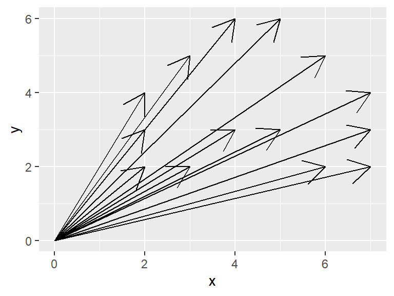

## Геометрическая интерпретация матрицы

**Интерпретация матрицы, вариант 2**

Аналогичное изображение


```r
qplot(Image[,1], Image[,2] ) + geom_polygon(fill = "red") + coord_fixed()
```

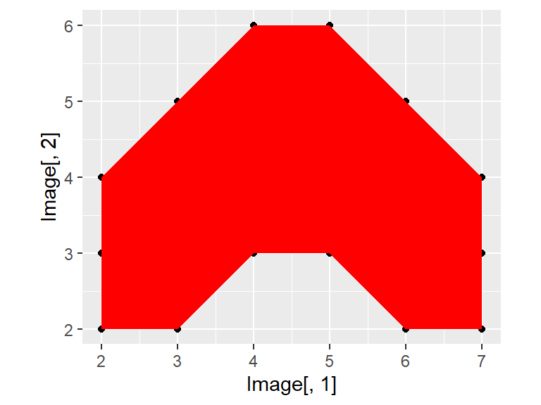


## Матрицы позволяют преобразовывать системы векторов {.smaller .columns-2}

Вращающая матрица
$$
\textbf{Rot} = 
\begin{pmatrix}
\cos\phi & -\sin \phi \\
\sin\phi & \cos\phi
\end{pmatrix}
$$

Поворот изображения на заданный угол

$$
\textbf{Y}_{rot} = \textbf{Rot} \times \textbf{Y}
$$


```r
phi <- 30  # Угол в градусах, 
# на который надо повернуть объект

angle <- phi*pi/180 # Угол в радианах

# Вращающая матрица
Rot <- matrix(c(cos(angle), sin(angle), 
                -sin(angle), cos(angle)), nrow = 2)


# Перобразованние исходной матрицы 
# с помощью вращающей матрицы

Image_trans <-   t((Rot) %*% t(Image))     


qplot(Image_trans[,1], Image_trans[,2] ) + 
  geom_polygon(fill = "red") + 
  coord_fixed()
```

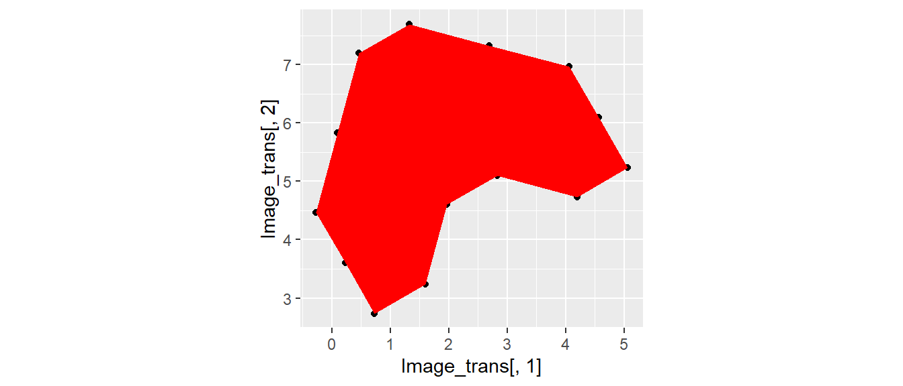


## Матрицы позволяют преобразовывать системы векторов {.smaller .columns-2}

Масштабирующая матрица
$$
\textbf{Scale} = 
\begin{pmatrix}
a & 0 \\
0 & b
\end{pmatrix}
$$

<br>

<br>

$$
\textbf{Y}_{scaled} = \textbf{Scale} \times \textbf{Y}
$$


```r
Scale <- matrix(c(1, 0, 0, 2), nrow = 2)

Image_trans2 <-   t((Scale) %*% t(Image_trans))     

qplot(Image_trans2[,1], Image_trans2[,2] ) + 
  geom_polygon(fill = "red") + 
  coord_fixed()
```

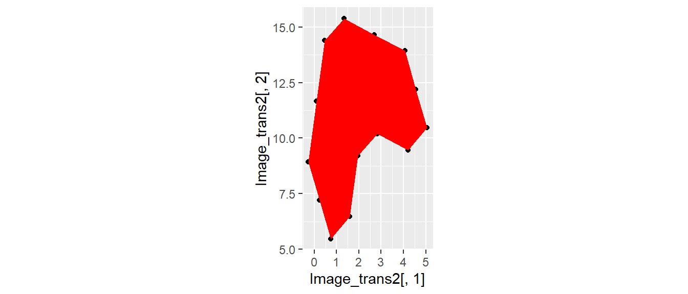

## Применение вращения и  масштабирования матричных обектов

- Многомерные анализы (о некоторых приемах речь впереди)
- Работа с изображениями


# Level 6: Корреляционные и ковариационные матрицы

## Ковариационная матрица
Во многих методах многомерной статистики применяется матрица ковариации.

Ковариация (согласованное отклонение от среднего):

$$
cov(X, Y) = \frac{1}{n - 1}\sum{(x_i - \bar{x})(y_i - \bar{y})}
$$

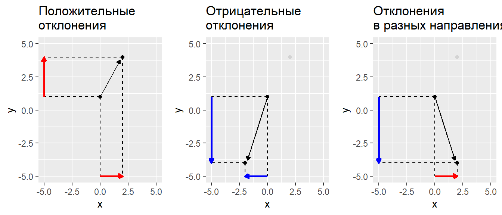


## Ковариационная матрица

$$
\textbf{S} = \frac{1}{n - 1} \textbf{Y}_{centered}'\textbf{Y}_{centered}
$$


где $\textbf{Y}_{centered}$ - центрированная матрица исходных значений

**Центрирование** - перемещение начала координат в точку с координатами, равными средним значениям (центроид)  


## Корреляционая матрица

То же самое, что ковариационная матрица, но только на основе стандартизованных исходных значений

$$
\textbf{R} = \frac{1}{n - 1} \textbf{Y}_{stand}'\textbf{Y}_{stand}
$$


## Вычисление матрицы ковариации с помощью линейной алгебры {.smaller .columns-2}

Исходная матрица

```r
M <- matrix(c(1,2,3,4,5,5,2,1,2,5,2,1,3,5,4,6,8,4,0,2), ncol = 4)
M
```

```
##      [,1] [,2] [,3] [,4]
## [1,]    1    5    2    6
## [2,]    2    2    1    8
## [3,]    3    1    3    4
## [4,]    4    2    5    0
## [5,]    5    5    4    2
```


<br>


<br>


Матрица центрированных значений

```r
Cent_M <- scale(M, center = TRUE, scale = FALSE) 
Cent_M
```

```
##      [,1] [,2] [,3] [,4]
## [1,]   -2    2   -1    2
## [2,]   -1   -1   -2    4
## [3,]    0   -2    0    0
## [4,]    1   -1    2   -4
## [5,]    2    2    1   -2
## attr(,"scaled:center")
## [1] 3 3 3 4
```


## Вычисление матрицы ковариации с помощью линейной алгебры
### Задание:  
Вычислите ковариационную матрицу с помощью методов линейной алгебры и сравните ее с матрицей, полученной с помощью функции `cov()`  

## Вычисление матрицы ковариации  с помощью линейной алгебры
### Решение: 


```r
# Вычисление вручную
Cov_M <- (t(Cent_M) %*% Cent_M)/(nrow(M) - 1)
Cov_M
```

```
##      [,1] [,2] [,3] [,4]
## [1,]  2.5  0.0  2.0   -4
## [2,]  0.0  3.5  0.0    0
## [3,]  2.0  0.0  2.5   -5
## [4,] -4.0  0.0 -5.0   10
```


```r
cov(M) # Стандартная функция R
```

```
##      [,1] [,2] [,3] [,4]
## [1,]  2.5  0.0  2.0   -4
## [2,]  0.0  3.5  0.0    0
## [3,]  2.0  0.0  2.5   -5
## [4,] -4.0  0.0 -5.0   10
```

## Вычисление матрицы ковариации  с помощью линейной алгебры

По главной диагонали ковариационной матрицы лежат квадраты стандартных отклонений каждого из векторов (колонок, признаков) исходной матрицы


```r
diag(Cov_M)
```

```
## [1]  2.5  3.5  2.5 10.0
```
Сравним

```r
apply(M, 2, FUN = function(x)sd(x)^2)
```

```
## [1]  2.5  3.5  2.5 10.0
```


## Вычисление матрицы  корреляций с помощью линейной алгебры {.smaller .columns-2}

Для вычисления матрицы корреляций необходимо стандартизировать значения в исходной матрице


```r
Stand_M <- scale(M, center = TRUE, scale = TRUE)
Stand_M
```

```
##        [,1]   [,2]   [,3]   [,4]
## [1,] -1.265  1.069 -0.632  0.632
## [2,] -0.632 -0.535 -1.265  1.265
## [3,]  0.000 -1.069  0.000  0.000
## [4,]  0.632 -0.535  1.265 -1.265
## [5,]  1.265  1.069  0.632 -0.632
## attr(,"scaled:center")
## [1] 3 3 3 4
## attr(,"scaled:scale")
## [1] 1.58 1.87 1.58 3.16
```

<br>

<br>
<br>
<br>
<br>


```r
# Вычисление вручную
Cor_M <- (t(Stand_M) %*% Stand_M)/(nrow(M) - 1)
Cor_M
```

```
##      [,1] [,2] [,3] [,4]
## [1,]  1.0    0  0.8 -0.8
## [2,]  0.0    1  0.0  0.0
## [3,]  0.8    0  1.0 -1.0
## [4,] -0.8    0 -1.0  1.0
```


```r
cor(M) # Стандартная функция R
```

```
##      [,1] [,2] [,3] [,4]
## [1,]  1.0    0  0.8 -0.8
## [2,]  0.0    1  0.0  0.0
## [3,]  0.8    0  1.0 -1.0
## [4,] -0.8    0 -1.0  1.0
```


## Зачем нужна ковариационная матрица?

В ковариационной матрице содержится вся информация о варьировании признаков и о их взаимосвязи   
 
Свойства этой матрицы  позволяют раскладывать изменчивость на отдельные составляющие (про это у нас будет специальная лекция).  


# Level 7: Еще немного повторения: *Обращение (инверсия) матриц*

## Обращение (инверсия) матриц {.smaller .columns-2}

В линейной алгебре нет процедуры деления. Вместо нее используют обращение матриц.

$$
\textbf{X}^{-1}\textbf{X} = \textbf{I}
$$


Обратить можно только такую матрицу, у которой определитель не равен нулю $$|\textbf{X}| \ne 0$$

Матрицы, у которых определитель $|\textbf{X}| = 0$ называются *сингулярными* матрицами они не могут быть инвертированы.

**Важно!**: Только квадратные матрицы имеют  обратную матрицу.

Для квадратных матриц справедливо $\textbf{X} \textbf{X}^{-1} = \textbf{X}^{-1} \textbf{X}$


**Важное свойство**: Если квадратная матрица состоит из ортогональных векторов (ортогональная матрица), то $\textbf{X}'  = \textbf{X}^{-1}$


## Вычисление обратной матрицы в среде R

Создадим матрицу

```
##      [,1] [,2] [,3]
## [1,]    1    2    3
## [2,]    4    5    6
## [3,]    7    8   10
```

Ее определитель

```r
det(X)
```

```
## [1] -3
```

## Вычисление обратной матрицы в среде R
Обратная матрица

```r
solve(X)
```

```
##        [,1]  [,2] [,3]
## [1,] -0.667 -1.33    1
## [2,] -0.667  3.67   -2
## [3,]  1.000 -2.00    1
```

По определению $\textbf{X}^{-1}\textbf{X} = \textbf{I}$

```r
round(solve(X) %*% X )
```

```
##      [,1] [,2] [,3]
## [1,]    1    0    0
## [2,]    0    1    0
## [3,]    0    0    1
```


## Summary
- Линейная алгебра позволяет решать самые разные типы задач.
- Матричные методы лежат в основе очень многих типов анализа и служат для решения прикладных задач.


## Что почитать
* Legendre P., Legendre L. (2012) Numerical ecology. Second english edition. Elsevier, Amsterdam. Глава 2. Matrix algebra: a summary.

# Not The End
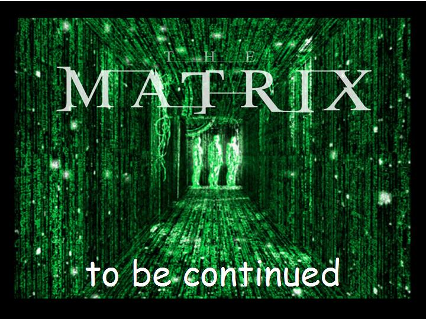

