```{r setup, include = FALSE, cache = FALSE, purl = FALSE, fig.showtext = TRUE}
source("assets/xaringan_setup.R")
library(xaringanExtra)
use_tile_view()
use_scribble()
use_search(show_icon = FALSE)
use_progress_bar(color = "#6d2b5e", location = "bottom", height = "10px")
use_freezeframe()
# use_webcam()
# use_panelset()
# use_extra_styles(hover_code_line = TRUE)

# http://tachyons.io/docs/
# https://roperzh.github.io/tachyons-cheatsheet/
use_tachyons()
```

```{r, libs-funs, echo=FALSE}
library(ggplot2)
library(grid)
theme_set(theme_bw(base_size = 14) + theme(legend.key = element_blank()))
update_geom_defaults("point", list(shape = 19, size = 5))
library(gridExtra)
```

## Вы сможете

- Проводить анализ главных компонент при помощи функций из пакета `vegan`
- Оценивать долю дисперсии, объясненной компонентами
- Снизить размерность данных, оставив небольшое число компонент
- Интерпретировать смысл компонент по их факторным нагрузкам
- Строить ординацию объектов в пространстве главных компонент
- Создавать комплексные переменные и использовать их в других видах анализов

---

class: middle, center, inverse

# Постановка задачи для анализа главных компонент

---

## Зачем нужен анализ главных компонент?

Когда признаков много, можно представить все объекты как облако точек в многомерном пространстве. Обычно в биологических исследованиях признаки объектов взаимозависимы (между ними есть ненулевая ковариация или корреляция).

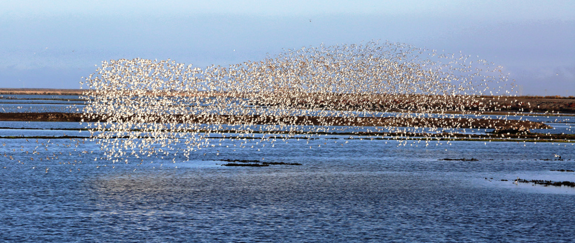

Migration by Don McCullough
on [Flickr](https://flic.kr/p/fEFhCj)

---

## Не все проекции несут важную информацию

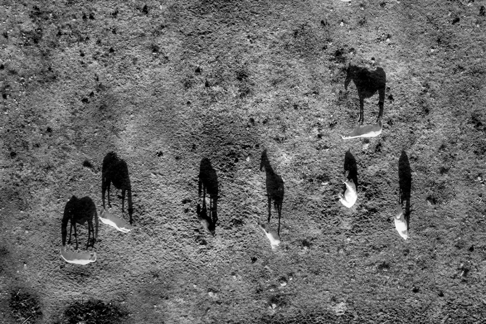

black shadows for a white horses / les negres ombres dels cavalls blancs by  Ferran Jordà
on [Flickr](https://flic.kr/p/9XJxiL)

---

## Можно найти оптимальную проекцию, чтобы сохранить максимум информации в минимуме измерений

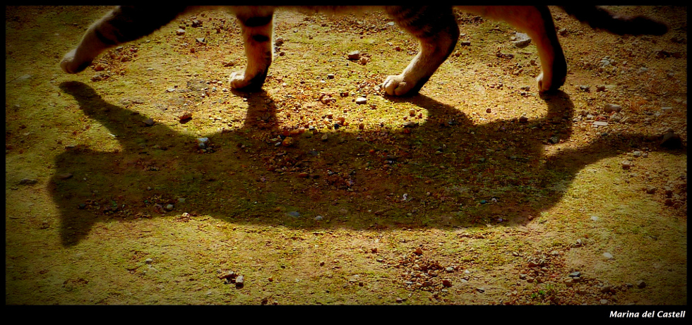

Cat's shadow by Marina del Castell on [Flickr](https://flic.kr/p/ebe5UF)

---

## Анализ главных компонент (Principal Component Analysis, PCA)

- Ординация объектов по многим признакам.

- Описание системы взаимосвязей между множеством исходных признаков и ранжирование признаков по важности.

- Снижение размерности многомерных данных (dimension reduction) и создание синтетических взаимонезависимых признаков для других анализов (например, для регрессии, дискриминантного анализа)

---

## Пример: Размеры медуз

Данные о размерах медуз _Catostylus mosaicus_ (Lunn & McNeil 1991). Медузы собраны в реке Хоксбери (Новый Южный Уэльс, Австралия): часть --- на острове Дангар, другая --- в заливе Саламандер.

.pull-left[
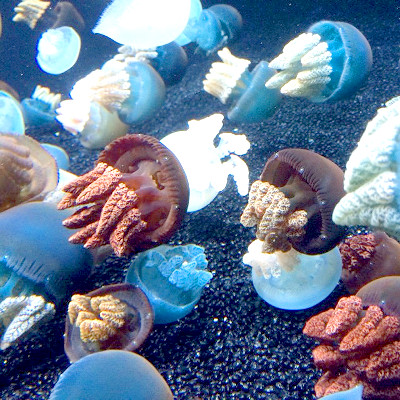

.tiny[Blubber jellies! by  Kirsti Scott
on [Flickr](https://flic.kr/p/nWikVp)]
]

.pull-right[

```{r, echo = FALSE, purl = FALSE}
jelly <- read.delim("data/jellyfish.csv")
jelly %>%
  kable("html") %>%
  kable_styling() %>%
  scroll_box(width = "100%", height = "500px")
```
]

---

## Задача анализа главных компонент

Нужно найти такую трансформацию исходных данных, чтобы "новые" переменные:

- содержали всю исходную информацию
- были независимы друг от друга
- были ранжированы в порядке убывания важности (например, в порядке убывания их дисперсии)

Интуитивно, мы можем добиться этого, если проведем одну ось вдоль направления, в котором максимально вытянуто облако исходных данных. Вторую ось проведем перпендикулярно первой (и они будут независимы).

```{r echo = FALSE, purl = FALSE, message=FALSE, opts.label='XLxS'}
library(ggplot2)
theme_set(theme_bw(base_size = 14))
update_geom_defaults("point", list(shape = 19))

X_raw <- jelly[, 2:3]

# График исходных данных
gg <- ggplot(as.data.frame(X_raw), aes(x = width, y = length)) + 
  geom_point(size = 2) 
# gg + coord_equal(expand = c(0, 0))

# Центрируем
X <- scale(X_raw, center = TRUE, scale = FALSE)
A <- cov(X)    # Матрица ковариаций
E <- eigen(A)  # Спектральное разложение
# Координаты точек в новом пространстве
Y <- X %*% E$vectors

# График точек в новом пространстве
gg_rotated <- gg %+% as.data.frame(Y) + 
  aes(x = V1, y = V2) + 
  geom_hline(yintercept = 0) + 
  geom_vline(xintercept = 0) + 
  labs(x = "PC1", y = "PC2") %+% 
  coord_equal() 

# Исходные данные
jelly <- read.delim("data/jellyfish.csv")
X_raw <- jelly[, 2:3]
X <- scale(X_raw, center = TRUE, scale = FALSE) # Центрируем
A <- cov(X)    # Матрица ковариаций
E <- eigen(A)            # Спектральное разложение
U <- E$vectors           # Собственные векторы
Lambda <- E$values       # Собственные числа

library(cowplot)
plot_grid(gg + ggtitle("До"),
          gg_rotated + ggtitle("После"),
          align = "h", rel_widths = c(2, 3))

# # собственные векторы
dimnames(U) <- list(colnames(X),paste0("PC", 1:ncol(X)))
# # Собственные числа
Explained <- Lambda/sum(Lambda)       # Доля объясненной изменчивости
# Факторные координаты
Y <- X %*% U # Координаты точек в новом пространстве
```

---

## Алгоритм PCA

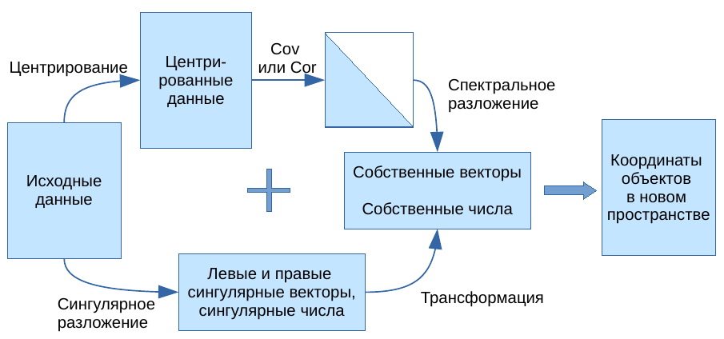
---

## PCA в R своими руками 

Открываем данные по медузам и извлекаем из таблицы числовые измерения. 
```{r}
jelly <- read.delim("data/jellyfish.csv")
X_raw <- jelly[, 2:3]
```

---

## Задание 1 

Получите новые координаты для датасета с медузами в осях главных компонент. 

---

## Решение

```{r}
# Исходные данные
X <- scale(X_raw, center = TRUE, scale = FALSE) # Центрируем
A <- t(X) %*% X / (nrow(X) - 1)   # Матрица ковариаций
E <- eigen(A)            # Спектральное разложение
U <- E$vectors           # Собственные векторы
Lambda <- E$values 

# Координаты точек в новом пространстве
Y <- X %*% U
```

---

## Визаулизация результатов PCA 

.pull-left[
```{r}
# график исходных данных
gg_jelly_raw <- ggplot(as.data.frame(X_raw), 
                       aes(x = width, y = length)) +
  geom_point(size = 2)
gg_jelly_raw
```
]

.pull-right[
```{r}
# график в главных осях
gg_jelly_rotated <- ggplot(as.data.frame(Y), 
                           aes(x = V1, y = V2)) +
    geom_point(size = 2) +
    geom_hline(yintercept = 0) +
    geom_vline(xintercept = 0) +
    labs(x = "PC1", y = "PC2")
gg_jelly_rotated
```
]

---

## Результаты работы PCA

.pull-left[

- __Собственные векторы__ (__факторные нагрузки__)
  - перпендикулярны друг другу (ортогональны, независимы) 
  - задают __главные компоненты__ --- направления новых осей
  - линейные комбинации исходных признаков
  - упорядочены в порядке убывания дисперсии

- __Собственные числа__
  - показывают дисперсию вдоль главных компонент
  - упорядочены в порядке убывания дисперсии
  - используются для вычисления доли общей изменчивости, связанной с каждой из главных компонент

]

.pull-right[
```{r echo=FALSE, fig.width=5, fig.height=4.5, message=FALSE}
plot_grid(gg + ggtitle("До"),
          gg_rotated + ggtitle("После") + labs(x = "PC1", y = "PC2"),
          ncol = 1,
          align = "hv", axis = "b")
```

- __Факторные координаты__
  - координаты объектов в пространстве главных компонент

]

---

## Результаты работы PCA

- Главные компоненты 
  - новые "синтетические" признаки объектов, которые сочетают несколько исходных признаков
  - упорядочены по убыванию доли объясненной изменчивости
  - используя разное число главных компонент можно снизить размерность исходных данных

```{r echo=FALSE, fig.width=9, message=FALSE}
gg_rotated +
  aes(colour = jelly$location) +
  scale_color_brewer("Location", palette = "Set1") +
  labs(title = "Результаты PCA",
       x = paste0("PC1, ", round(Explained[1] * 100, 1), "%"),
       y = paste0("PC2, ", round(Explained[2] * 100, 1), "%"))
```

- PC1 --- "размер медузы" --- больше всего изменчивости
- PC2 --- остаточная изменчивость

---

class: middle, center, inverse

# Действительно многомерные данные

---

## Пример: Потребление белков в странах Европы с разными видами продуктов питания


<small>Paleo Diet by zsoolt on [Flickr](https://flic.kr/p/pPK1nz)</small>

<div class = "footnote">Данные из Weber, 1973</div>

---

## Открываем данные

```{r R.options=list(width = 100)}
protein <- read.table(file="data/protein.csv", sep="\t", dec=".", header=TRUE)
protein$region <- factor(protein$region)
rownames(protein) <- protein$country
head(protein)
```

<div class = "footnote">Данные из Weber, 1973</div>

---

## Делаем PCA

```{r pca-owl, message=FALSE, opts.label='LxM', eval=TRUE, echo=-c(3, 5), fig.align='left'}
library(vegan)
prot_pca <- rda(protein[, -c(1, 2)], scale = TRUE)
op <- par(mar = c(5, 4, 0, 2) + 0.1, cex = 1.5)
biplot(prot_pca)
par(op)
```

---

## Делаем PCA

```{r pca-owl, message=FALSE, opts.label='MxM', eval=FALSE, echo=-c(3, 5), purl=FALSE}
```

.pull-left[

```{r pca-owl, message=FALSE, opts.label='MxM', eval=TRUE, echo=FALSE, purl=FALSE}
```
]
.pull-right[

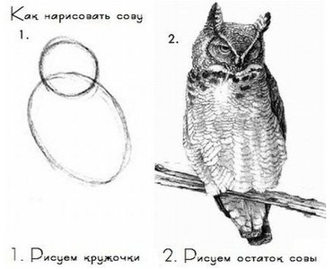

]

---

## Разбираемся с результатами PCA

.scroll-box-26[

```{r pca-res, message=FALSE}
summary(prot_pca)
```

]

---

class: middle, center, inverse

# 1. Сколько компонент нужно оставить?

---

## Собственные числа показывают вклады главных компонент в общую изменчивость

```
Eigenvalues, and their contribution to the correlations 

Importance of components:
                         PC1    PC2    PC3    PC4     PC5     PC6  ...  
Eigenvalue            4.0064 1.6350 1.1279 0.9547 0.46384 0.32513 ...
Proportion Explained  0.4452 0.1817 0.1253 0.1061 0.05154 0.03613 ...
Cumulative Proportion 0.4452 0.6268 0.7521 0.8582 0.90976 0.94589 ...
```

```{r purl=FALSE}
eigenvals(prot_pca) # собственные числа
```

---

## Сколько компонент нужно оставить, если мы хотим редуцировать данные?

- Эмпирические правила (выберите любое, но одно)
    - Компоненты у которых соб. число > 1 (правило Кайзера-Гатмана)
    - В сумме объясняют заданный % от общей изменчивости (60-80%) - слишком субъективно
    - Объясняют больше чем по Broken Stick Model.
    
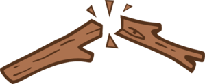

```{r}
eigenvals(prot_pca) # собственные числа

bstick(prot_pca) # ожидаемое по Broken Stick Model
```

---

## График собственных чисел

```{r}
screeplot(prot_pca, type = "lines", bstick = TRUE) # график собственных чисел
```

---

class: middle, center, inverse

# 2. Графики факторных нагрузок и ординации

---

## Параметр `scaling`

Внимание! Координаты объектов или переменных можно получить в нескольких вариантах, отличающихся масштабом. От этого масштаба будет зависеть интерпретация.

```{r, echo=FALSE, results='asis', purl = FALSE}
df <- data.frame(
  scaling = c("1, sites", "2, species", "3, symmetric", "0, none"),
  bip = c("биплот расстояний", "биплот корреляций", "", ""),
  scaled = c("координаты объектов масштабированы (х корень из соб. чисел)", "координаты признаков масштабированы (х корень из соб. чисел)", "масштабированы координаты объектов и признаков (х корень 4-й степени из соб. чисел)", "нет масштабирования"),
  dist = c("аппроксимируют евклидовы", "НЕ аппроксимируют евклидовы", "", ""),
  ang = c("нет смысла", "отражают корреляции", "", "")
  )

colnames(df) <- c("scaling", "Название графика", "Масштаб", "Расстояния между объектами", "Углы между векторами")

df %>%
  kable("html") %>%
  kable_styling()
```

---

## Графики

```{r, opts.label='XLxL', fig.show='hold'}
op <- par(mfrow = c(1, 2), cex = 1.5)
# График факторных координат
biplot(prot_pca, display = "sites")
# График факторных нагрузок
biplot(prot_pca, display = "species", scaling = "species")
par(op)
```

---

## Те же самые графики можно построить в ggplot2

```{r ord-p, echo=FALSE}
# Данные для графиков
df_scores <- data.frame(protein[, 1:2],
                        scores(prot_pca, display = "sites",
                               choices = c(1, 2, 3), 
                               scaling = "sites"))
## График ординации в ggplot

p_scores <- ggplot(df_scores, aes(x = PC1, y = PC2, colour = region)) +
  geom_text(aes(label = country)) +
  coord_equal(xlim = c(-1.2, 1.2), ylim = c(-1.2, 1.2))
```

```{r, load-p, echo=FALSE}
## Данные для графика нагрузок
df_load <- as.data.frame(scores(prot_pca, 
                                display = "species", 
                                choices = c(1, 2, 3), 
                                scaling = "species"))
# поправки для размещения подписей
df_load$hjust <- ifelse(df_load$PC1 >= 0, -0.1, 1)
df_load$vjust <- ifelse(df_load$PC2 >= 0, -0.1, 1)
library(grid) # для стрелочек
ar <- arrow(length = unit(0.25, "cm"))
## График нагрузок в ggplot
p_load <- ggplot(df_load) +
  geom_text(aes(x = PC1, y = PC2, label = rownames(df_load)),
            size = 3, vjust = df_load$vjust, hjust = df_load$hjust) +
  geom_segment(aes(x = 0, y = 0, xend = PC1, yend = PC2),
               colour = "grey40", arrow = ar) +
  coord_equal(xlim = c(-2, 2), ylim = c(-2, 2))
```

```{r, ord-plot-grid, warning=FALSE, opts.label='XLxL', echo=FALSE}
plot_grid(p_load, p_scores, align = "h",
          rel_widths = c(0.5, 0.68))
```

---

## Исходный код графика

```{r ord-p, eval=FALSE, purl = FALSE}
```

--

```{r load-p, eval=FALSE, purl = FALSE}
```

---

class: middle, center, inverse

# 3. Интерпретация компонент

---

## Интерпретация компонент

.pull-left-55[

Факторные нагрузки оценивают вклады переменных в изменчивость по главной компоненте

- Модуль нагрузки --- величина вклада 
- Знак нагрузки --- направление вклада

```{r}
scores(prot_pca, display = "species", 
       choices = c(1, 2, 3), scaling = 0)
```

]

.pull-right-45[

__Первая главная компонента__:

Высокие __положительные нагрузки по первой главной компоненте__ у переменных `cereals` и `nuts`. Значит, чем больше значение PC1, тем больше потребление этих продуктов.

Высокие __отрицательные нагрузки__ у переменных `eggs`, `milk`, `whitemeat`, `redmeat`. Т.е., чем меньше значение PC1, тем больше их потребление. 

```{r echo=FALSE, purl=FALSE}
p_load
```

]

--

- Т.е. первую компоненту можно назвать "Мясо -- злаки и орехи"

---

## Интерпретация компонент


.pull-left-55[

Факторные нагрузки оценивают вклады переменных в изменчивость по главной компоненте

- Модуль нагрузки --- величина вклада 
- Знак нагрузки --- направление вклада

```{r}
scores(prot_pca, display = "species", 
       choices = c(1, 2, 3), scaling = 0)
```

]

.pull-right-45[
__Вторая главная компонента__:

Высокие __положительные нагрузки по второй главной компоненте__ у переменных `fish`, `frveg`. Значит, чем больше значение PC2, тем больше потребление рыбы, овощей.

Высоких __отрицательных нагрузок по второй главной компоненте__ нет ни у одной из переменных. 

```{r echo=FALSE, purl=FALSE}
p_load
```
]

--

- Т.е. вторую компоненту можно назвать "Рыба и овощи"


---

class: middle, center, inverse

# PCA и другие методы

---

.pull-left-45[

### PCA

- Метод обучения "без учителя" (unsupervised learning)
- Все переменные-признаки равноправны
- Задачи:
  - описать сходство объектов
  - снизить размерность данных
  - интерпретировать связи между переменными
- Главные компоненты --- линейные комбинации переменных, задающие направления максимального варьирования исходных данных. 

]

.pull-right-55[

### Линейная регрессия

- Метод обучения "с учителем" (supervised learning)
- Переменные делятся на зависимые (отклики) и независимые (предикторы)
- Задачи:
  - описать зависимость значений отклика от предикторов
  - предсказать значения отклика при известных значениях предикторов
- Линия регрессии --- направление минимального разброса значений зависимой переменной (сумма квадратов остатков).


```{r echo=FALSE, purl=FALSE, opts.label='MxXS'}
library(dplyr)
set.seed(392987)
dat <- data.frame(x = 1:100) %>% 
  mutate(y = 15 + 0.8 * x + rnorm(100, 0, 20),
         y_lm_yx = predict(lm(y ~ x)),
         x_lm_xy = predict(lm(x ~ y)),
         )
#covariance
xyCov <- cov(scale(dat[, c("x", "y")], scale = FALSE))
eigenVectors <- eigen(xyCov)$vectors

# Где-то ошибка со знаком собственных векторов
# intercept = mean(y) - tan(acos(eigenVectors[1,1])) * mean(x)
dat %>% 
  ggplot(aes(x = x, y = y)) + 
  geom_point(alpha = 0.3) +
  geom_abline(aes(slope = tan(acos(eigenVectors[1,1])), intercept = mean(y) - tan(acos(eigenVectors[1,1])) * mean(x), colour = "PC1")) +
  geom_line(aes(x = x, y = y_lm_yx, colour = "lm(x~y)")) +
  geom_line(aes(x = x_lm_xy, y = y, colour = "lm(y~x)")) +
  
  guides(colour = guide_legend(override.aes = list(linetype = c(1, 1, 1)))) +
  scale_colour_manual(values = c("PC1" = "#E41A1C", "lm(y~x)" = "#377EB8", "lm(x~y)" = "#4DAF4A"), breaks = c("PC1", "lm(y~x)", "lm(x~y)")) +
  # coord_fixed() +
  labs(colour = "")
```

]

---

.pull-left[

### PCA

- PCA представляет многомерные данные в пространстве независимых осей, ранжированных по важности, поэтому __есть возможность оставить только самые важные оси изменчивости__.

- Расстояния между объектами на любой ординации PCA соответствуют их евклидовым расстояниям в пространстве главных компонент.

- Исходные признаки --- количественные переменные, связанные друг с другом линейно. Для описания различий между такими объектами подходит евклидово расстояние.
]

.pull-right[

### nMDS

- nMDS пытается найти отображение многомерного пространства в заданном числе измерений (например, на плоскости) __с максимальным сохранением информации из всех измерений__.

- Ранги расстояний между объектами на nMDS будут соответствовать их рангам в исходной матрице различий.
<br/><br/>

- Исходные признаки могут быть любыми, т.к. может быть использована любая мера различий между объектами.
]

---

## Результаты PCA и nMDS будут похожи, если для nMDS-ординации использовано евклидово расстояние

```{r echo=FALSE, message=FALSE, opts.label='XLxL', purl = FALSE, fig.align='center'}
ord_nmds <- metaMDS(scale(protein[, 3:ncol(protein)]),
                    distance = "euclidean",
                    trace = 0, autotransform = FALSE)
nMDS <- ggplot(as.data.frame(ord_nmds$points), aes(x=MDS1, y=MDS2)) + 
  geom_text(aes(color = protein$region, label = protein$country), size = 6) + 
  coord_equal()
plot_grid(p_scores + guides(color=FALSE) + ggtitle("PCA"),
  nMDS + guides(color=FALSE) + ggtitle("nMDS"),
  align = "h")
```

---

class: middle, center, inverse

# Создание составных переменных при помощи PCA

---

## Создание составных переменных

Факторные координаты --- это новые составные признаки, которых можно использовать вместо исходных переменных

Свойства факторных координат:

- Среднее = 0, Дисперсия = 1
- Не коррелируют друг с другом

Применение:

  - Уменьшение числа зависимых переменных --- для дисперсионного анализа
  - Уменьшение числа предикторов --- во множественной регрессии

```{r, echo=FALSE, purl = FALSE}
# Значения факторов (= факторные координаты)
head(scores(prot_pca, display = "sites", 
       choices = c(1, 2, 3), scaling = "sites"))
```

---

## При помощи дисперсионного анализа можно проверить, различается ли значение первой главной компоненты ("Мясо -- злаки и орехи") между разными регионами Европы

```{r}
# Значения факторов (= факторные координаты)
df <- data.frame(region = protein$region,
  scores(prot_pca, display = "sites", choices = c(1, 2, 3), scaling = "sites"))
mod <- lm(PC1 ~ region, data = df)
anova(mod)
```

> - Регионы Европы различаются по потреблению мяса, злаков и орехов

---

## Проверка условий применимости дисперсионного анализа

```{r, fig.width=10, fig.height=4, echo = FALSE}
mod_diag <- fortify(mod)
res_p <- ggplot(data = mod_diag, aes(x = .fitted, y = .stdresid)) + geom_point(aes(size = .cooksd)) + geom_hline(yintercept = 0) + geom_smooth(method="loess", se=FALSE) 
mean_val <- mean(mod_diag$.stdresid)
sd_val <- sd(mod_diag$.stdresid)
norm_p <- ggplot(mod_diag, aes(sample = .stdresid)) + geom_point(stat = "qq") + geom_abline(intercept = mean_val, slope = sd_val)
plot_grid(res_p, norm_p, ncol = 2, rel_widths = c(0.55, 0.45))
# 
```

> - Условия применимости дисперсионного анализа выполняются

---

## График значений первой компоненты по регионам

```{r, pc1_p, fig.width = 10, fig.height=6, echo=FALSE}
df$region <- reorder(df$region, df$PC1, FUN=mean)
ggplot(df, aes(x = region, y = PC1, colour = region)) + 
  stat_summary(geom = "pointrange", fun.data = "mean_cl_boot", size = 1) + 
  theme(axis.text.x = element_text(angle = 30, vjust = 1, hjust = 1)) 
```

---

## Пост-хок тест

```{r}
TukeyHSD(aov(mod))
```

---

## Take-home messages

- Применение метода главных компонент (PCA):
    - снижение размерности данных
    - исследование связей между переменными
    - построение ординации объектов
    - создание комплексных переменных
- Терминология:
    - Собственные числа --- вклад компонент в общую изменчивость
    - Факторные нагрузки --- корреляции исходных переменных с компонентами --- используются для интерпретации
    - Значения факторов --- новые координаты объектов в пространстве уменьшенной размерности

---

class: middle, center, inverse

# Анализ главных компонент в геометрической морфометрии

---

## Анализ морфометрических данных при помощи анализа главных компонент

- Классический подход к морфометрии
- Геометрическая морфометрия
- Эволюция формы

### Вы сможете

- Проанализировать морфометрические данные корректно удалив влияние абсолютного размера
- Рассказать, что происходит во время обобщенного прокрустова анализа
- Проанализировать данные о координатах меток используя методы геометрической морфометрии
- Понимать, каким образом происходит отображение филогенетического древа в пространство форм

---

class: middle, center, inverse

# Классический подход к морфометрии

---

## Классический подход к морфометрии

Для анализа формы различных структур анализируются расстояния между метками, а не их координаты.

Признаки сильно интегрированных структур, например частей скелета, лучше анализировать совместно друг с другом. Один из вариантов анализа --- анализ главных компонент.

---

## Пример: морфометрия черепах

Черепахи --- единственные живые представители анапсид (череп не имеет височных окон). Морфология черепа важна для их систематики (Claude et al., 2004).

Данные --- 24 разных измерения черепов черепах 122 ныне живущих пресноводных, морских и наземных видов и одного ископаемого.

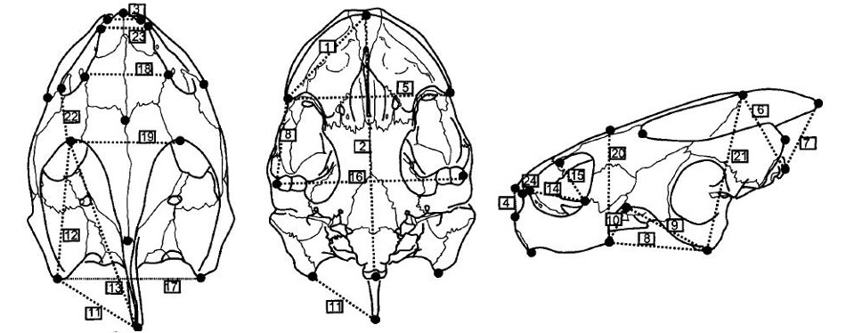

<div class = "footnote">Рис. 30.1 из Zuur et al. 2007</div>

---

## Читаем данные

```{r}
turt <- read.table("data/turtles.txt", header = TRUE)
turt$Environment3 <- factor(turt$Environment3, levels = c(0, 1, 2, 9),
          labels = c("Freshwater", "Terrestrial", "Marine", "Fossil"))
colnames(turt)
```

.pull-down[.tiny[Данные из Zuur et al. 2007]]

---

## Чтобы понять, нужно ли стандартизовать исходные данные, построим боксплот

```{r opts.label='XLxL',}
boxplot(x = turt[8:31])
```

--

- Наверное, лучше стандартизовать

---

## Делаем анализ главных компонент по стандартизованным данным

```{r}
library(vegan)
turt_pca <- rda(turt[, 8:31], scale = TRUE)
```

---

## Сколько компонент достаточно для описания данных?

```{r}
eig <- eigenvals(turt_pca)[1:5]
eig*100/sum(eig) # доля объясненной изменчивости
screeplot(turt_pca, bstick = TRUE)
```

--

- Первая компонента объясняет очень много, остальные - почти ничего. Одной компоненты достаточно?
- Нет! Не все так просто.

---

## Что странного в этой картинке?

```{r biplot-raw}
biplot(turt_pca, display = "species", scaling = 2)
```

- Как вы думаете, почему у всех переменных большие нагрузки по первой компоненте?

- Что отражает первая компонента?

---

## При анализе сырых морфометрических данных первая компонента отражает размер объектов и, возможно, немножко - их форму

```{r biplot-raw, echo=FALSE}
```

---

## Классические способы избавиться от влияния размера:

- использовать одну из исходных переменных как оценку "размера": использовать в PCA остатки от регрессий исходных признаков от "размера"
- стандартизация исходных данных при помощи деления на величину "размера" для каждого образца (корень из суммы квадратов измерений)
- сделать двойное центрирование (логарифмированных) исходных данных
- и т.д. и т.п.

---

## Двойное центрирование

Нам достаточно центрировать строки, т.к. столбцы будут центрированы автоматически в процессе анализа главных компонент.

```{r}
# Функция, которая может центрировать вектор
center <- function(x){
  x - mean(x, na.rm = TRUE)
}
# применяем эту функцию к каждой строке
dbcent <- t(apply(turt[, 8:31], 1, center))
# получившийся датафрейм пришлось транспонировать,
# поскольку apply() результаты от каждой строки
# возвращает в виде столбцов
```

---

## После двойного центрирования большие собственные числа у нескольких компонент

```{r, }
turt_db_pca <- rda(dbcent)
eig_db <- eigenvals(turt_db_pca)[1:5]
eig_db*100/sum(eig_db)
screeplot(turt_db_pca, bstick = TRUE)
```

---

## После двойного центрирования у переменных высокие нагрузки на несколько компонент, влияние размера удалено

```{r }
biplot(turt_db_pca, display = "species", scaling = 2)
```

Интерпретируем как обычно: компонента отражает несколько признаков

---

## Ординация черепах по морфометрии черепов (двойное центрирование данных)

```{r tradit-pca, echo=FALSE, fig.show='hold', purl=FALSE, opts.label='XLxM'}
op <- par(mfrow = c(1, 2), mar = c(4, 4, 0.5, 0.5), cex = 1.3)
biplot(turt_db_pca, display = "species", scaling = 2)
# цвета для графика факторных координат
colvec <- c("orange2", "limegreen", "steelblue", "red3")
# пустой график
plot(turt_db_pca, type = "n", scaling = 1)
# точки, раскрашенные по уровням фактора turt$Environment3
points(turt_db_pca, display = "sites", scaling = 1, pch = 21, 
       col = colvec[turt$Environment3], bg = colvec[turt$Environment3])
# легенда
legend("bottomright", legend = levels(turt$Environment3), bty = "n", pch = 21, 
       col = colvec, pt.bg = colvec)
par(op)
```

- У пресноводных большие D12 и D13, и маленькая D2. У морских наоборот
- Ископаемая черепаха похожа на нынешних морских

---

## Код для графика ординации черепах по морфометрии черепов

```{r tradit-pca, eval=FALSE, purl=TRUE}
```

---

class: middle, center, inverse

.pull-right[
Но настоящие джедаи теперь анализируют координаты меток, а не расстояния между ними!
]

# Геометрическая морфометрия

---

## Пример: Форма головы Апалачских саламандр рода _Plethodon_

_Plethodon jordani_ и _P.teyahalee_ встречаются вместе и раздельно.
В совместно обитающих популяциях меняется форма головы обоих видов. В разных группах популяций этот процесс параллельно приводит к одинаковым результатам. По-видимому, одной из причин параллельной эволюции может быть межвидовая конкуренция (Adams, 2004, 2010).

.pull-left[


.tiny[_Plethodon jordani_ - Jordan's Salamander by [John P Clare on Flickr](https://flic.kr/p/dMfNq6)]
]

.pull-right[
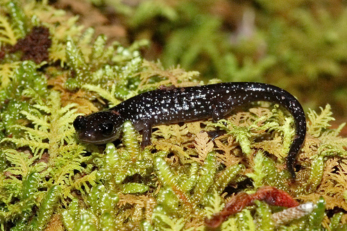

.tiny[_Plethodon_ cf. _teyahalee_ by [squamatologist on Flickr](https://flic.kr/p/8m82g6)]
]

---

## Морфометрия головы саламандр

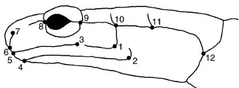

```{r}
# install.packages("geomorph", dependencies = TRUE)
library(geomorph)
data(plethodon)
str(plethodon, vec.len = 2, give.attr = F)
```

.pull-down[.tiny[рис. из Adams, 2004, 2010]]

---

## Сырые морфометрические данные еще не выравнены

Все образцы разного размера и разной ориентации в пространстве. На этом графике --- два образца для примера.

```{r}
plotRefToTarget(plethodon$land[, , 1], plethodon$land[, ,10],
                method = "points", mag = 1, 
                links = plethodon$links)
```

---

## Если нарисовать не выравненные образцы, получится полная каша. Что делать?

Слева --- три образца, справа --- все. Жирные точки --- центроиды соответствующих меток.

```{r  fig.show='hold', opts.label='XLxM'}
op <- par(mfrow = c(1, 2), mar = c(4, 4, 1, 1))
plotAllSpecimens(plethodon$land[, , 1:3], links=plethodon$links)
plotAllSpecimens(plethodon$land,links=plethodon$links)
par(op)
```

---

## Геометрическая морфометрия

1. Влияние размера удаляется при помощи обобщенного прокрустова анализа (масштабирование, поворот и сдвиг координат)
1. Преобразованные координаты меток используются как признаки объектов (конкретных особей) в анализе главных компонент. Получается морфопространство. Главные компоненты отражают изменения формы.

- можно получить усредненную форму для любой группы выравненных координат
- можно сравнить форму любой особи со средней формой
- можно проследить изменение формы вдоль осей главных компонент

---

## Прокрустов анализ

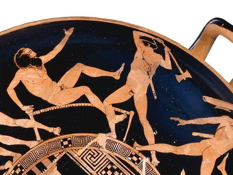

.small[Тезей убивает разбойника Прокруста (источник https://mrpsmythopedia.wikispaces.com/Procrustes)]

---

## Шаг 1. Выравниваем данные при помощи обобщенного прокрустова анализа

Generalized Procrustes Analysis (GPA)

Минимизируем сумму квадратов расстояний между одноименными метками, меняя масштаб, поворачивая и сдвигая координаты. Вот как это выглядит на данных про черепах:

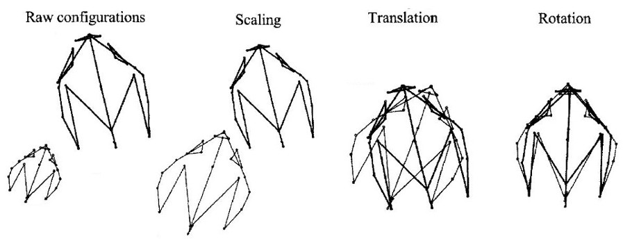

.pull-down[.small[Рис. 30.8 из Zuur et al. 2007 с изменениями]]

---

## Выравниваем головы саламандр

```{r, opts.label='LxL'}
gpa <- gpagen(plethodon$land, print.progress = FALSE)
plotAllSpecimens(gpa$coords,links=plethodon$links)
```

---

## Усредненная форма

```{r opts.label='LxL'}
ref <- mshape(gpa$coords) 
plotRefToTarget(ref, ref, method = "TPS", links = plethodon$links)
```

---

## Можем посмотреть, как отличается любой из образцов от усредненной формы

Изменение формы можно представить графически несколькими способами

```{r comparis, echo=FALSE, fig.show='hold', opts.label='XLxL'}
# матрица, в которой хранится разметка общего графика
m <- matrix(data = c(1, 2,
                     3, 3),
            nrow = 2, ncol = 2, byrow = TRUE)
l <- layout(m, heights = c(1, 1), widths = c(1, 1))
# layout.show(l) # можно просмотреть разметку

# Графики
op <- par( mar = c(0, 0, 0, 0))
# 1) изменение конфигурации обозначено векторами
plotRefToTarget(ref, gpa$coords[, , 11],
                method = "vector", mag = 1,
                links = plethodon$links)
# 2) формы обозначены точками
plotRefToTarget(ref, gpa$coords[, , 11],
                method = "points", mag = 1,
                links = plethodon$links)
# 3) сплайн
plotRefToTarget(ref, gpa$coords[, , 11],
                method = "TPS", mag = 1,
                links = plethodon$links)
par(op)
```

---

## Код для графиков сравнения образцов с усредненной формой

```{r comparis, echo=TRUE, eval=FALSE}
```

---

## Шаг 2. Создаем морфопространство

__Анализ главных компонент по координатам меток для выравненных образцов__. Главные компоненты отражают изменения формы.

```{r opts.label='XLxL'}
op <- par(mfrow = c(1, 2), mar = c(4, 4, 1, 1))
ord <- gm.prcomp(gpa$coords)
plot(ord, main = "PCA")
```

---

## Можно раскрасить по группам

```{r pca-p, opts.label='XLxL', echo=FALSE}
# группа должна быть фактором
gp <- as.factor(paste(plethodon$species, plethodon$site)) 

# задаем соответствие цветов уровням фактора
colvec <- c("Jord Allo" = "yellow2", 
            "Jord Symp" = "orange", 
            "Teyah Allo" = "green4", 
            "Teyah Symp" = "green1")
# вектор цветов в порядке заданном фактором gp
colvec <- colvec[match(gp, names(colvec))]
# график
plot(ord, bg = colvec, pch = 21, col = "grey20")
# легенда
legend("topright", legend = levels(gp), 
                   bty = "n", pch = 21, 
                   col = "grey20", 
                   pt.bg = levels(as.factor(colvec)))
par(op)
```

---

## Код для графика ординации и для легенды

```{r pca-p, eval=FALSE}
```

---

## Доля объясненной изменчивости и факторные координаты

```{r}
# Доля изменчивости объясненной 1-5 компонентами
expl <- round(ord$d[1:5]/sum(ord$d) * 100, 1) 

# Факторные координаты по 1-5 компонентам
head(ord$x[, 1:5]) 
```

---

## Чтобы легко рисовать изменения формы вдоль главной компоненты нам понадобится функция

```{r, fig.show='hold'}
plot_shape_change <- function(ord, ref_shape, PC,
                              horiz = TRUE,
                              gridPars = NULL, ...){
  if(horiz){
    op <- par(mfrow = c(1, 2), mar = c(0, 0 , 0, 0))
    plotRefToTarget(M1 = ref_shape, M2 = ord$shapes[[PC]]$min,
                    gridPars = gridPars,  ...)
    plotRefToTarget(M1 = ref_shape, M2 = ord$shapes[[PC]]$max,
                    gridPars = gridPars, ...)
    par(op)
    } else {
     op <- par(mfrow = c(2, 1), mar = c(0, 0 , 0, 0))
     plotRefToTarget(M1 = ref_shape, M2 = ord$shapes[[PC]]$max,
                     gridPars = gridPars,  ...)
     plotRefToTarget(M1 = ref_shape, M2 = ord$shapes[[PC]]$min,
                     gridPars = gridPars, ...)
     par(op)
    }
}

```

---

## Изменение формы вдоль главных компонент относительно средней формы

```{r fig.height=1.25}
plot_shape_change(ord, ref_shape = gpa$consensus, PC = 1, 
                  links = plethodon$links, method = "TPS") 
```

```{r, fig.width=3, fig.height=2.5}
plot_shape_change(ord, ref_shape = gpa$consensus, PC = 2, 
                  links = plethodon$links, method = "TPS", horiz = FALSE) 
```

---

## Можно нарисовать одновременно изменение формы вдоль обеих компонент и ординацию

```{r forms-pca-p, echo=FALSE, opts.label='XLxXL', purl=FALSE}
my_gridPar <- gridPar(tar.pt.size = 0.6, grid.lwd = 0.7)
library(cowplot)
library(gridGraphics)
gg_pca <- plot_grid(
  # Изменение формы вдоль PC2
  ~ plot_shape_change(ord, ref_shape = gpa$consensus, PC = 2,
                      horiz = FALSE, links = plethodon$links,
                      method = "TPS", gridPars = my_gridPar),
  # Ординация
  ~ {plot(ord, bg = colvec, pch = 21, col = "grey20", cex = 1.5)
    legend("topright", legend = levels(gp),  bty = "n", 
           pch = 21, col = "grey20", 
           pt.bg = levels(as.factor(colvec)))},
  # пустой график
  NULL,
  # Изменение формы вдоль PC1
  ~ plot_shape_change(ord, ref_shape = gpa$consensus, PC = 1,
                      links = plethodon$links, 
                      method = "TPS", gridPars = my_gridPar),
  # Параметры размещения
  ncol = 2, rel_heights = c(5, 1), rel_widths = c(1, 4)
)

gg_pca
```


---

## Код для графика

```{r forms-pca-p, echo=TRUE, eval=FALSE, purl=TRUE}
```

---

class: middle, center, inverse


# Эволюционные изменения формы

---

## Фило-морфо пространство

Если у вас есть данные о средних формах для каждого вида и данные о филогении (из любого источника), то можно изобразить эволюционные изменения формы

Этапы:

1. Выравнивание средних форм для таксонов при помощи обобщенного прокрустова анализа
1. Ординация таксонов при помощи анализа главных компонент
1. Поиск анцестральных состояний количественных признаков (форм) методом максимального правдоподобия
1. Наложение филогенетического дерева и анцестральных форм на график ординации

---

## Фило-морфопространство саламандр рода Plethodon

P. serratus, P. cinereus, P. shenandoah, P. hoffmani, P. virginia, P. nettingi, P. hubrichti, P. electromorphus, P. richmondi

```{r}
data(plethspecies)
str(plethspecies, vec.len = 2, give.attr = F)
```

---

## Выравниваем средние формы для видов

```{r}
species_gpa <- gpagen(plethspecies$land) #GPA-alignment
```

---

## Наложение филогенетического дерева и анцестральных форм на график PCA ординации

Филоморфопространство

```{r opts.label='LxL'}
pca_with_phylo <- gm.prcomp(species_gpa$coords, phy = plethspecies$phy)
plot(pca_with_phylo, phylo = TRUE)
```

---

## Take-home messages

- Классический подход к морфометрии
    - анализируют расстояния между метками
    - для корректного анализа необходимо удалить влияние размера и оставить форму, но сделать это корректно почти невозможно
- Геометрическая морфометрия
    - анализируют координаты меток
    - различные конфигурации выравнивают при помощи обобщенного прокрустова анализа
    - преобразованные координаты точек используют в анализе главных компонент
    - чтобы визуализировать эволюцию форм, можно наложить филогенетическое древо на ординацию

---

## Что почитать

- Bookstein, F.L., 2003. Morphometric Tools for Landmark Data Geometry and Biology. Cambridge University Press.
- Borcard, D., Gillet, F., Legendre, P., 2011. Numerical ecology with R. Springer.
- Claude, J., 2008. Morphometrics With R. Springer.
- GEOL G562 - Geometric Morphometrics [WWW Document], n.d. URL http://www.indiana.edu/~g562/PBDB2013/ (accessed 4.1.15).
- Legendre, P., Legendre, L., 2012. Numerical ecology. Elsevier.
- Oksanen, J., 2011. Multivariate analysis of ecological communities in R: vegan tutorial. R package version 2–0.
- The Ordination Web Page http://ordination.okstate.edu/ (accessed 05.04.17).
- Quinn, G.G.P., Keough, M.J., 2002. Experimental design and data analysis for biologists. Cambridge University Press.
- Zelditch, M., Swiderski, D.L., Sheets, D.H., Fink, W.L., 2004. Geometric Morphometrics for Biologists. Academic Press.
- Zuur, A.F., Ieno, E.N., Smith, G.M., 2007. Analysing ecological data. Springer.
