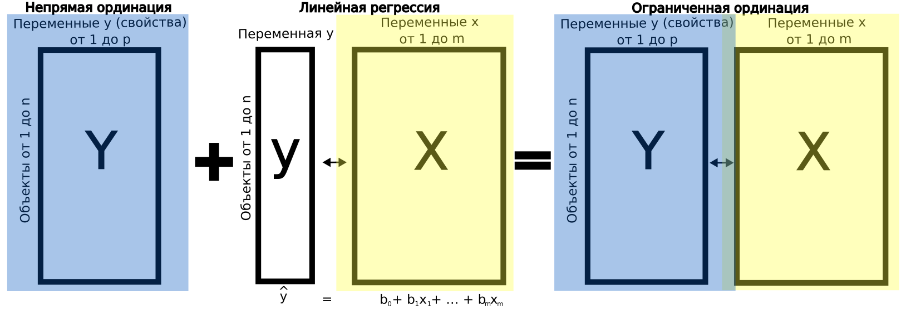

```{r setup, include = FALSE, cache = FALSE, purl = FALSE, fig.showtext = TRUE}
source("assets/xaringan_setup.R")
library(xaringanExtra)
use_tile_view()
use_scribble()
use_search(show_icon = FALSE)
use_progress_bar(color = "#C6FFE7", location = "bottom", height = "10px")
use_freezeframe()
# use_webcam()
# use_panelset()
# use_extra_styles(hover_code_line = TRUE)

# http://tachyons.io/docs/
# https://roperzh.github.io/tachyons-cheatsheet/
use_tachyons()
```

---

## Анализ избыточности (Redundancy analysis, RDA)

- Связь нескольких наборов переменных
- Анализ избыточности, теория и практика
- Проверка значимости ординации
- Выбор оптимальной модели
- Частный анализ избыточности и компоненты объясненной инерции
- Компоненты объясненной изменчивости

### Вы сможете

- Проводить анализ избыточности
- Оценивать долю объясненной инерции
- Интерпретировать компоненты по нагрузкам переменных
- Строить ординацию объектов в пространстве компонент
- Проверять значимость модели ординации при помощи пермутационного теста
- Разделять объясненную инерцию на компоненты, связанные с разными наборами переменных, при помощи частного анализа избыточности

---

class: middle, center, inverse

# Связь нескольких наборов переменных

---

## Что будет определять генетическую структуру в колониях бабочек?
### Пример: генетика бабочек _Euphydryas editha_

Частоты разных аллелей фосфоглюкоизомеразы и данные о факторах среды для 16 колоний бабочек _Euphydryas editha_ в Калифорнии и Орегоне (данные McKechnie et al., 1975)

.pull-left[.
```{r echo=FALSE, fig.height=4, fig.width=4, purl=FALSE}
library(ade4)
data(butterfly)
# расположение сайтов
s.label(butterfly$xy, contour = butterfly$contour, inc = FALSE)
```
]
.pull-right[

]
<!-- фосфоглюкоизомераза превращает глюкозу во фруктозу, участвует в гликолизе и в глюконеогенезе. нейротрофический фактор для спинальных и чувствительных нейронов, и т.п. -->

---

class: middle, center, inverse

# Анализ избыточности

---

## Анализ избыточности (Redundancy analysis, RDA)

.content-box-green[
RDA --- метод прямой ординации из группы методов канонического анализа (ограниченной ординации = constrained ordination). 
]

RDA совмещает в себе:

- множественную линейную регрессию
- анализ главных компонент (PCA, principal component analysis)

Особенности:

- две матрицы данных: матрица предикторов (X) и матрица зависимых переменных/переменных отклика (Y);
- поиск компонент из матрицы зависимых переменных, которые являются линейными комбинациями предикторов и отражают максимум изменчивости.

---

## Ординации и регрессия 




---
