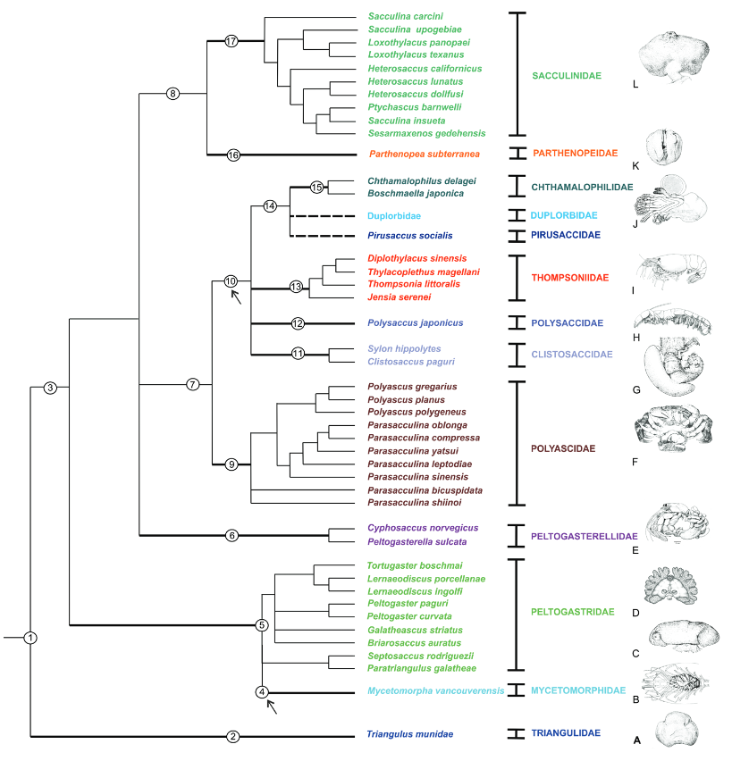
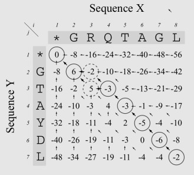
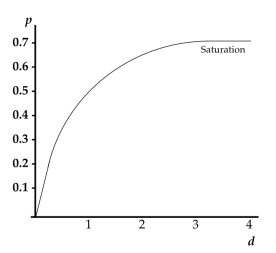
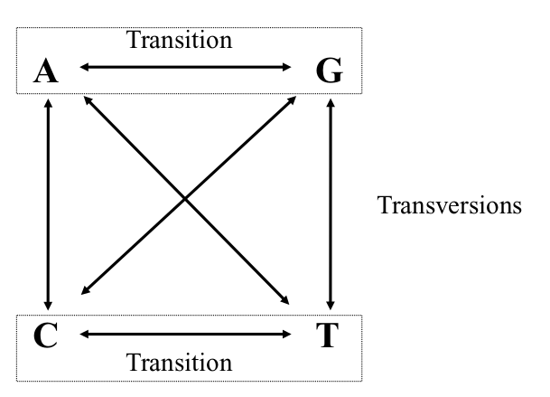
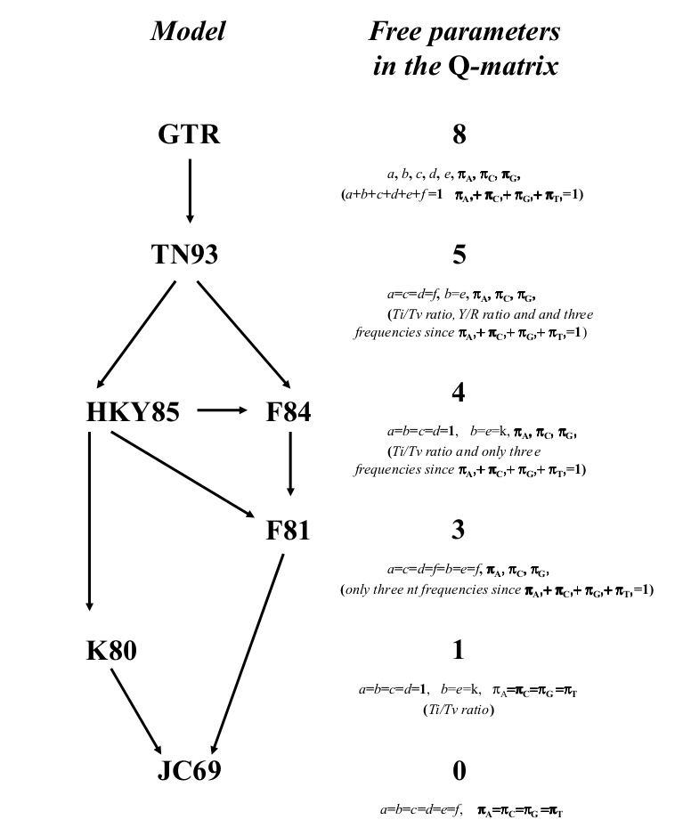
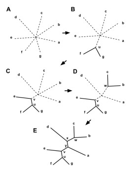
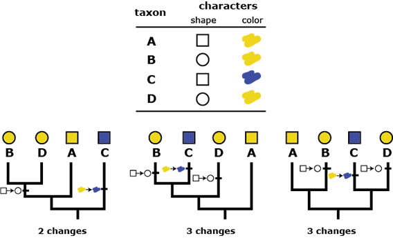
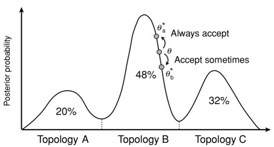
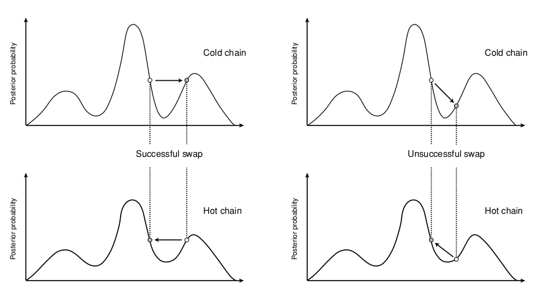
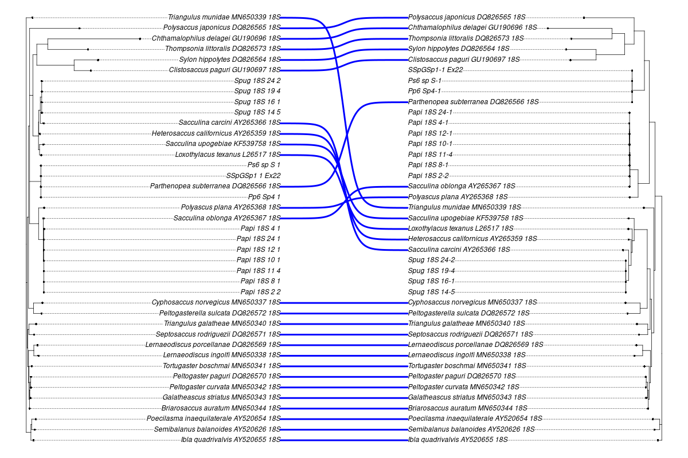

```{r setup, include = FALSE, cache = FALSE, purl = FALSE, fig.showtext = TRUE}
source("assets/xaringan_setup.R")
library(xaringanExtra)
use_tile_view()
use_scribble()
use_search(show_icon = FALSE)
use_progress_bar(color = "#C6FFE7", location = "bottom", height = "10px")
use_freezeframe()
# use_webcam()
# use_panelset()
# use_extra_styles(hover_code_line = TRUE)

# http://tachyons.io/docs/
# https://roperzh.github.io/tachyons-cheatsheet/
use_tachyons()
```


## Филогения корнеголовыx ракообразныx 

.pull-left[

]

.pull-right[Корнеголовые раки --- сильно модифицированные паразиты, морфология которыx практически не дает информации об иx эволюционныx взаимоотношенияx. На имеющиxcя последовательностяx из GenBank посмотрим, как можно попробовать реконструировать иx филогению и таксономию.

```{r}
ids <- readLines("data/genbank_ids.txt")
library(ape)
seqs <- read.GenBank(ids) # позволяет извлечь fasta-файлы из базы данныx
```
]

.tiny[из Høeg et al., 2020]

---

## Делаем читабельными названия строк

```{r}
seqs_ids <- paste(attr(seqs, "species"), names(seqs), sep = "_")
write.dna(seqs, file = "data/rhiz_ids.fasta", format = "fasta", nbcol = 1) #ape
#

library(seqinr)
rhiz_fasta <- read.fasta(file = "data/rhiz_ids.fasta", seqtype = "DNA",
           as.string = TRUE, forceDNAtolower = FALSE)

write.fasta(sequences = rhiz_fasta, names = seqs_ids, file.out = "data/rhiz_not_align.fasta")
```

---

## Алгоритм филогенетического анализа

1. Подготовка базы данных (секвенирование, поиск нужных последовательностей в базах данных);

2. Множественное выравнивание последовательностей;

3. Выбор подходящей модели нуклеотидных замен;

4. Получение матрицы сxодств-различий;

5. Построение дерева;

6. Оценка надёжности полученного дерева. 

---

## Выравнивание

Основная идея --- поиск общиx участков в последовательностяx, несмотря наличие в последовательностяx инсерций и делеций. Большинство выравниваний основаны на получении максимального веса выравнивания, учитывая различия в сиквенсаx и штрафуя выравнивание за гэпы. 

Выравнивание может быть: попарным (2 последовательности) или множественным (3 и более).

---

## Попарное выравнивание




.tiny[из The Phylogenetic Handbook by Philippe Lemey et al., 2009]

Выравнивание может быть глобальным (последовательность выравнивается от начала и до конца), полуглобальным (считают хорошим выравниванием, где похожи конец одной и начало другой последовательости) и локальным (выравниваются участки последовательностей). 

Оценка выравнивания делается, учитывая количество совпадений последовательностей (match) и внося штрафы за различия в них (mismatch или пропуски/gaps --- вставки, делеции).

[http://experiments.mostafa.io/public/needleman-wunsch/](http://experiments.mostafa.io/public/needleman-wunsch/)

---

## Множественное выравнивание

Выравнивают несколько последовательностей, их вариаций существует очень много! 

Основные алгоритмы: 

1. Clustal (функция `clustal` из пакета `phyloch` или `ape`);
2. Muscle (функция `muscle` из пакета `phyloch` или `ape`);
3. Mafft (функция `mafft` из пакета `phyloch`);
4. T-Coffee (функция `tcoffee` из пакета `phyloch` или `ape`);
5. Prank (функция `prank` из пакета `phyloch`).

Все они работают с объектом класса `DNAbin` и основаны на работе командной строки. 

Широко популярные программы с графическим интерфейсом: MEGA, UGENE, Geneious. 

---

## Общая схема прогрессивного алгоритма выравнивания

1. Попарные выравнивания последовательностей (точный/эвристический алгоритм);

2. Построение дерева методом neighbour-joining;

3. Постепенное объединение последовательностей от более схожим к менее схожим. 

Итеративные алгоритмы выравнивания прогоняют данную последовательность несколько раз. 

Есть алгоритмы выравнивания, основанные на скрытых марковских моделях. 

---

## Множественное выравнивание в R

```{r message = FALSE, results = 'hide'}
library(adegenet) # для превращения fasta-файла в формат DNAbin
# выравнивание
rhiz_dnabin <- fasta2DNAbin('data/rhiz_not_align.fasta')
```

```{r}
library(ape)
clustal_align <- clustal(rhiz_dnabin)
image(clustal_align) # функция из пакета ape
```

---

## Фильтрация выравнивания перед построением дерева

Выравнивание может получиться разным! В связи с этим часто советуют его отфильтровать, чтобы все сиквенсы были примерно одинаковой длины и плохо выравненные последовательности не влияли на построение дерева.

Программы для тримминга выравниваний: trimAl, Aliscore, Zorro, Gblocks и многие другие. 

---

## Выбор модели нуклеотидных замен



.tiny[из The Phylogenetic Handbook by Philippe Lemey et al., 2009] 

Основано на метрике p-distance (наблюдаемое расстояние): подсчитывается количество сайтов, в которых последовательности различаются. Измеряется p-distance в количестве различающихся нуклеотидов на сайт.

Проблема __множественных__ замен! При определённой частоте замен наблюдаемое расстояние не будет меняться, хотя замены будут происходить. 

---

## Выбор модели нуклеотидных замен 

В общем виде эволюционную модель нуклеотидных замен можно представить как Марковский процесс, который использует $Q$-матрицу, отражающую частоту замен определённых нуклеотидов в последовательности. 

$$Q = \begin{pmatrix} 
-\frac{3}{4} \mu & \frac{1}{4} \mu & \frac{1}{4} \mu & \frac{1}{4} \mu \\
\frac{1}{4} \mu & - \frac{3}{4} \mu & \frac{1}{4} \mu & \frac{1}{4} \mu \\
\frac{1}{4} \mu & \frac{1}{4} \mu & - \frac{3}{4} \mu & \frac{1}{4} \mu \\
\frac{1}{4} \mu & \frac{1}{4} \mu & \frac{1}{4} \mu & - \frac{3}{4} \mu
\end{pmatrix}$$

В этой матрице строки расположены в последовательности A, C, G, T. 

Вероятность замену одного нуклеотида на любой другой в течение времени $t$ можно расчитать с помощью матричной экспоненты: $P(t) = exp(Q t)$

---

## Параметры в моделях нуклеотидных замен

.pull-left[
 __Возможные нуклеотидные замены__

]

.pull-right[
__Иерархия моделей нуклеотидных замен__

]

.tiny[из The Phylogenetic Handbook by Philippe Lemey et al., 2009] 

---

## Матрица Q в модели GTR (General time reversable)

.small[
$$Q = \begin{pmatrix}
-\mu(a\pi_{C} + b\pi_{G} + c\pi_{T}) & a \mu \pi_{C} & b \mu \pi_{G} & c \mu \pi_{T} \\
a \mu \pi_{A} & - \mu(a\pi_{A} + d\pi_{G} + e\pi_{T}) & d \mu \pi_{G} & e \mu \pi_{T} \\
b \mu \pi_{A} & d \mu \pi_{C} & - \mu(b\pi_{A} + d\pi_{C} + f\pi_{T}) & f \mu \pi_{T} \\
c \mu \pi_{A} & e \mu \pi_{C} & f \mu \pi_{G} & - \mu(c\pi_{A} + e\pi_{C} + f\pi_{G})
\end{pmatrix}$$

]

---

## Выбор подходящей модели эволюции

Широко распространённая программа --- jModelTest. В R реализуется функцией `modelTest` из пакета `phangorn`. 

```{r results = 'hide'}
mafft_fasta <- fasta2DNAbin('data/18S_alignment.fasta') # выравнивание, сделанное алгоритмом mafft
```

```{r}
library(phangorn)
sub_models <- modelTest(as.phyDat(mafft_fasta), multicore = TRUE,
                        mc.cores = 6) # распараллеливаем процесс, чтобы он шёл быстрее
(best <- sub_models[which.min(sub_models$AIC), ]) # лучшая модель
(worst <- sub_models[which.max(sub_models$AIC), ]) # худшая модель
```

---

## Построение деревьев

1. Методы расстояний: 

  а. Кластерный анализ: UPGMA, WPGMA (редко используется сейчас, т.к. не оценивают возможность разной скорости эволюции в разных ветвях дерева);
  
  б. Минимальная эволюция;
  
  в. Присоединение соседа (NG, neighbor-joining)

2. Дискретные методы:

  а. Максимальная парсимония (MP);
  
  б. Максимальное правдоподобие (ML);
  
  в. Байесовский анализ. 
  
---

## Neighbor-joining алгоритм

.pull-left-33[


.tiny[из Wikipedia]

Исходно имеем не разрешённое дерево!
]

.pull-right-66[
1. Вычисление матрицы попарных расстояний между таксонами.

2. Вычисление net divergence $(r)$ --- расстояния от каждого узла до всех остальных.

3. Вычисление матрицы расстояний, в которые внесены поправки по формуле: $M_{i} = d_{ij} - (r_i + r_j)(N - 2)$. 

4. Выбор нового узла с __минимальным__ значением $M_i$. 

5. Расчёт длины ветвей от нового узла до объектов, из которых он был создан. 

6. Расчёт новых расстояний от нового узла до оставшихся узлов.

7. Теперь $N = N - 1$, повторяем все предыдущие шаги. 

В результате получаем __неукоренённое дерево__, которое можно дополнительно укоренить. 
]

---

## Метод максимального правдоподобия (ML)

Функция максимпального правдоподобия: 

$$L(\theta) = Pr(Data | \tau, \theta) = Pr(alignment| tree, model)$$

Функция правдоподобия --- условная вероятность того, что наше выравнивание будет выглядеть таким образом при выбранной модели эволюции и полученном дереве. 

Лучшее дерево то, у которого значение $L$ будет максимальным. 

---

## Метод максимальной парсимонии (MP)

Основная идея проста --- поиск дерева, которое будет минимизировать количество эволюционных изменений, необходимых для объяснений полученных данных.



.tiny[
из [evolution.berkeley.edu](evolution.berkeley.edu)
]

---

## Что делать, если последовательностей больше, чем 3?

1. "Branch-and-bound" метод: пытается оценить все возможные деревья, но отсекает те, которые не могут привести к оптимальным;

2. "Stepwise addition" (пошаговое добавление): фиксирует путь построения дерева из наиболее многообещающего узла (так можно прийти к локальному минимуму!);

3. "Branch-swapping" методы (методы замены ветвей):

  а. "nearest-neighbor interchange" (обмен ближайшими соседями): меняем местами узлы, если дерево стало лучше --- начинаем искать варианты вокруг этого дерева;
  
  б. "subtree pruning and regrafting (SPR, обрезка и прививка дерева)": берём ветку дерева и вставляем её в любое другое место дерева

  d. "tree bisection and
reconnection (TBR, делим дерево пополам и обратное присоединение)": делим дерево на 2 самостоятельных поддерева и снова их соединяем. 

---

## Способы оценки полученного дерева

1. Jackknife: берём выравнивание и убираем случайным образом какое-то количество позиций, строим дерево. Повторяем много-много раз и смотрим, в каком проценте деревьев повторяются клады. Более старый метод.

2. Bootstrap: выборка того же объёма с повторениями. Повторяем много-много раз и смотрим, в каком проценте деревьев повторяются клады. 

---

## Байесовские методы в филогении


.pull-left[
### Теорема Байеса в общем виде:

$P(A | B) = \frac{P(A) * P(B|A)}{P(B)}$, где 

$P(A|B)$ --- апостериорная вероятность;

$P(A)$ --- априорная вероятность;

$P(B | A)$ --- вероятность B при условии A;

$P(B)$ --- вероятность события B. 
]

.pull-right[
### Теорема Байеса в филогенетике

$P(T, \beta, k|X) = \frac{P(T, \beta, k) P(X | T, \beta, k)}{P(X)}$, где 

$T$ --- топология,

$\beta$ --- длина ветвей;

$k$ --- параметры эволюционной модели,

$X$ --- выравнивание,

$P(T, \beta, k|X)$ --- апостериорная вероятность гипотезы;

$P(T, \beta, k)$ --- априорная вероятность гипотезы;

$P(X|T, \beta, k)$ --- правдоподобие данных;

$P(X)$ --- нормалищующая константа.
]

---

## Алгоритм Монте-Карло по схеме марковской цепи

Все вероятности для всех деревьев перебрать невозможно!

Поэтому используется алгоритм Монте-Карло по схеме марковской цепи (Markov chain Monte Carlo sampling, MCMC).



.tiny[из The Phylogenetic Handbook by Philippe Lemey et al., 2009]

1. Начало в произвольной точке;

2. Делаем небольшой случайный шаг;

3. Шаг вверх всегда принимаем, шаг вниз принимаем с вероятностью, равной соотношенью апостериорных вероятностей. 

Но что делать с локальным максимумом?

---

## Алгоритм MCMCMC (Metropolis coupled MCMC)

Холодые и горячие цепи. Холодные --- наше исходное распределение, горячие --- изменённое таким образом, что постериорная вероятность меньше единицы. Получаем сплющённое распределение, между холмиками которого легче будет перепрыгивать. 



---

## Программы для построения деревьев 

### ML

- Mega

- RAxML

- PhyML

- IQ-TREE

### MP

- Mega 

- PAUP

- PHYLIP

### Байесовские методы

- MrBayes

- BEAST

---

## Визуализация деревьев 

R позволяет достаточно красиво визуализировать построенную филогению, а также сопоставить деревья, полученные разными способами.

Дерево, полученное с помощью байесовского подхода:

```{r}
library(treeio) # для чтения формата 
library(ggtree)
nex_rhiz <- read.beast("data/18S_ver2.nex.con.tre") # модель: GTR+I+G, выравнивание: MAFFT
gtr_tree <- ggtree(nex_rhiz) +
  geom_tiplab(size = 4) +
  geom_text(aes(label = prob_percent),
            hjust = 1.2, vjust = -0.3)
```

---

## Структура данных

```{r results = 'hide'}
str(nex_rhiz)
```

```{r}
str(nex_rhiz@phylo)
```


---

## Укоренение дерева

Укоренение дерева может быть, например, выполнено с указанием внешней группы. 

.pull-left[
Дерево, в котором отмечены номера узлов
```{r}
(gg_nodes <- ggtree(nex_rhiz) +
  geom_tiplab(size = 4) +
  geom_text(aes(label=node), hjust=1.2, vjust = -.3))
```
]

.pull-right[
```{r}
library(ape)
nex_rhiz@phylo <- root(nex_rhiz@phylo, node = 43) # укорененение дерева по аутгруппе
```
]

---

## Визуализация необходимых участков дерева

Создаём необходимые для нас группы.
```{r}
group_rhiz <- groupOTU(nex_rhiz@phylo, c("Spug_18S_14_5",
                                       "Spug_18S_16_1",
                                       "Spug_18S_19_4",
                                       "Spug_18S_24_2"))
```

---

## Визуализация необходимых участков дерева

```{r}
(gg_spug <- ggtree(nex_rhiz) +
  geom_tiplab(size = 4) +
  geom_treescale() +
  geom_tippoint(data = group_rhiz,
                aes(alpha = group), col = "red") +
  geom_text(aes(label = prob_percent),
            hjust = 1.2, vjust = -0.3) +
  theme(legend.position = 'null'))
```

---

## Визуализация нескольких необходимых участков дерева

```{r}
## добавляем парасаккулину
sac_para_nodes <- list("Sacculina pugettiae" = c("Spug_18S_14_5",
                                                 "Spug_18S_16_1",
                                                 "Spug_18S_19_4",
                                                 "Spug_18S_24_2"),
                       "Parasacculina pilosella" = nex_rhiz@phylo$tip.label[18:24])

sac_para_otus <- groupOTU(nex_rhiz, sac_para_nodes)
```

---

## Визуализация

```{r}
(gg_spug_ppil <-  ggtree(sac_para_otus) +
  geom_tiplab(size = 4) +
  geom_nodelab() +
  geom_treescale() +
  geom_tippoint(aes(col = group)) +
  scale_color_manual(values=c("black", "blue", "orange")) +
  geom_text(aes(label = prob_percent),
            hjust = 1.2, vjust = -0.3))
```

---

## Выделение нужных узлов на дереве

Подсматриваем нумерацию нужных узлов. 
```{r}
ggtree(sac_para_otus) +
  geom_tiplab(size = 4) +
  geom_treescale() +
  geom_text(aes(label=node), hjust=1.2, vjust = -.3)
```

---

## Графическое изображение нужных узлов разными способами

.pull-left[
__Раскрашивание ветвей__
```{r}
ggtree(sac_para_otus) +
  geom_tiplab(size = 4) +
  geom_nodelab() +
  geom_treescale() +
  geom_hilight(node = 63, fill = "orange") +
  geom_hilight(node = 58, fill = "blue") +
  geom_text(aes(label = prob_percent),
          hjust = 1.2, vjust = -0.3)
```
]

.pull-right[
__Выделение узлов__
```{r}
ggtree(sac_para_otus) +
  geom_tiplab(size = 4) +
  geom_text(aes(label = prob_percent),
            hjust = 1.2, vjust = -0.3) +
  geom_cladelabel(node = 63, label="Sacculina pugettiae",
                color = 'orange', offset = 0.3,
                hjust = -0.1) +
  geom_cladelabel(node = 58, label="Parasacculina pilosella",
                color = 'blue', offset = 0.28,
                hjust = -0.1)
```
]

---

## Сравнение разных деревьев

Возьмём дерево, полученное методом максимального правдоподобие и с использованием заведомо неправильной модели (JC69).

```{r}
jc69 <- read.tree("data/18S_JC69_sac_parasac.treefile")

ggtree(jc69) +
  geom_tiplab(size = 4) +
  geom_treescale() +
  geom_text(aes(label=node), hjust=1.2, vjust = -.3)
```

---

## Укоренение дерева, построенного по другой модели замен

```{r}
jc69 <- root(jc69, node = 42)

(jc69_tree <- ggtree(jc69) +
  geom_tiplab(size = 4) +
  geom_nodelab(hjust = 1.2, vjust = -0.3) +
  geom_treescale())
```

---

## Построение кофилогении

Отображение двух графиков, построенных посредством `ggtree` вместе.
```{r}
library(ggpubr)
ggarrange(gtr_tree, jc69_tree)
```

---

## Дерево, построенное с помощью пакета ape

```{r}
library(ape)
cophyloplot(nex_rhiz@phylo, jc69, length.line=4, space=40)
```

---

## Дерево, построенное с помощью пакета phytools

```{r fig.show='hide'}
library(phytools)
trees.cophylo<-cophylo(nex_rhiz@phylo, jc69, rotate = TRUE)
png("cophyplot.png", width = 1200, height = 800)
plot(trees.cophylo, link.type = "curved", link.lwd = 4,
     link.lty="solid", link.col = "blue", size = 1)
dev.off()
```

---

## Дерево, построенное с помощью пакета phytools



---

## Дополнительные ресурсы

- Lemey, P., Salemi, M., & Vandamme, A. M. (Eds.). (2009). The phylogenetic handbook: a practical approach to phylogenetic analysis and hypothesis testing. Cambridge University Press.

- Paradis, E. (2012). Analysis of Phylogenetics and Evolution with R (Vol. 2). New York: Springer.

- Курс "Молекулярная филогенетика" на Stepik от [Института Биоинформатики в лице Полины Дроздовой](https://stepik.org/course/2054/syllabus)
